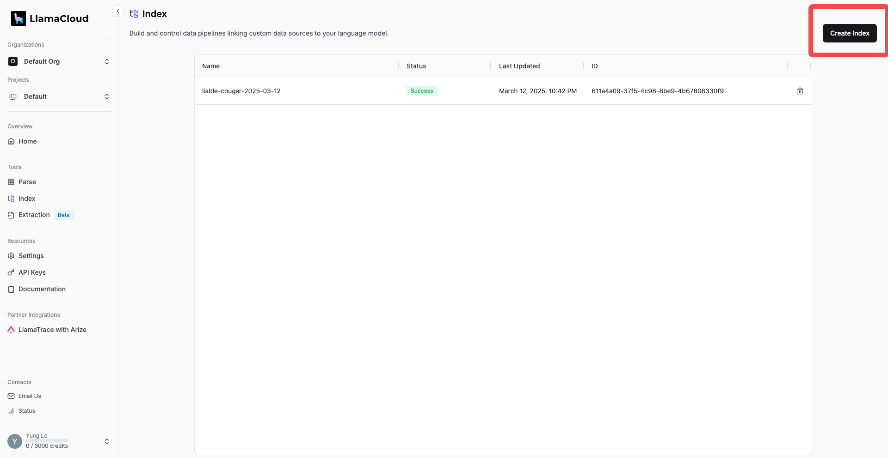
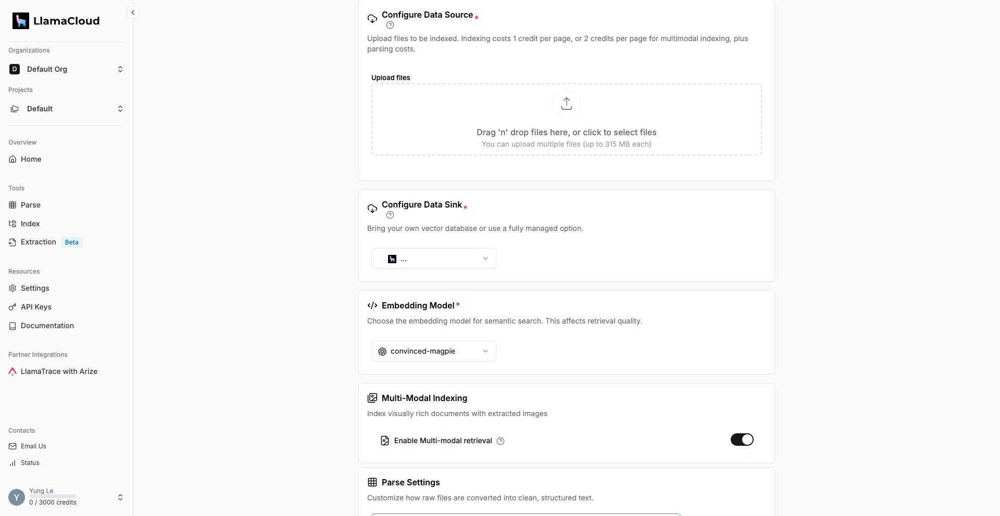
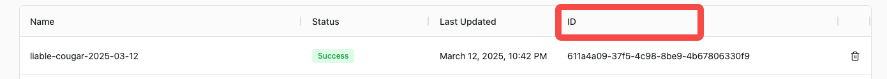
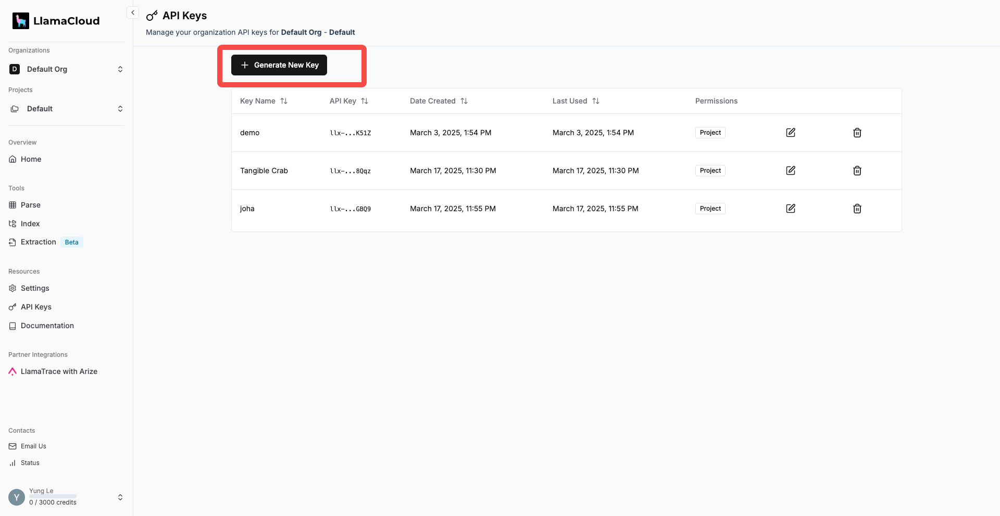
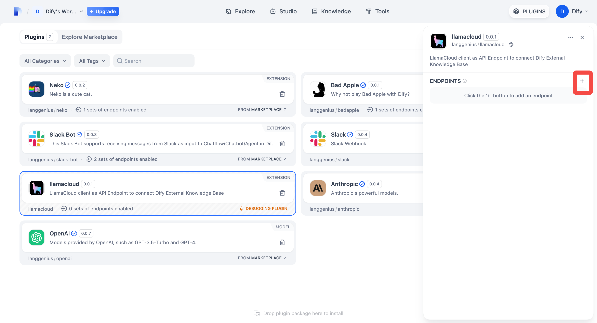
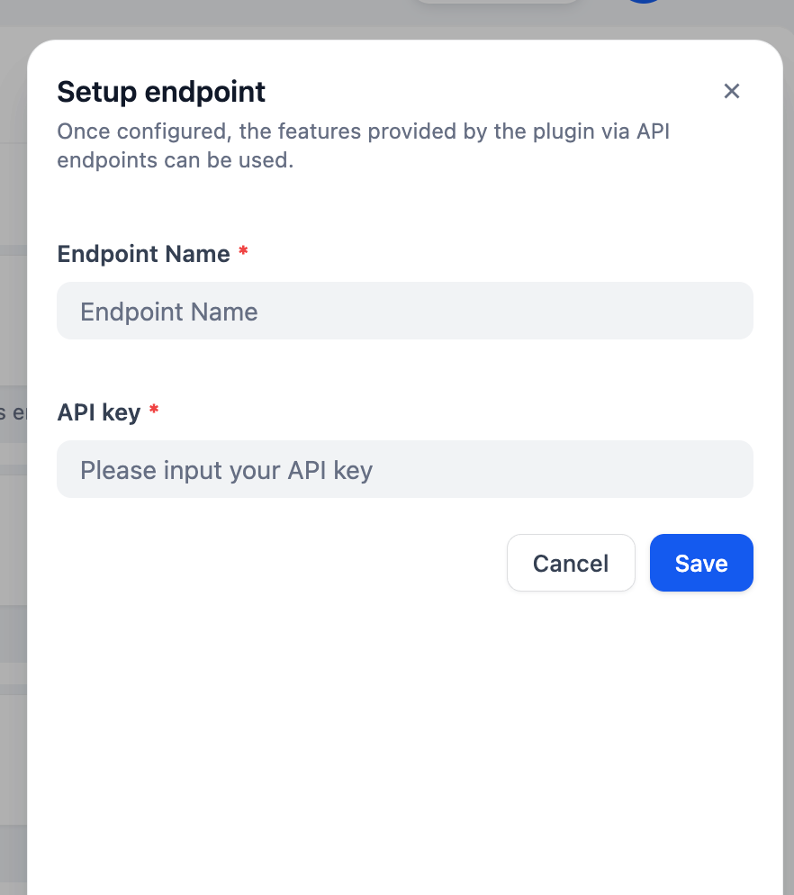
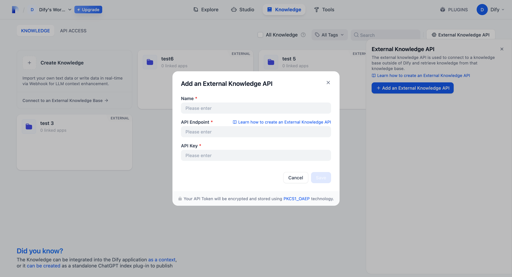
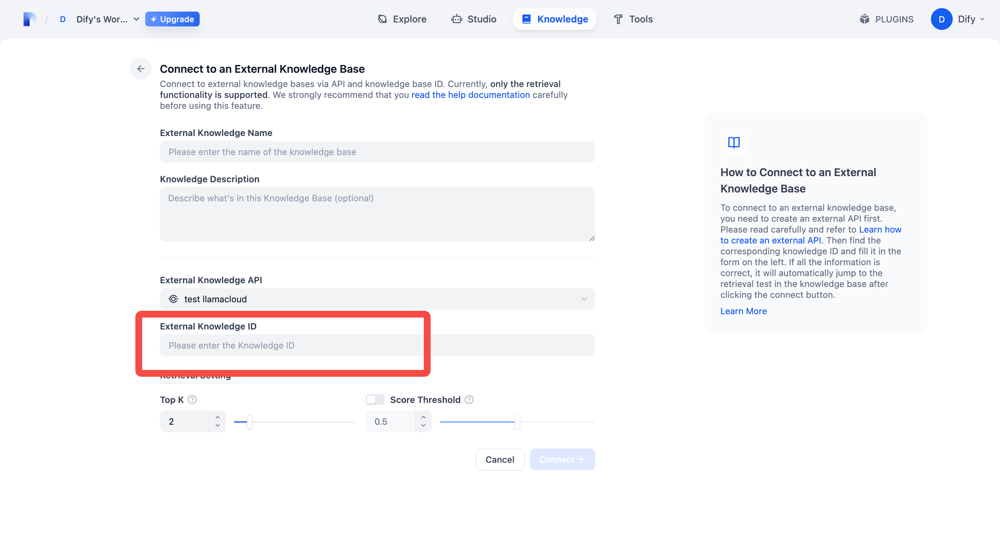
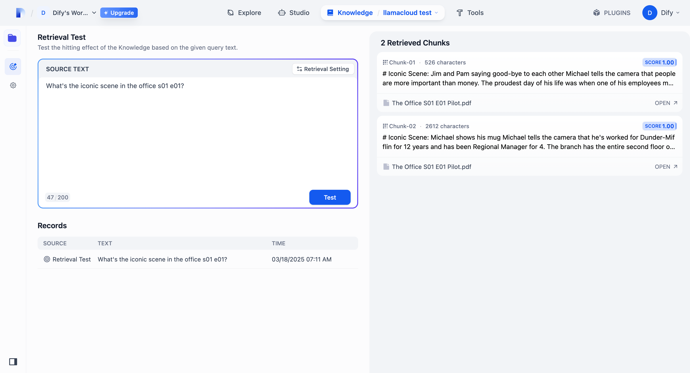

## llamacloud

**作成者:** langgenius
**バージョン:** 0.0.2
**タイプ:** 拡張機能

### 説明

LlamaCloud は、UI を備えた LlamaIndex のオンライン版です。

コンテキスト検索機能を持つ AI エージェントを構築しようとしており、主に Dify のナレッジベースを使用していない場合、Dify の外部ナレッジベースを使用して、お好みの RAG ソリューションに接続できます。このプラグインは、LlamaCloud インデックスをエンドポイントとしてデプロイし、Dify 外部ナレッジベースがシームレスに接続できるようにします。

LlamaCloud でインデックスを設定するには、**Tools: Index** セクションで Create Index をクリックします。

インデックスパネルでは、データのアップロード、ベクトルストレージと埋め込みモデルの接続、解析設定の構成ができます。

インデックスを設定すると、Pipeline ID が取得できます。

ここで API キーを生成します：

次に、Dify のマーケットプレイスで LlamaCloud を見つけてインストールします。
ここをクリックして新しいエンドポイントを作成します：

エンドポイントに名前を付け、先ほど作成した API キーを貼り付けます。

新しく作成されたエンドポイント URL をコピーし、ナレッジベースに移動し、「外部ナレッジ API」、「外部ナレッジ API を追加」を選択し、「API エンドポイント」に URL を貼り付けます。

**注意：URL から "/retrieval" を削除する必要があります！！！！！** API キーについては、認証を設定していないため、任意の内容を入力できます。したがって、**エンドポイント URL を誰にも知られないようにしてください！！！**

外部ナレッジベースが接続されたら、「外部ナレッジベースに接続」に移動し、「ナレッジ ID」に Pipeline ID を入力し、名前を付ければ準備完了です。

これで、外部ナレッジベースの検索テストを実行できます。

