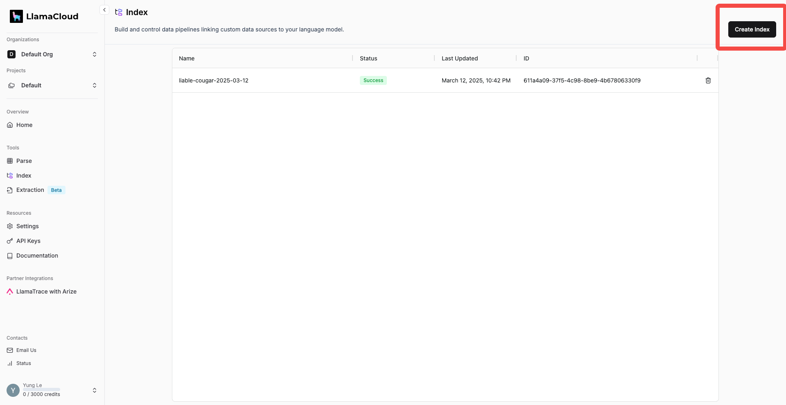
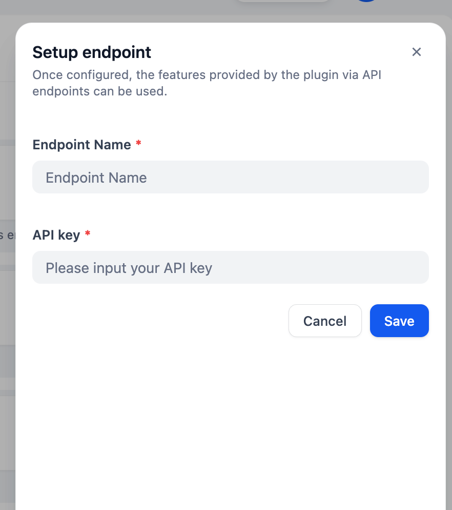

## llamacloud

**Autor:** langgenius
**Versão:** 0.0.2
**Tipo:** extensão

### Descrição

LlamaCloud é uma versão online do LlamaIndex com interface de usuário.

Se você está tentando construir um Agente de IA com capacidade de recuperação de contexto e não está usando principalmente a Base de Conhecimento do Dify, você pode usar a Base de Conhecimento Externa do Dify para se conectar com a solução RAG de sua preferência. Este plugin ajudará você a implantar seu Índice LlamaCloud como um endpoint para que a Base de Conhecimento Externa do Dify possa se conectar perfeitamente a ele.

Para configurar um Índice no LlamaCloud, na seção **Tools: Index**, clique em Create Index.

No painel de Índice, você pode fazer upload de seus dados, conectar armazenamento de vetores e modelo de embedding, configurar as definições de análise.

Depois de configurar seu Índice, você receberá um Pipeline ID.

Gere uma chave de API aqui:

Agora, no marketplace do Dify, encontre LlamaCloud e instale-o.
Crie um novo endpoint clicando aqui:

Dê um nome ao seu endpoint e cole a chave de API que acabamos de criar.

Copie a URL do Endpoint recém-criado, vá para Base de Conhecimento, "API de Conhecimento Externo", "Adicionar uma API de Conhecimento Externo" e cole a URL em "Endpoint de API".

**AVISO: Você DEVE REMOVER o "/retrieval" da sua URL!!!!!** Para a chave de API, como não configuramos nenhuma autorização, você pode digitar qualquer coisa que quiser. Portanto, **CERTIFIQUE-SE DE QUE NINGUÉM SAIBA A URL DO ENDPOINT!!!**

Depois que sua base de conhecimento externa estiver conectada, vá para "conectar a uma base de conhecimento externa", digite o Pipeline ID em "ID de Conhecimento", dê um nome e pronto.

Agora você pode fazer um teste de recuperação da sua Base de Conhecimento Externa.

