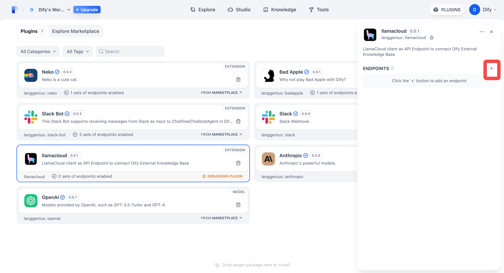
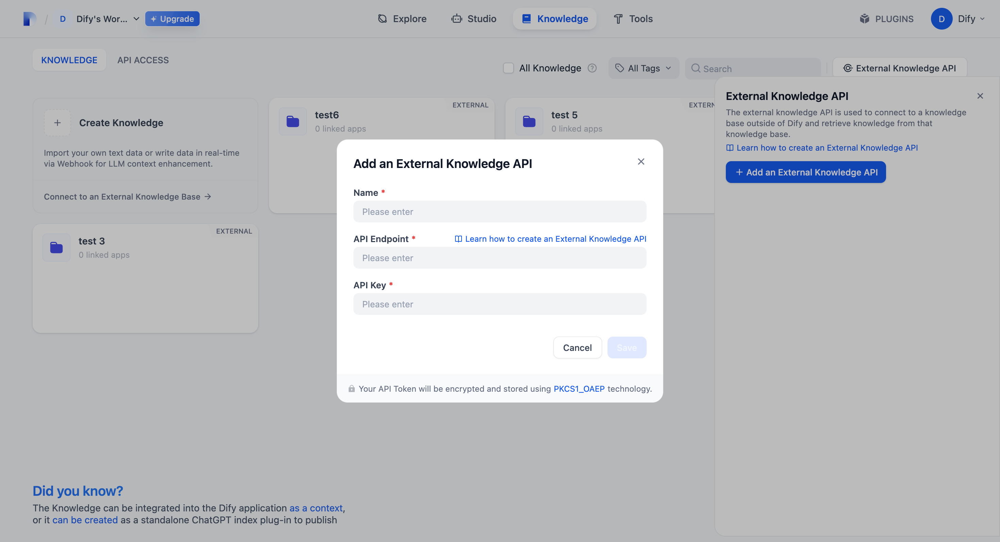
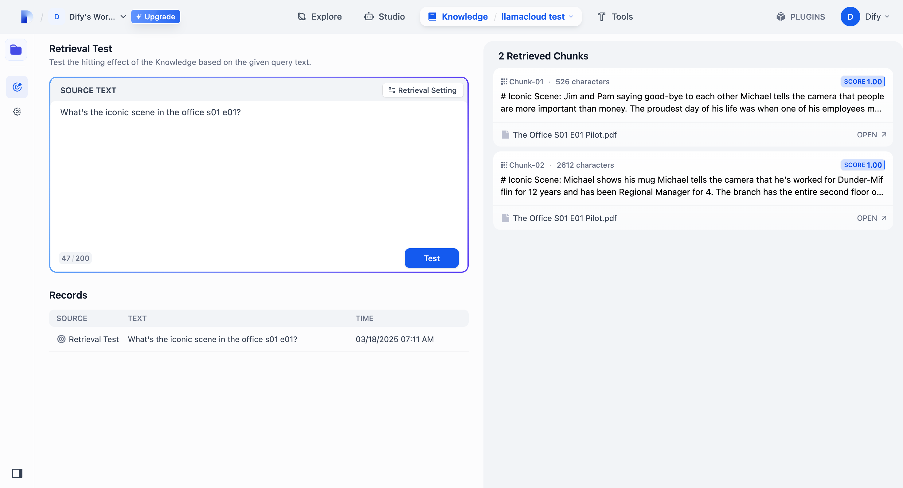

## llamacloud

**作者:** langgenius
**版本:** 0.0.2
**类型:** 扩展

### 描述

LlamaCloud 是 LlamaIndex 的在线版本，带有用户界面。

如果你正在构建具有上下文检索能力的 AI Agent，并且主要不使用 Dify 的知识库，你可以使用 Dify 的外部知识库来连接你喜欢的 RAG 解决方案。此插件将帮助你将 LlamaCloud 索引部署为端点，以便 Dify 外部知识库可以无缝连接。

要在 LlamaCloud 中设置索引，请在 **Tools: Index** 部分点击 Create Index。

在索引面板中，你可以上传数据、连接向量存储和嵌入模型、配置解析设置。

设置好索引后，你将获得一个 Pipeline ID。

在此处生成 API 密钥：

现在在 Dify 的市场中找到 LlamaCloud 并安装它。
点击此处创建新端点：

为你的端点命名，并粘贴我们刚刚创建的 API 密钥。

复制新创建的端点 URL，进入知识库，"外部知识 API"，"添加外部知识 API"，并将 URL 粘贴到"API 端点"中。

**注意：你必须删除 URL 中的 "/retrieval"！！！！！** 对于 API 密钥，由于我们没有配置任何授权，你可以输入任何内容。所以**请确保没有人知道端点 URL！！！**

连接外部知识库后，进入"连接到外部知识库"，在"知识 ID"中输入 Pipeline ID，为其命名，就可以开始使用了。

现在你可以对外部知识库进行检索测试。

