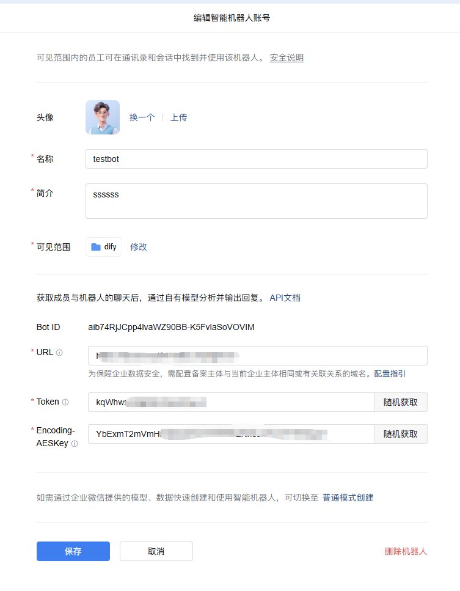
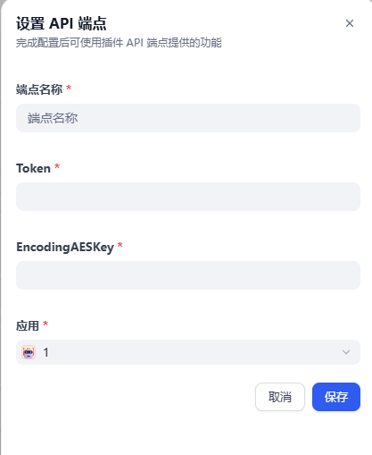
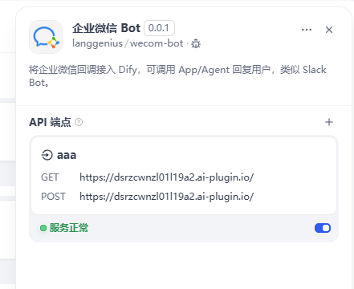
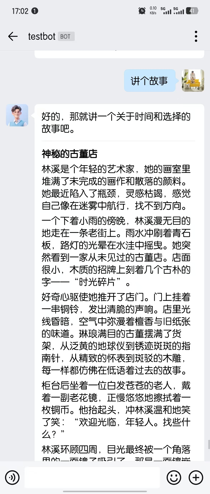

## Configuration Guide

#### Step 1: Create a Bot Application in WeCom (Enterprise WeChat)

Please refer to this [article](https://cloud.tencent.com/document/product/1759/121473)

After reaching this step, leave the URL field empty for now (we'll fill it in the next step). First, randomly generate a Token and Encoding-AESKey.

#### Step 2: Configure the Plugin in Dify

Find the `WeCom Bot` plugin on the Dify plugin page, add a configuration, fill in the Token and Encoding-AESKey obtained from Step 1, and select a chat-type Dify application.

After saving, you will get a URL. Copy it and paste it into the WeCom configuration page from Step 1, then click save (if the save fails, try again).

Now you can chat with this bot in WeCom:

