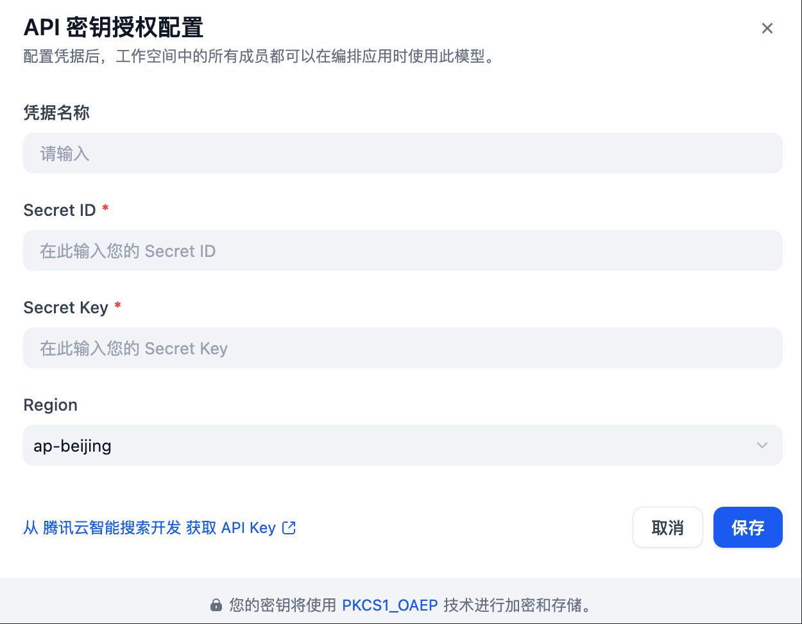

### Overview ｜ 概览

[Tencent Cloud Elasticsearch Service (ES) ](https://cloud.tencent.com/document/product/845/120084) is a fully-managed massive data retrieval and analysis service featuring a high-performance self-developed kernel and integrated X-Pack capabilities. It enables you to efficiently build services for information retrieval, log analysis, and operation monitoring. Its distinctive vector search capability further empowers the development of AI-driven in-depth applications based on semantics and images. This plugin provides high-performance fundamental models tailored for RAG (Retrieval-Augmented Generation) scenarios by Tencent Cloud ES, allowing you to seamlessly integrate these powerful models into your applications with ease.

Tencent Cloud ES supports various model types:
- Text Embedding
- Rerank
- LLM（Large Language Models）

[腾讯云 Elasticsearch Service（ES）](https://cloud.tencent.com/document/product/845/120084) 是云端全托管海量数据检索分析服务，拥有高性能自研内核，集成X-Pack。使用 ES 您可以高效构建信息检索、日志分析、运维监控等服务，它独特的向量检索还可助您构建基于语义、图像的 AI 深度应用。本插件为腾讯云 ES 为 RAG 场景提供的高性能基础模型，您可以轻松使用本插件将这些强大的模型无缝集成到你们的应用中。

腾讯云 ES 支持多种模型类型：
- 文本嵌入
- 重排序
- LLM（大语言模型）

### Configure ｜ 配置

After installing the plugin, configure your Tencent Cloud ES settings in the Model Provider section. This includes:
- Authentication: Secret ID + Secret Key
- Optional Regions: ap-beijing (Beijing), ap-singapore (Singapore)

Save your configuration to start using Tencent Cloud ES models.

Get API Key: [Tencent Cloud ES Console](https://console.cloud.tencent.com/es/aisearch/atomic) 

安装插件后，请在“模型提供商”部分配置您的腾讯云 ES 设置。这包括：
- **身份验证**：Secret ID + Secret Key   
- **可选地域**：ap-beijing（北京，需国内站账号）、ap-singapore（新加坡，需国际站账号）   

保存配置后，即可开始使用腾讯云 ES 模型。
获取 API 密钥：[腾讯云 ES 控制台](https://console.cloud.tencent.com/es/aisearch/atomic) 

### About us｜ 关于我们

官网：[腾讯云 ES](https://cloud.tencent.com/product/es?Is=sdk-topnav) 

Website：[Tencent Cloud ES](https://cloud.tencent.com/product/es?Is=sdk-topnav) 

### Contract｜ 联系

If you have any issues or require feedback, please do not hesitate to [contact us](https://cloud.tencent.com/online-service?from=connect-us) .

如果存在问题需求反馈，欢迎[联系我们](https://cloud.tencent.com/online-service?from=connect-us)
