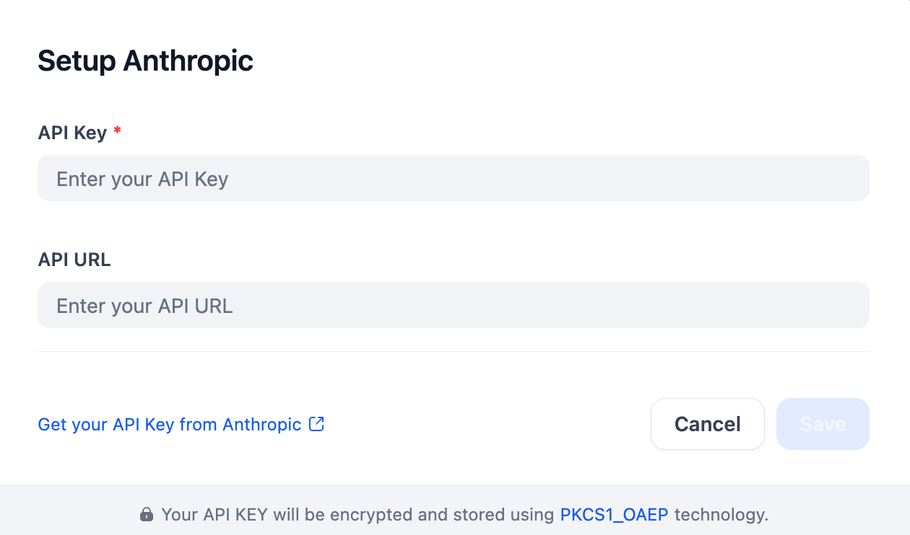

## Overview
Anthropic offers a suite of AI models designed for safety and helpfulness, excelling in natural language processing and generation tasks such as coding and creative writing. Using this plugin, developers can easily configure and access LLMs from the Claude family (Sonnet, Haiku, and Opus) by providing the necessary API credentials.

## Configure
You'll need your Anthropic API Key to configure this plugin. After obtaining it from Anthropic, enter it along with your API URL in the settings below. Save to activate.

## Prompt-Caching Options
Claude’s API allows you to mark specific parts of a request as *ephemeral*. The blocks are then cached on Anthropic’s side so future requests are cheaper and faster.  
This plugin exposes fine-grained switches so you control exactly **what** is cached.

| Parameter | Default | Description |
|-----------|---------|-------------|
| `prompt_caching_system_message` | `true` | Cache content wrapped in `<cache>…</cache>` inside the system prompt. |
| `prompt_caching_tool_definitions` | `true` | Adds `cache_control` to every tool definition sent in the `tools` array. |
| `prompt_caching_images` | `true` | Caches image blocks. |
| `prompt_caching_documents` | `true` | Caches PDF document blocks. |
| `prompt_caching_tool_results` | `true` | Caches `tool_use` / `tool_result` blocks. |
| `prompt_caching_message_flow` | `0` | If set to a positive integer *N*, any user or assistant text message longer than *N* words gets cached automatically. `0` disables this auto-caching. |

**Anthropic limit:** At most **4** blocks may include `cache_control` in a single request.  
The plugin enforces this by prioritising blocks in the following order:
1. Images / Documents  
2. System-message `<cache></cache>` blocks  
3. Large text messages (message-flow threshold)  
4. Tool definitions & tool results

If more than four candidates exist, lower-priority blocks have their `cache_control` removed automatically before the request is sent.
