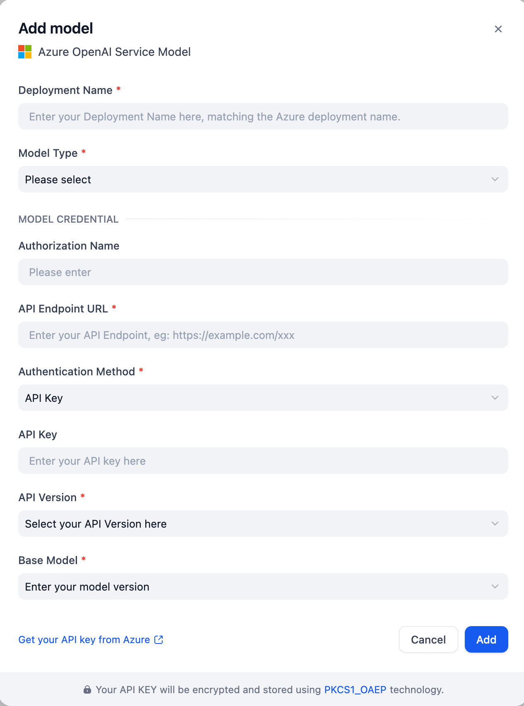

## Overview
Azure OpenAI Service is a cloud-based platform that provides access to advanced AI models developed by OpenAI, integrated with Microsoft's Azure infrastructure. This plugin allows users to leverage cutting-edge generative AI capabilities such as LLMs, text embedding, speech-to-text (STT), and text-to-speech (TTS) for various applications, ensuring security and compliance through Azure's robust framework.

## Configure
Once the plugin is installed, configure your Azure OpenAI Service Model by providing the Model Type, Deployment Name, API Endpoint URL, Authentication Method, and the Base Model. The API Version is optional when your endpoint already uses the Azure OpenAI `v1` path, for example `https://<resource>.openai.azure.com/openai/v1/`.

### Base Model Configuration

The Base Model field determines how the plugin routes requests and handles model parameters. You can choose from predefined base models (e.g., gpt-4o, gpt-4-turbo) or use the **Custom** option for unlisted Azure OpenAI model families.

#### When to Use Custom

Select **Custom** when:
- Your Azure OpenAI resource has a model family not yet available in the predefined list (e.g., gpt-6.1-sol, gpt-7, or other future model generations)
- You want to use a deployment without waiting for a plugin release that adds explicit support

When **Custom** is selected, you must provide:
1. **Custom Base Model** — the underlying model-family name (e.g., `gpt-6`, `gpt-5.5`) that identifies the model generation. This drives parameter routing and API selection (not the deployment name).
2. **Model Context Size** — the model's context window (default: 128,000 tokens). Adjust this to match your model's actual context limit.
3. **Upper Bound for Max Tokens** — the maximum output token limit for this model (default: 16,384 tokens). Set this to the model's maximum completion length.

The Custom option enables version-agnostic routing for new model generations: gpt-5+ models automatically use the Responses API or Chat Completions route as appropriate, and reasoning families (o-series, gpt-5+) have parameters mapped correctly without manual intervention.

#### Credential Validation

When you validate credentials, the plugin performs a test request to your Azure OpenAI resource. If validation fails, the error message will include a list of models actually available in your resource (e.g., "Available models in this resource: gpt-4o, gpt-6.1-sol, ..."). This advisory information helps you verify that your Base Model selection and Deployment Name match what your Azure resource serves.

### Web Search (Azure native)

This plugin supports Azure OpenAI native Web Search for models that use the Responses API path in this provider.

Available model parameters:
- **Enable Web Search** (`enable_web_search`): Enables `tools: [{"type": "web_search"}]`.
- **Web Search Country** (`web_search_user_country`): Optional ISO 3166-1 alpha-2 country code (for example, `US`, `JP`).
- **Allowed Domains** (`web_search_allowed_domains`): Optional allowlist of domains (comma/newline-separated).
- **Include Source Metadata** (`web_search_include_sources`): Optional opt-in flag to request `include=["web_search_call.action.sources"]`.

Notes:
- Web Search is controlled by Azure subscription settings and can be blocked by admins.
- Grounding with Bing terms, privacy, and pricing apply.
- If your endpoint/API version does not support Web Search for the selected model, Azure will return an API error.

### Authentication Methods

This plugin supports two authentication methods:

#### 1. API Key Authentication (Default)
- Select "API Key" as the authentication method
- Provide your Azure OpenAI API Key
- Find your API key in Azure Portal

#### 2. Microsoft Entra ID (Service Principal)
- Select "Microsoft Entra ID (Service Principal)" as the authentication method
- No API Key is required - uses Azure Active Directory for authentication
- Provide the following credentials from your Azure AD App Registration:
  - **Application (Client) ID**: Your Azure AD application client ID
  - **Directory (Tenant) ID**: Your Azure AD tenant ID
  - **Client Secret Value**: Your Azure AD application client secret value (not the Secret ID)
- Each user/workspace can have different credentials
- Enhanced security with centralized identity management
- Suitable for production environments and automated workflows

**Prerequisites:**
1. Create an App Registration in Azure AD (Azure Portal → Azure Active Directory → App registrations → New registration)
2. Generate a client secret for the application (Certificates & secrets → New client secret)
3. Copy the **Value** (not the Secret ID) when the secret is created
4. Assign the "Cognitive Services User" role to the Service Principal on your Azure AI Services resource:
   - Go to your Azure AI Services resource
   - Access Control (IAM) → Add role assignment
   - Select "Cognitive Services User" role
   - Assign to your App Registration
5. Wait up to 5 minutes for role assignment to propagate

**Note:** The credentials you enter are specific to your configuration and are not shared with other users.

**Reference:** [Configure Microsoft Entra ID for Azure OpenAI](https://learn.microsoft.com/azure/ai-foundry/foundry-models/how-to/configure-entra-id)

### Request Metadata (Optional)

This plugin supports an optional "Enable request metadata" credential that attaches Dify app information to Azure OpenAI requests as metadata, enabling filtering in the Azure OpenAI Usage Dashboard.

When enabled:
- Attaches `dify_app_id` and `dify_source` as metadata on both Chat Completions and Responses API routes
- Automatically sets `store=true` (required by Azure OpenAI API: metadata is only accepted when store is enabled)
- Requests and responses are persisted to Stored Completions on your Azure OpenAI resource

**Requirements:**
- API Version of `2024-10-01-preview` or newer, OR a versionless `/openai/v1` endpoint
- On older API versions, metadata is skipped rather than failing the request

**Default:** Disabled

**Data Storage:** Requests and responses are persisted on your Azure OpenAI resource with the same data-storage context as Azure OpenAI's standard logging. Data does not leave Azure and is not used to train foundation models.

**Reference:** [Azure OpenAI Data Privacy](https://learn.microsoft.com/en-us/azure/foundry/responsible-ai/openai/data-privacy)

