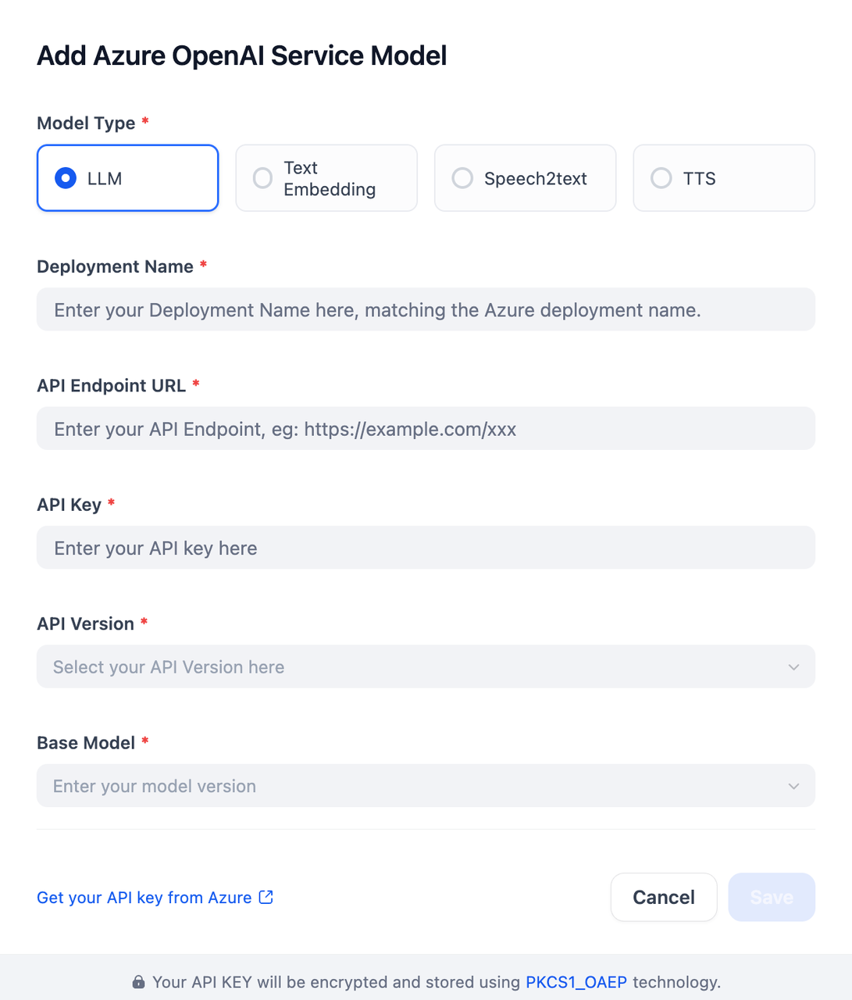

## Overview
Azure OpenAI Service is a cloud-based platform that provides access to advanced AI models developed by OpenAI, integrated with Microsoft's Azure infrastructure. This plugin allows users to leverage cutting-edge generative AI capabilities such as LLMs, text embedding, speech-to-text (STT), and text-to-speech (TTS) for various applications, ensuring security and compliance through Azure's robust framework.

## Configure
Once the plugin is installed, configure your Azure OpenAI Service Model by providing the Model Type, Deployment Name, API Endpoint URL, Authentication Method, the API Version, and the Base Model.

### Authentication Methods

This plugin supports two authentication methods:

#### 1. API Key Authentication (Default)
- Select "API Key" as the authentication method
- Provide your Azure OpenAI API Key
- Find your API key in Azure Portal

#### 2. Microsoft Entra ID (Service Principal)
- Select "Microsoft Entra ID (Service Principal)" as the authentication method
- No API Key is required - uses Azure Active Directory for authentication
- Provide the following credentials from your Azure AD App Registration:
  - **Application (Client) ID**: Your Azure AD application client ID
  - **Directory (Tenant) ID**: Your Azure AD tenant ID
  - **Client Secret Value**: Your Azure AD application client secret value (not the Secret ID)
- Each user/workspace can have different credentials
- Enhanced security with centralized identity management
- Suitable for production environments and automated workflows

**Prerequisites:**
1. Create an App Registration in Azure AD (Azure Portal → Azure Active Directory → App registrations → New registration)
2. Generate a client secret for the application (Certificates & secrets → New client secret)
3. Copy the **Value** (not the Secret ID) when the secret is created
4. Assign the "Cognitive Services User" role to the Service Principal on your Azure AI Services resource:
   - Go to your Azure AI Services resource
   - Access Control (IAM) → Add role assignment
   - Select "Cognitive Services User" role
   - Assign to your App Registration
5. Wait up to 5 minutes for role assignment to propagate

**Note:** The credentials you enter are specific to your configuration and are not shared with other users.

**Reference:** [Configure Microsoft Entra ID for Azure OpenAI](https://learn.microsoft.com/azure/ai-foundry/foundry-models/how-to/configure-entra-id)

