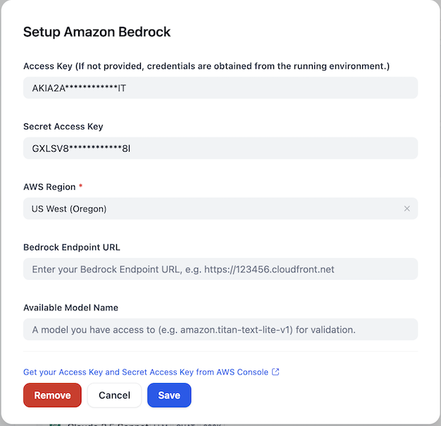

## Amazon Bedrock

**Author:** aws
**Type:** Model Provider

## Overview | 概述

The [Amazon Bedrock](https://aws.amazon.com/bedrock/) is a fully managed service that offers a choice of high-performing foundation models (FMs) from leading AI companies like AI21 Labs, Anthropic, Cohere, Meta, Stability AI, and Amazon with a single API. With Amazon Bedrock, you can easily experiment with and evaluate top FMs for your use case, privately customize them with your data using techniques such as Retrieval Augmented Generation (RAG) and Fine-tuning, and build agents that execute tasks using your enterprise systems and data sources.

Amazon Bedrock supports various model types:
- LLM (Large Language Models)
- Text Embedding
- Rerank

[Amazon Bedrock](https://aws.amazon.com/bedrock/) 是一项完全托管的服务，通过单一 API 提供来自 AI21 Labs、Anthropic、Cohere、Meta、Stability AI 和亚马逊等领先 AI 公司的高性能基础模型 (FMs)。使用 Amazon Bedrock，您可以轻松地为您的用例试验和评估顶级基础模型，使用检索增强生成 (RAG) 和微调等技术私密地用您的数据进行定制，并构建能够使用您的企业系统和数据源执行任务的代理。

Amazon Bedrock 支持多种模型类型：
- LLM（大型语言模型）
- 文本嵌入
- 重排序

## Configure | 配置

After installing the plugin, configure the Amazon Bedrock credentials within the Model Provider settings. You'll need to provide your AWS Access Key, Secret Access Key, and select the appropriate AWS Region. You can also specify a Bedrock Endpoint URL if needed. For validation purposes, you can provide an available model name that you have access to (e.g., amazon.titan-text-lite-v1).

安装插件后，在模型提供商设置中配置 Amazon Bedrock 凭证。您需要提供 AWS Access Key、Secret Access Key 并选择适当的 AWS 区域。如果需要，您还可以指定 Bedrock 端点 URL。为了进行验证，您可以提供一个您有权访问的可用模型名称（例如：amazon.titan-text-lite-v1）。

### 临时凭证支持

插件现在支持来自 SSO/SAML 认证的 AWS 临时凭证（例如 `aws sso login` 或 `saml2aws login`）：

- **Access Key 认证**：使用 Access Key 认证时，您可以选择性地提供 AWS Session Token 用于临时凭证。该字段为可选项，仅在使用 SSO/STS 获得的临时凭证时需要填写。
- **IAM Role 认证**：使用 IAM Role 认证时，插件会自动从 `~/.aws/credentials` 文件读取凭证。当令牌过期时，插件会自动检测并重试，从磁盘刷新凭证，使凭证轮换（如 `saml2aws login` 或 `aws sso login` 产生的临时令牌）透明地生效。

此功能适用于需要临时凭证的用户场景，无需额外配置即可自动处理令牌过期和刷新。

## Claude 5 系列模型（Opus 5 / Sonnet 5 / Fable 5）

“Anthropic Claude 5” 条目提供 Claude Opus 5（`anthropic.claude-opus-5`）、Claude Sonnet 5（`anthropic.claude-sonnet-5`）与 Claude Fable 5（`anthropic.claude-fable-5`）。与之前的 Claude 世代相比：

- **仅支持推理配置文件调用。** 不支持裸模型 ID 的按需调用。各模型的地理配置文件覆盖不同：Opus 5 / Sonnet 5 提供 `us.`（同时服务加拿大区域）、`eu.`、`au.` 配置文件；Fable 5 仅提供 `us.`。`global.` 可从几乎所有商业区域调用。插件根据“跨区域推理”选项自动解析；所在区域没有地理配置文件时请选择 `global`。
- **自适应思考默认开启。** 思考深度由 Effort 参数（`low`/`medium`/`high`/`xhigh`/`max`）控制，取代思考预算。这些模型不支持调节采样参数（temperature / top_p / top_k），因此不再暴露。
- **拒答与回落。** 请求可能被安全分类器拒绝（`stop_reason: refusal`，Fable 5 概率明显更高）。默认开启“拒答回落”时，插件会自动用 Claude 4.8 Opus 重试同一请求；流式输出已产生内容后发生的拒绝无法回落，将直接报错。
- **Fable 5 前置条件：数据保留 opt-in。** 调用 Fable 5 前，AWS 账户必须通过 Bedrock Data Retention API 将数据保留模式设置为 `provider_data_share`（上线初期无控制台入口）。详见 [Fable 5 模型卡](https://docs.aws.amazon.com/bedrock/latest/userguide/model-card-anthropic-claude-fable-5.html)。插件不会修改账户设置。
- **价格说明。** 展示价格为 Global 跨区域费率（Opus 5 每百万 token $5/$25，Sonnet 5 $3/$15，Fable 5 $10/$50）。Geo/区域内调用约贵 10%。Prompt 缓存读写费率无法体现在 Dify 费用统计中，请以 AWS 账单为准。

## Issue Feedback | 问题反馈

For more detailed information, please refer to [aws-sample/dify-aws-tool](https://github.com/aws-samples/dify-aws-tool/), which contains multiple workflows for reference.

更多详细信息可以参考 [aws-sample/dify-aws-tool](https://github.com/aws-samples/dify-aws-tool/)，其中包含多个 workflow 供参考。

If you have issues that need feedback, feel free to raise questions or look for answers in the [Issue](https://github.com/aws-samples/dify-aws-tool/issues) section.

如果存在问题需要反馈，欢迎到 [Issue](https://github.com/aws-samples/dify-aws-tool/issues) 去提出问题或者寻找答案。
