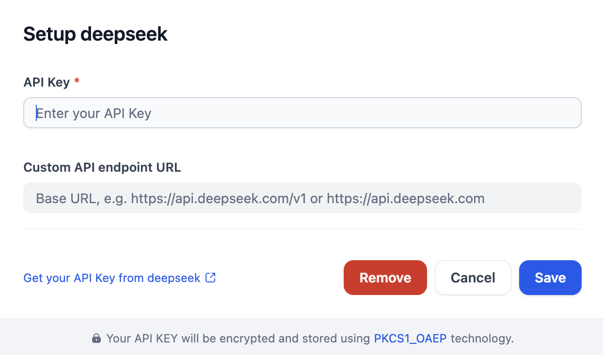

# Overview
DeepSeek provides advanced AI capabilities for chats and completions. This plugin enables developers to integrate DeepSeek's current v4 models, including `deepseek-v4-flash` and `deepseek-v4-pro`, while retaining compatibility with legacy aliases such as `deepseek-chat` and `deepseek-reasoner`.

# Configure
After installation, you need to get API keys from [Deepseek](https://platform.deepseek.com/api_keys) and setup in Settings -> Model Provider.

