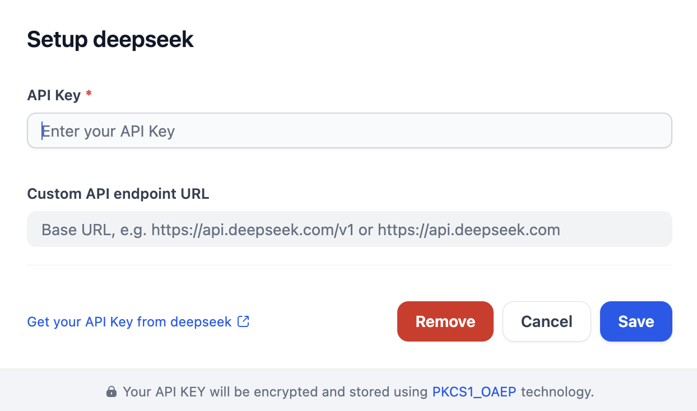

# Overview

This plugin integrates the current official DeepSeek models, `deepseek-v4-flash` and `deepseek-v4-pro`.

These stable API IDs automatically use the latest model versions.

DeepSeek pricing varies by cache status and time window, so refer to the [official pricing page](https://api-docs.deepseek.com/quick_start/pricing/) for current rates.

# Configure

Get an API key from [DeepSeek](https://platform.deepseek.com/api_keys), then configure it under Settings → Model Provider.

