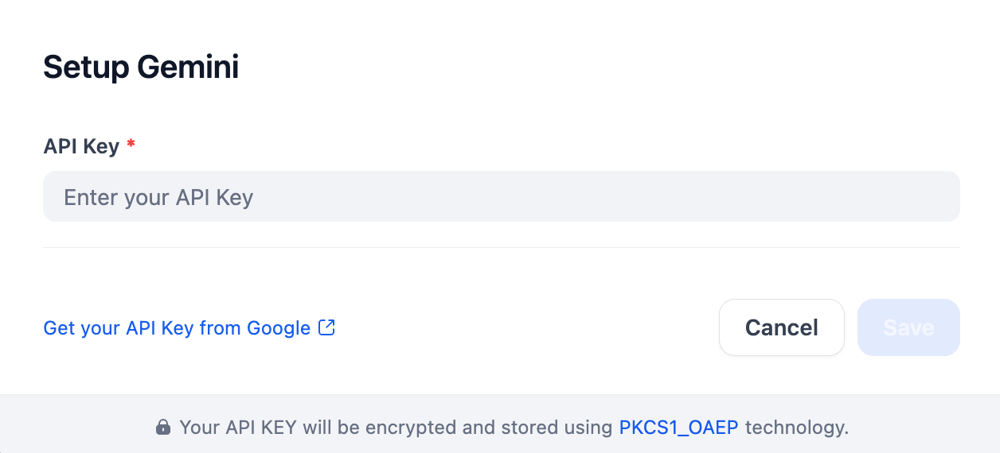

# Overview

- [Configure](#configure)

Gemini is a family of multimodal AI models from Google, designed to process and generate various types of data, including text, images, audio, and video. This plugin provides access to Gemini models via a single API key, enabling developers to build versatile multimodal AI applications.

## Configure
After installing the Gemini plugin, configure it with your API key, which you can get from Google. Enter the key in the Model Provider settings and save.

If you use `url` mode for `MULTIMODAL_SEND_FORMAT` in gemeni and other vision models meantime, you can set `Files URL` to gain better performance.

`Enable request metadata` is optional and disabled by default. Turning it on attaches `dify_app_id` and `dify_source` to each Gemini request as `labels` on `GenerateContentConfig`, so usage can be attributed to a specific Dify app in Cloud Billing. The opt-in applies to the `generate_content` route only; the Interactions API does not surface labels in its billing breakdown and is intentionally left untouched. The Dify session lookup is best-effort: if the session context is not initialized, no labels are attached and the request is sent unchanged.

