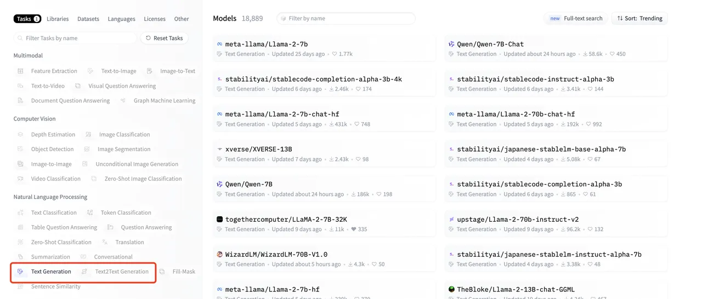
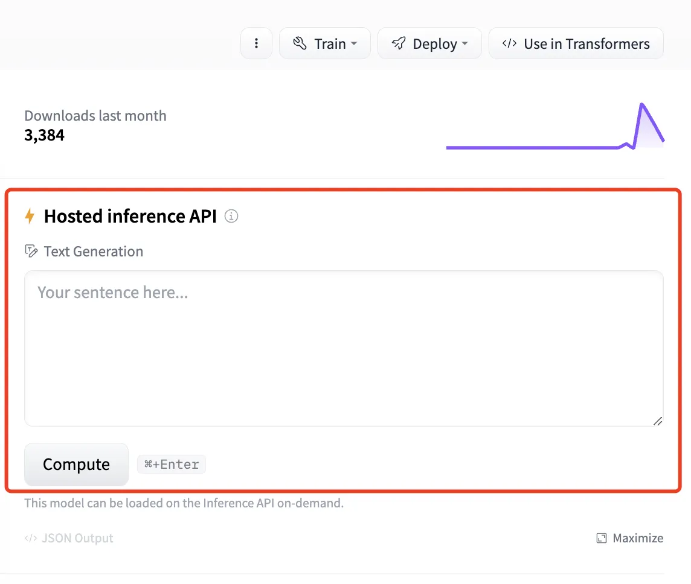
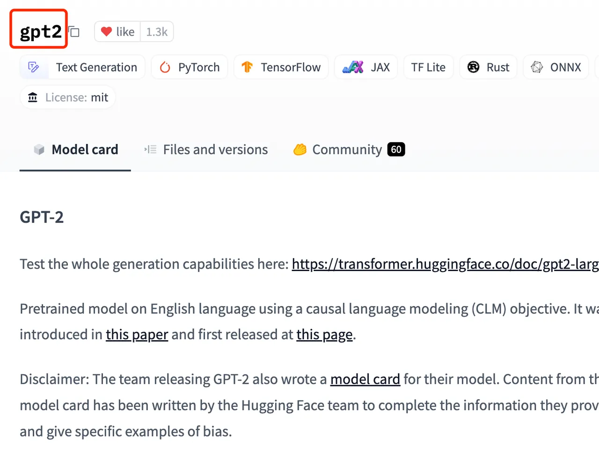
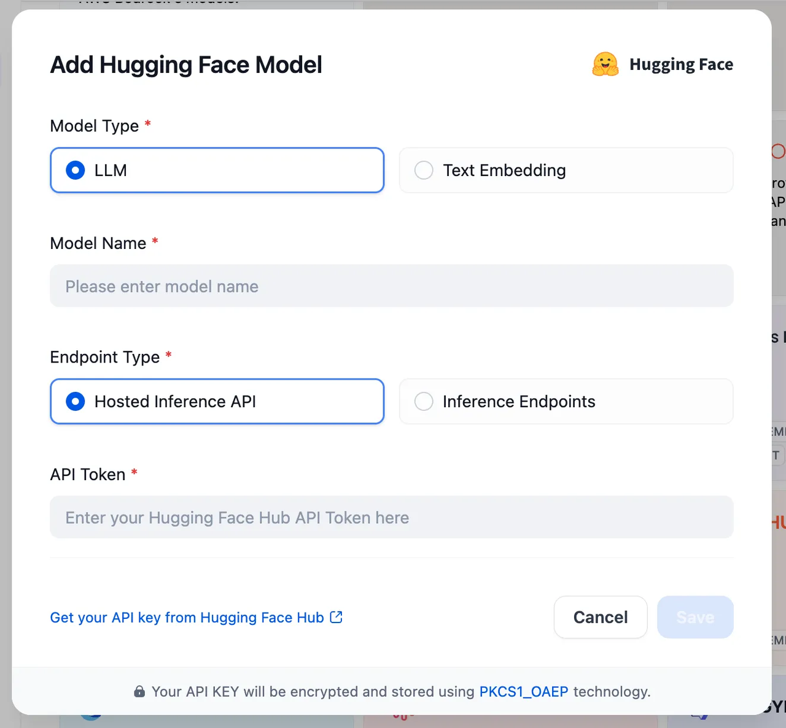
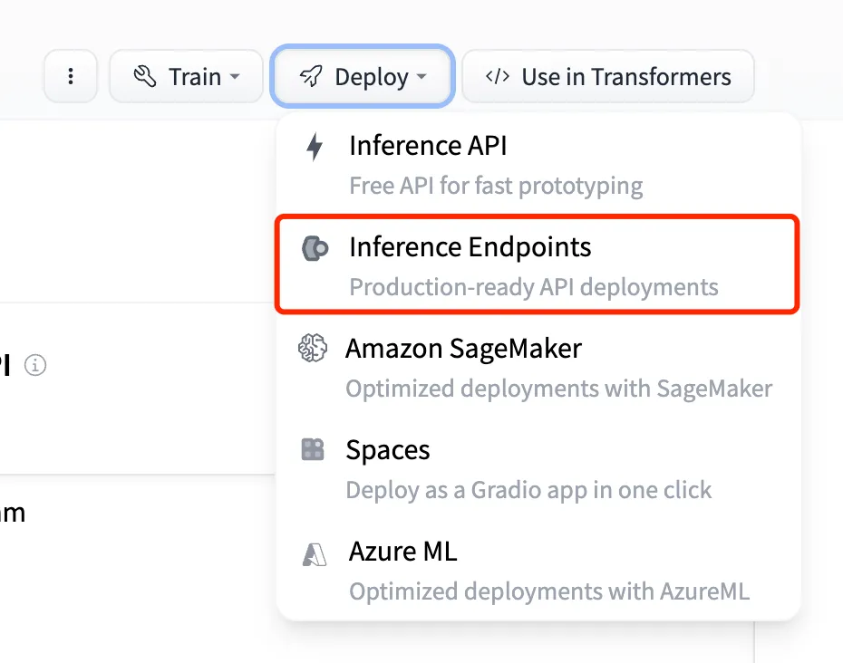
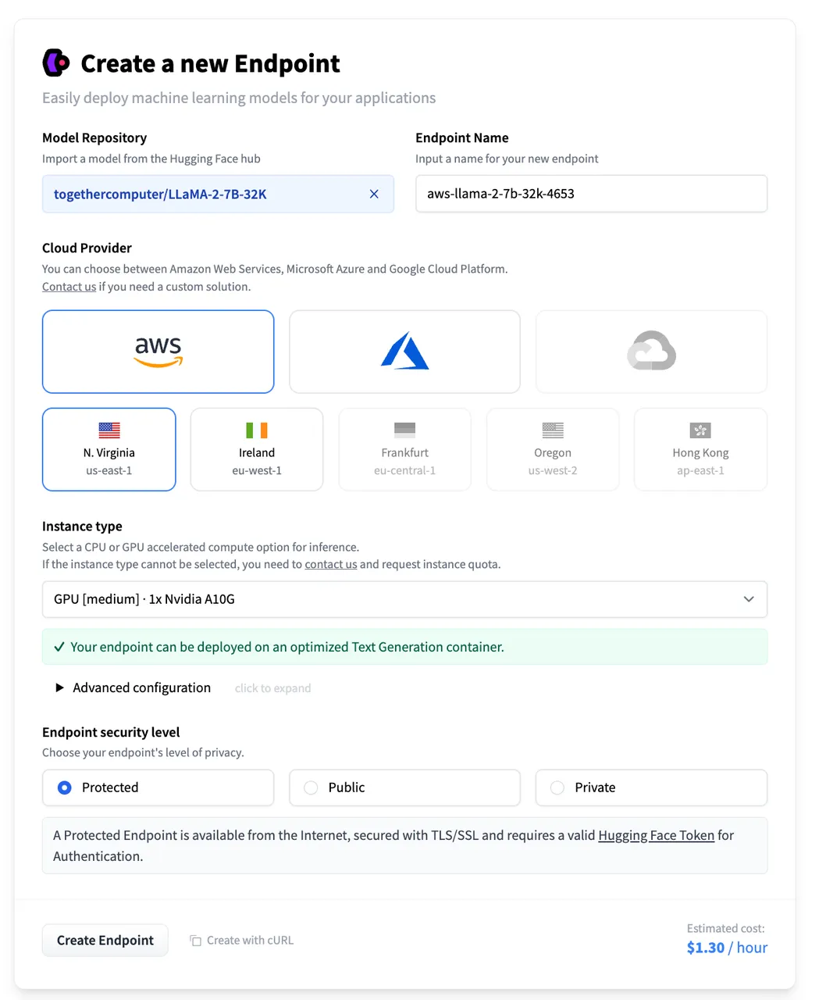
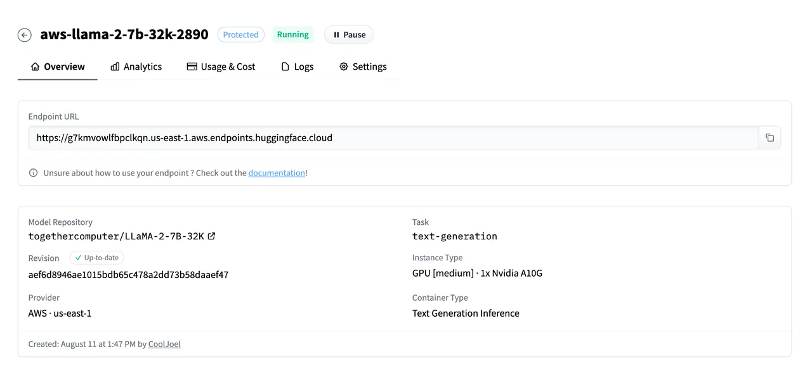
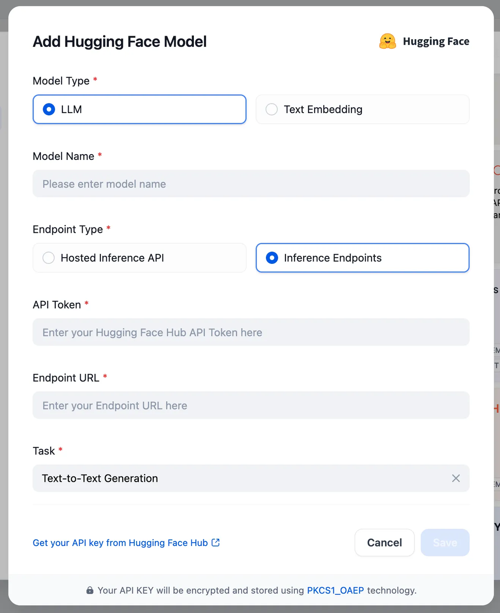
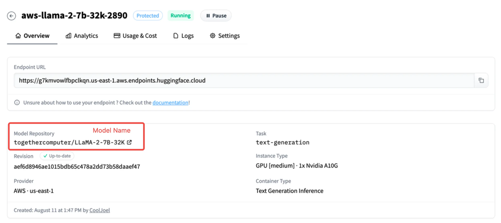

## Overview

Hugging Face is a leading open-source platform and community dedicated to advancing artificial intelligence (AI) and machine learning (ML), particularly in the field of natural language processing (NLP). Founded in 2016, the company initially aimed to create an interactive chatbot but quickly pivoted to focus on providing powerful tools and resources for AI development. Today, it is widely recognized as a central hub for researchers, developers, and enthusiasts to collaborate on machine learning projects.

## Configuration

Dify supports Text-Generation and Embeddings for Hugging Face. Below are the corresponding Hugging Face model types:

* Text-Generation：[text-generation](https://huggingface.co/models?pipeline_tag=text-generation&sort=trending)，[text2text-generation](https://huggingface.co/models?pipeline_tag=text2text-generation&sort=trending)
* Embeddings：[feature-extraction](https://huggingface.co/models?pipeline_tag=feature-extraction&sort=trending)

The specific steps are as follows:

1. You need a Hugging Face account ([registered address](https://huggingface.co/join)).
2. Set the API key of Hugging Face ([obtain address](https://huggingface.co/settings/tokens)).
3. Select a model to enter the [Hugging Face model list page](https://huggingface.co/models?pipeline_tag=text-generation&sort=trending).

Dify supports accessing models on Hugging Face in two ways:

1. Hosted Inference API. This method uses the model officially deployed by Hugging Face. No fee is required. But the downside is that only a small number of models support this approach.
2. Inference Endpoint. This method uses resources such as AWS accessed by the Hugging Face to deploy the model and requires payment.

## Models that access the Hosted Inference API

### 1. Select a model

Hosted inference API is supported only when there is an area containing Hosted inference API on the right side of the model details page. As shown in the figure below:

On the model details page, you can get the name of the model.

### 2. Using access models in Dify

Select Hosted Inference API for Endpoint Type in `Settings > Model Provider > Hugging Face > Model Type`. As shown below:

API Token is the API Key set at the beginning of the article. The model name is the model name obtained in the previous step.

## Method 2: Inference Endpoint

### 1. Select the model to deploy

Inference Endpoint is only supported for models with the Inference Endpoints option under the Deploy button on the right side of the model details page. As shown below:

### 2. Deployment model

Click the Deploy button for the model and select the Inference Endpoint option. If you have not bound a bank card before, you will need to bind the card. Just follow the process. After binding the card, the following interface will appear: modify the configuration according to the requirements, and click Create Endpoint in the lower left corner to create an Inference Endpoint.

After the model is deployed, you can see the Endpoint URL.

### 3. Using access models in Dify

Select Inference Endpoints for Endpoint Type in `Settings > Model Provider > Hugging face > Model Type`. As shown below:

The API Token is the API Key set at the beginning of the article. The name of the Text-Generation model can be arbitrary, but the name of the Embeddings model needs to be consistent with Hugging Face. The Endpoint URL is the Endpoint URL obtained after the successful deployment of the model in the previous step.

> Note: The "User name / Organization Name" for Embeddings needs to be filled in according to your deployment method on Hugging Face's [Inference Endpoints](https://huggingface.co/docs/inference-endpoints/guides/access), with either the ''[User name](https://huggingface.co/settings/account)'' or the "[Organization Name](https://ui.endpoints.huggingface.co/)".
