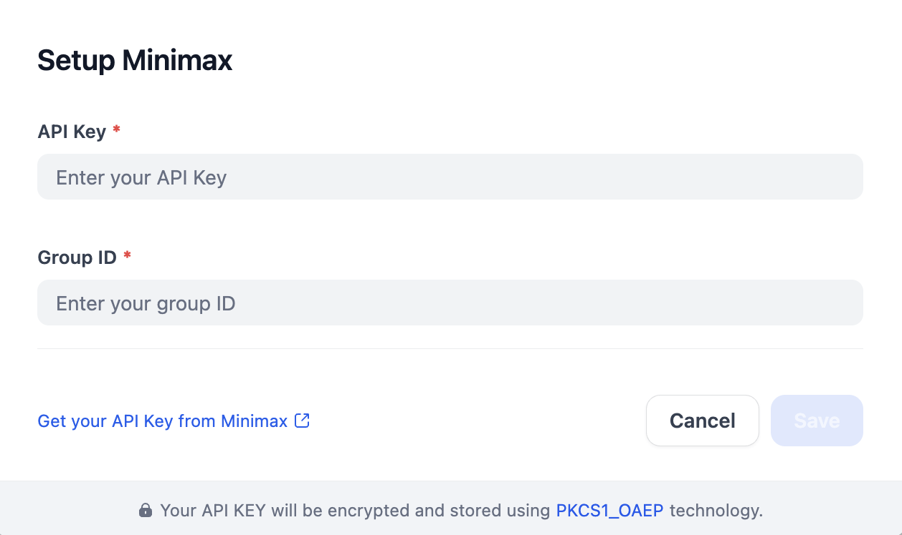

# Overview
MiniMax is an advanced AI platform that provides a suite of powerful models designed for various applications, including LLMs. 

# Configure
1. Install Minimax from Dify Marketplace.
2. Create a Minimax account and [get API keys](https://platform.minimaxi.com/user-center/basic-information/interface-key).
3. Fill in the configurations for Minimax in Settings -> Model Provider.

## Request metadata

`Enable request metadata` is optional and disabled by default. Turning it on attaches `dify_app_id` and `dify_source` to each MiniMax request as keys in the request's `metadata` field, so usage can be attributed to a specific Dify app. The MiniMax LLM uses an Anthropic-compatible endpoint, and the Anthropic API silently ignores unknown metadata keys, so this is safe whether or not the upstream service consumes the values. Any caller-supplied `metadata` keys (e.g. `user_id`) are preserved alongside the Dify keys; Dify keys win on collision. The Dify session lookup is best-effort: if the session context is not initialized, no Dify keys are attached and the request's `metadata` field is left unchanged.
