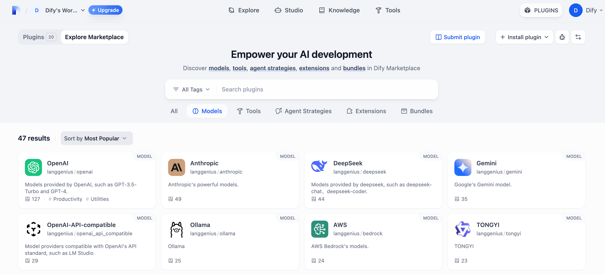
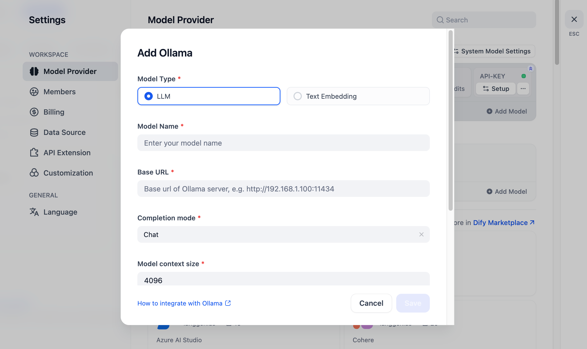
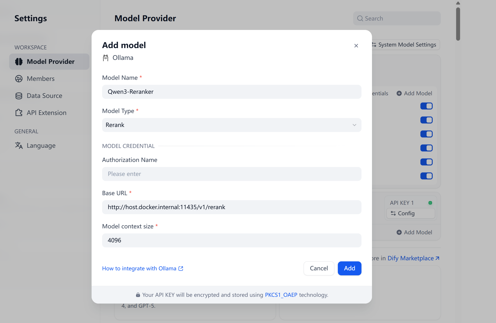

## Overview

Ollama is a cross-platform inference framework client (MacOS, Windows, Linux) designed for seamless deployment of large language models (LLMs) such as Llama 2, Mistral, Llava, and more. With its one-click setup, Ollama enables local execution of LLMs, providing enhanced data privacy and security by keeping your data on your own machine.

Dify supports integrating LLM and Text Embedding capabilities of large language models deployed with Ollama.

## Configure

#### 1. Download Ollama
Visit [Ollama download page](https://ollama.com/download) to download the Ollama client for your system.

#### 2. Run Ollama and Chat with Llava

````
ollama run llama3.2
````

After successful launch, Ollama starts an API service on local port 11434, which can be accessed at `http://localhost:11434`.

For other models, visit [Ollama Models](https://ollama.com/library) for more details.

#### 3. Install Ollama Plugin
Go to the Dify marketplace and search the Ollama to download it.



#### 4. Integrate Ollama in Dify

In `Settings > Model Providers > Ollama`, fill in:



- Model Name：`llama3.2`
- Base URL: `http://<your-ollama-endpoint-domain>:11434`
- Enter the base URL where the Ollama service is accessible.
- If Dify is deployed using Docker, consider using the local network IP address, e.g., `http://192.168.1.100:11434` or `http://host.docker.internal:11434` to access the service.
- For local source code deployment, use `http://localhost:11434`.
- Model Type: `Chat`
- Model Context Length: `4096`
- The maximum context length of the model. If unsure, use the default value of 4096.
- Maximum Token Limit: `4096`
- The maximum number of tokens returned by the model. If there are no specific requirements for the model, this can be consistent with the model context length.
- Support for Vision: `Yes`
- Check this option if the model supports image understanding (multimodal), like `llava`.

Click "Save" to use the model in the application after verifying that there are no errors.

The integration method for Embedding models is similar to LLM, just change the model type to Text Embedding.

For more detail, please check [Dify's official document](https://docs.dify.ai/en/use-dify/workspace/model-providers#local-ollama).

#### 5. Integrate Ollama Rerank in Dify
Hint: ollama officially does not support rerank models, please try locally deploying tools like vllm, llama.cpp, tei, xinference, etc., and fill in the complete URL ending with "rerank". Deployment reference [llama.cpp deployment tutorial for Qwen3-Reranker](https://github.com/AuditAIH/rerank_for_dify)

In `Settings > Model Providers > Ollama`, fill in:



- Model Name: `Qwen3-Reranker`
- Base URL: `http://<your-ollama-endpoint-domain>:11434`
- The plugin appends `/api/rerank` if the URL doesn't end with `/rerank`. For other services like `llama.cpp`, provide the full endpoint URL, e.g., `http://host.docker.internal:11435/v1/rerank`.
- If Dify is deployed using Docker, consider using a local network IP address, e.g., `http://192.168.1.100:11434` or `http://172.17.0.1:11434` or `http://host.docker.internal:11434` to access the service.
- 
- Model Type: `Rerank`
- Model Context Length: `4096`

Click "Add" to use the model in the application after verifying that there are no errors.
