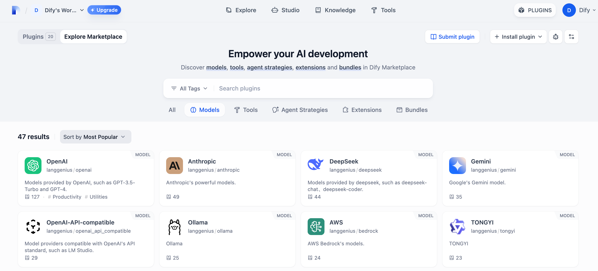
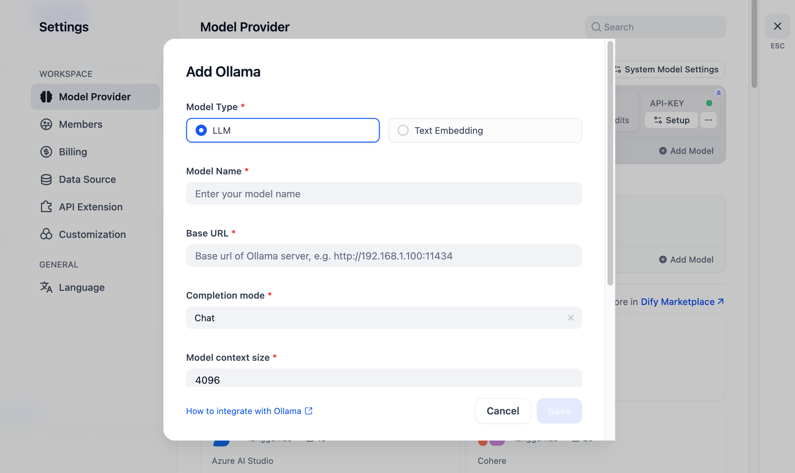
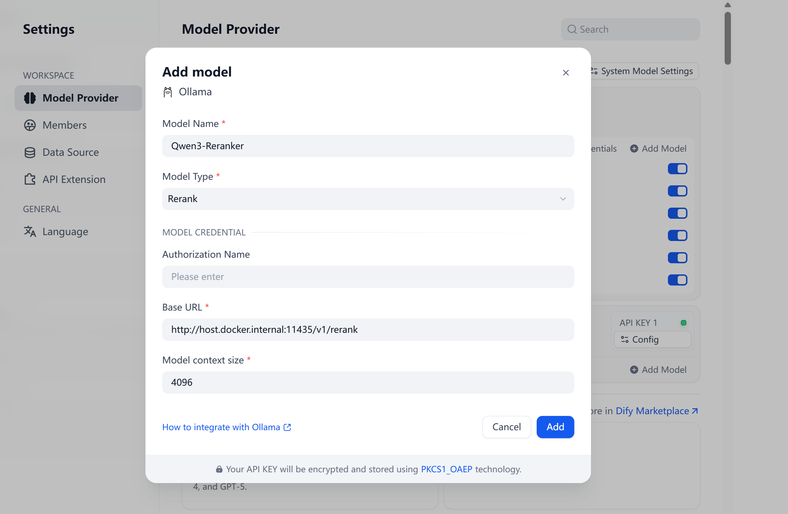

## Overview

Ollama runs open models locally on macOS, Windows, and Linux, and also exposes the same API for Ollama cloud models. This Dify plugin integrates Ollama chat/completion models, vision-capable models, text embeddings, tool calling, streamed responses, thinking output, and Ollama cloud web search/fetch tools.

Use the Ollama host root as the Base URL. For a local server, use `http://localhost:11434` or another reachable host root. For Ollama cloud models, use `https://ollama.com` and provide an Ollama API key. Do not include `/api` in the Base URL because the plugin appends `/api/chat`, `/api/generate`, and `/api/embed`.

## Capabilities

| Capability | Support | Notes |
| --- | --- | --- |
| Streaming | Yes | Ollama streams chat and generate responses as newline-delimited JSON. Dify receives incremental content, thinking output, and streamed tool calls. |
| Thinking | Yes | Enable `Think` for boolean thinking models. Use `Think Level` with `low`, `medium`, or `high` for GPT-OSS models. |
| Vision | Yes | Enable `Vision support` for multimodal models such as `gemma3` or other Ollama vision models. Images are sent as base64 through Ollama's `images` array. |
| Embeddings | Yes | Use model type `Text Embedding`. The plugin calls `/api/embed` and sends batched input with `truncate: true`. |
| Tool calling | Yes | Enable `Function call support` for tool-capable chat models. The plugin supports single, parallel, multi-turn, and streamed tool calls through Dify agents. |
| Web search | Yes | Configure the `Ollama Web` tool provider with an Ollama API key, then add `web_search` and `web_fetch` to an agent. These use Ollama cloud endpoints, not the local Ollama server. |
| Rerank | Compatible endpoint | Ollama does not provide a native rerank endpoint. Use an OpenAI-compatible rerank service and configure its full rerank URL. |

## Configure Ollama Models

#### 1. Install Ollama

Download Ollama from [ollama.com/download](https://ollama.com/download).

#### 2. Run a Model

Pull or run the model you want to use:

```bash
ollama run gemma3
ollama pull qwen3
ollama pull embeddinggemma
```

After startup, the local API is available at `http://localhost:11434`.

#### 3. Install the Plugin

In Dify, go to the Marketplace and install the Ollama plugin.



#### 4. Add an LLM Model

Go to `Settings > Model Providers > Ollama` and add a model.



- Model Name: for example `gemma3`, `qwen3`, `deepseek-r1`, or `gpt-oss`
- Base URL: `http://<your-ollama-host>:11434` for local Ollama, or `https://ollama.com` for Ollama cloud
- API Key: optional for local deployments; required for Ollama cloud
- Model Type: `Chat` for tool calling, vision, and multi-turn chat
- Model Context Length: match the model context window
- Upper bound for max tokens: the maximum `num_predict` value Dify should allow
- Vision support: choose `Yes` only for vision-capable models
- Function call support: choose `Yes` only for tool-capable models

For Docker deployments, use a host address reachable from the Dify container, such as `http://host.docker.internal:11434` or a LAN IP address.

#### 5. Use Thinking

In model parameters:

- Set `Think` to enable or disable Ollama's `think` field for models that accept booleans.
- Set `Think Level` to `low`, `medium`, or `high` for GPT-OSS models. When set, it overrides `Think`.

Thinking output is preserved in Dify responses with `<think>...</think>` so it can be displayed, hidden, or passed back in tool loops.

#### 6. Use Vision

Use a vision model and set `Vision support` to `Yes`. Dify image inputs are sent to Ollama in the message `images` array. The Ollama REST API expects base64 image data.

#### 7. Use Tool Calling

Use a tool-capable chat model and set `Function call support` to `Yes`. Dify will pass available tools to Ollama, execute returned tool calls, and send tool results back with Ollama's `tool_name` message field.

Streaming tool calls are supported. The plugin accumulates streamed `thinking`, `content`, and `tool_calls` so the next agent turn can continue the tool loop.

## Configure Embeddings

Add a model with Model Type `Text Embedding`.

Recommended Ollama embedding models include:

- `embeddinggemma`
- `qwen3-embedding`
- `all-minilm`

The plugin sends arrays of text to `/api/embed`, which returns L2-normalized vectors.

## Configure Ollama Web Search

Ollama web search and web fetch are cloud APIs. They require an Ollama account and API key.

1. Create an API key at [ollama.com/settings/keys](https://ollama.com/settings/keys).
2. In Dify, configure the `Ollama Web` tool provider with that key.
3. Add the `web_search` and `web_fetch` tools to an agent.
4. Use an Ollama tool-capable model with `Function call support` enabled so the model can call those tools.

`web_search` accepts `query` and `max_results` from 1 to 10. `web_fetch` accepts a single `url`.

## Configure Rerank

Ollama does not currently provide a native rerank model endpoint. To use rerank in this plugin, deploy a compatible rerank service such as `llama.cpp`, `vLLM`, `TEI`, or Xinference and configure the full rerank endpoint URL.



- Model Name: for example `Qwen3-Reranker`
- Base URL: either an Ollama-style host root or a full rerank endpoint URL
- Model Type: `Rerank`
- Model Context Length: match the rerank model

If the URL does not end with `/rerank`, the plugin appends `/api/rerank`.

## References

- [Ollama documentation](https://docs.ollama.com/)
- [Ollama API reference](https://docs.ollama.com/api)
- [Ollama model library](https://ollama.com/library)
- [Dify local Ollama guide](https://docs.dify.ai/en/use-dify/workspace/model-providers#local-ollama)
