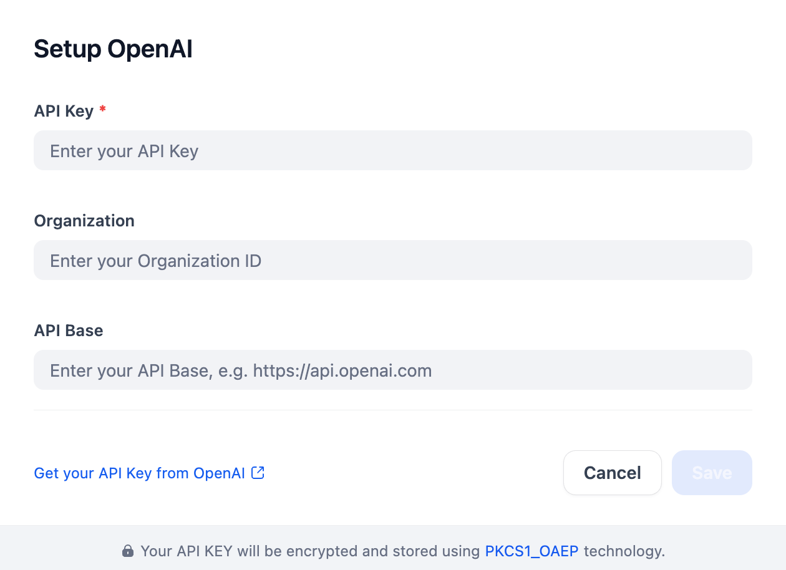

# OpenAI

> [!IMPORTANT]
> Version 1.0 is a major rewrite of the plugin runtime, model catalog, and test suite.
> It replaces the underlying request and streaming logic, removes deprecated model configurations, and adds focused coverage for reasoning, tool calls, multimodal inputs, and interleaved streams.

This plugin connects Dify to OpenAI language, embedding, moderation, speech-to-text, and text-to-speech models.

## What changed in 1.0

- The LLM integration was rewritten around the official OpenAI Python SDK.
- The Responses API is now the default for supported language models.
- Chat Completions remains available for compatible endpoints and audio-capable chat models.
- Stateless reasoning replay preserves every OpenAI output item, including encrypted reasoning items and assistant phase metadata.
- Reasoning summaries, refusals, parallel function calls, terminal states, usage, and stream cancellation now have explicit handling.
- The model catalog was checked against OpenAI's model and deprecation documentation.
- Deprecated and unavailable model entries were removed, while missing current entries were added.
- The deprecated `gpt-4o`, `gpt-audio-mini`, and `gpt-4o-mini-tts` aliases were removed while their still-current dated snapshots remain available.
- The tests were reorganized into parameterized pytest suites with request, response, streaming, and non-LLM boundary coverage.

## Capabilities

- Text and vision generation.
- Structured outputs and function calling.
- Reasoning effort, summaries, modes, and context controls where supported by the selected model.
- URL and base64 image or document inputs through the Responses API.
- Audio input through supported Chat Completions models.
- Text embeddings.
- Text moderation through `omni-moderation-latest`.
- Speech transcription and text-to-speech streaming.

## Configure

Install the plugin and open the OpenAI provider in Dify's Model Provider settings.

Add an OpenAI API key and, when needed, an Organization ID or custom API base URL.

The API base may be entered with or without the trailing `/v1`.

Responses is the recommended protocol and the default for official models that support it.

Choose Chat Completions only for a compatible endpoint or a model whose documented API surface requires it.



## Reasoning state

The plugin sends `store=false` by default and requests encrypted reasoning content when it uses the Responses API.

Complete response output items are stored in the assistant message's opaque payload and replayed in original order on the next turn.

Reasoning summaries are user-visible only when `reasoning_summary` is enabled for a supported model.

OpenAI may require organization verification before returning reasoning summaries.

## Development

Install the locked environment and run the checks from this directory.

```bash
uv sync --locked
uv run pytest
uv run ruff check .
uv run ruff format --check .
```

### Live OpenAI API tests

The tests in `tests/live` send billable requests to the real OpenAI API and are never enabled merely because a key exists.

Normal `uv run pytest` runs collect these tests but skip every one of them unless `--live-openai` is passed explicitly.

When `--live-openai` is passed, the live tests also skip dynamically if `OPENAI_API_KEY` is missing, empty, or whitespace-only in both `.env` and the process environment.

Create a local `.env` in this plugin directory for test credentials.

```dotenv
OPENAI_API_KEY=your-api-key
# OPENAI_ORGANIZATION=org-id
# OPENAI_BASE_URL=https://api.openai.com/v1
```

The test harness reads only those OpenAI variables from `.env`, and explicit process environment variables take precedence.

The repository ignores `.env`; never commit it or include its values in test output.

Run the complete matrix manually.

```bash
uv run pytest tests/live --live-openai
```

The complete matrix sends one logical request for every configured model plus focused boundary requests, and the tool replay scenario sends a second request.

The OpenAI SDK may retry transient failures, so actual HTTP attempts can exceed the logical request count.

It should be run serially because parallel execution increases both spend and rate-limit pressure.

Run one model while developing.

```bash
uv run pytest tests/live --live-openai --live-model gpt-4o-mini
```

Repeat `--live-model` to select several models, and add pytest `-k` expressions to select a single scenario.

The cheapest LLM smoke command sends one short request.

```bash
uv run pytest tests/live/test_llm.py --live-openai \
  --live-model gpt-4o-mini -k presented
```

The presentation matrix gives every LLM in `models/llm/_position.yaml` one minimal request, using streaming whenever the model contract supports it.

Embedding, moderation, speech-to-text, and text-to-speech tests are derived from every YAML configuration in their respective model directories.

Representative models separately cover Responses and Chat Completions, streaming and non-streaming, structured output, reasoning summaries, streamed function calls, encrypted reasoning replay, stop and incomplete states, and image, document, and audio inputs.

Exact event interleavings, fragmented tool arguments, empty reasoning blocks, failures, cancellation, and malformed responses remain in deterministic unit tests because a live service cannot reliably reproduce those event orders.

Cases blocked only by OpenAI organization verification are reported as skips; all other API errors fail the run.

Reasoning summary coverage may also be skipped when OpenAI accepts the request but withholds the summary from an unverified organization.

## Official references

- [Model catalog](https://developers.openai.com/api/docs/models)
- [Model guidance](https://developers.openai.com/api/docs/guides/latest-model)
- [Responses API migration](https://developers.openai.com/api/docs/guides/migrate-to-responses)
- [Reasoning](https://developers.openai.com/api/docs/guides/reasoning)
- [Function calling](https://developers.openai.com/api/docs/guides/function-calling)
- [Embeddings](https://developers.openai.com/api/docs/guides/embeddings)
- [Speech to text](https://developers.openai.com/api/docs/guides/speech-to-text)
- [Text to speech](https://developers.openai.com/api/docs/guides/text-to-speech)
- [Deprecations](https://developers.openai.com/api/docs/deprecations)
- [Pricing](https://developers.openai.com/api/docs/pricing)
