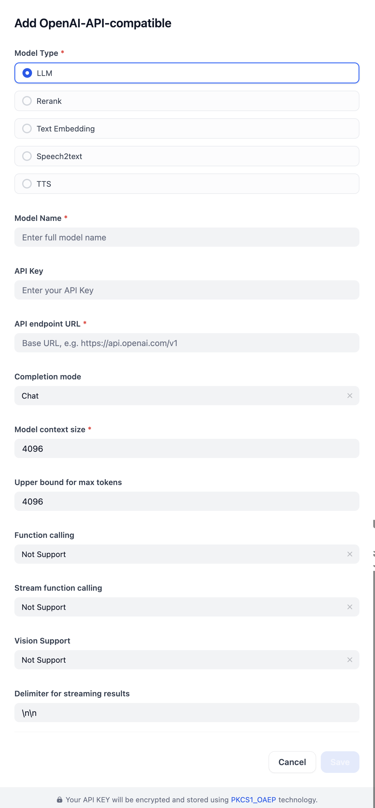

## Overview

This plugin provides access to models that are OpenAI-compatible, including LLMs, reranking, text embedding, speech-to-text (STT), and text-to-speech(TTS) models. Developers can easily add models by providing configuration parameters such as the model name and API key.

## Configure

Configure the OpenAI-API-compatible model by providing its core details (Type, Name, API Key, URL) and adjusting further options like completion, context, and token limits, as well as streaming and vision settings. Save when done.

### TokenLab example

TokenLab can be configured through this plugin with the OpenAI-compatible API surface:

| Field | Value |
| --- | --- |
| Type | `LLM` |
| Model Name | `gpt-5.4-mini` |
| API Key | Your TokenLab API key |
| API Base URL | `https://api.tokenlab.sh/v1` |
| Completion mode | `Chat` |

Use `https://api.tokenlab.sh/v1` for LLM/chat models. For non-LLM model types where this plugin appends the API version internally, such as text embedding, rerank, STT, and TTS, use `https://api.tokenlab.sh` instead to avoid a duplicated `/v1/v1` path.

Other TokenLab chat models can be added the same way, for example `gpt-5.5`, `claude-opus-4-8`, `claude-sonnet-5`, `gemini-3.5-flash`, `grok-4.3`, `qwen3.7-max`, `deepseek-v4-pro`, `deepseek-v4-flash`, `glm-5.2`, `minimax-m3`, and `kimi-k2.7-code`.

TokenLab also provides native endpoint families such as Responses, Anthropic Messages, and Gemini-compatible APIs. This OpenAI-API-compatible plugin uses TokenLab's `/v1` OpenAI-compatible endpoint.
