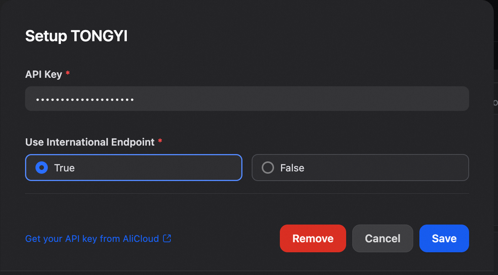

# Overview
Tongyi Qwen, developed by Alibaba Cloud, is a sophisticated series of LLMs. It includes multiple variants, such as Qwen for text processing, Qwen-VL for vision-language tasks, and Qwen-Audio for audio understanding. The models are notable for their impressive scale, with the flagship Qwen-72B model featuring 72 billion parameters and trained on over 3 trillion tokens.

# Configure
After installation, you need to get API keys from [Alibaba Cloud](https://bailian.console.aliyun.com/?apiKey=1#/api-key) and setup in Settings -> Model Provider.

# Speech-to-text runtime note

Tongyi speech-to-text patches DashScope's async-to-sync websocket bridge when it runs under Dify's gevent-based plugin runtime. This avoids sustained high CPU after STT requests while keeping the normal in-process recognition path.

If you need stronger isolation for STT recognition, set `TONGYI_STT_SUBPROCESS=1` in the plugin daemon environment. `TONGYI_STT_RECOGNITION_TIMEOUT` can be used to tune the subprocess timeout.
