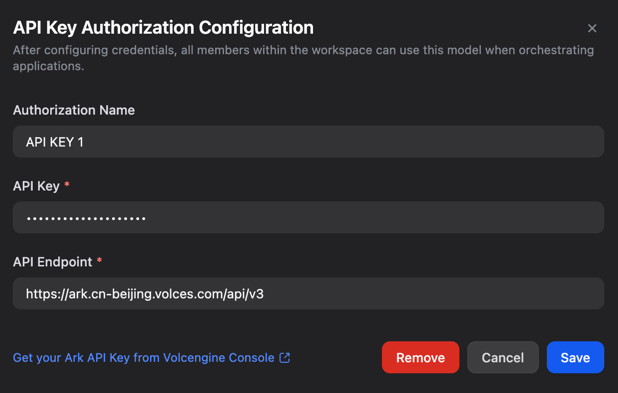

# Volcengine Ark

Use Volcengine Ark base models in Dify via the Ark API (no custom inference endpoint required).

## Configure

1. Create an Ark API Key in Volcengine Console: https://console.volcengine.com/ark/region:ark+cn-beijing/apiKey
2. In Dify, go to **Settings → Model Provider → Volcengine Ark**.
3. Fill in the credentials and save.

## Credentials

## Models

- Models are listed by Ark **model id** (for example: `doubao-seed-2-0-pro-260215`).
- If a model is visible in Dify but your Ark account has no access, the invocation will fail. Switch to a model you have enabled in Ark.

## Troubleshooting 

- **401/403**: invalid API key, or your account has no permission for the model.
- **404 / invalid URL**: `api_endpoint_host` must include `/api/v3` (default is `https://ark.cn-beijing.volces.com/api/v3`).
- **Model not found**: the model id is not enabled for your Ark account.
- **Timeout / connection error**: ensure your Dify deployment can reach `ark.cn-beijing.volces.com`.

