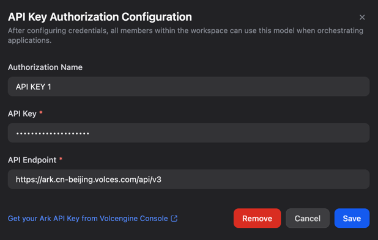

# Volcengine Ark

Use Volcengine Ark base and multimodal models in Dify via the Ark API.

## Configure

1. Create an Ark API Key in Volcengine Console: https://console.volcengine.com/ark/region:ark+cn-beijing/apiKey
2. In Dify, go to **Settings → Model Provider → Volcengine Ark**.
3. Fill in the API Key and API Endpoint, then save.

Default endpoint:

```text
https://ark.cn-beijing.volces.com/api/v3
```

## Credentials



## Models

- Models are listed by Ark **model id**.
- Volcengine models use IDs such as `doubao-seed-2-0-pro-260215`, `doubao-seedream-5-0-260128`, and `doubao-seedance-2-0-260128`.
- If a model is visible in Dify but your Ark account has no access, the invocation will fail. Switch to a model you have enabled.

## Multimodal Polling

- Seedream image generation returns a terminal polling result from `start`.
- Seedance video generation creates a task from `start` and checks task status from `check`.
- Video task statuses `queued` and `running` keep polling; `succeeded` returns the generated video; `failed`, `cancelled`, and `expired` fail the invocation.
- Generated image URLs are valid for about 24 hours.
- Video tasks can be retrieved for about 7 days from creation.
- Volcengine Seedream and Seedance models expose the `web_search` switch.

## Implementation Relationship

This package is an independent plugin so it can be registered and distributed separately from BytePlus. Its Ark multimodal polling logic intentionally mirrors the BytePlus plugin implementation; provider differences are isolated to the model IDs, default endpoint, platform name, and capability switches such as Volcengine-only `web_search`.

## Troubleshooting 

- **401/403**: invalid API key, or your account has no permission for the model.
- **404 / invalid URL**: `api_endpoint_host` must include `/api/v3`.
- **Model not found**: the model id is not enabled for your Ark account.
- **Timeout / connection error**: ensure your Dify deployment can reach the configured Ark endpoint.
