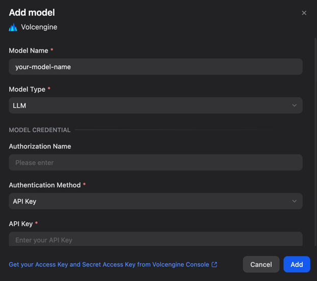

# Volcengine Ark (MaaS / Endpoint)

Use Volcengine Ark endpoints ("Endpoint ID") in Dify.

This plugin is a good fit when you:
- already created an **Ark Endpoint** (e.g., a deployed base model / fine-tuned model / embedding endpoint), and
- want to call it from Dify using **AK/SK** (IAM) or **Ark API Key** authentication.

If you want to call Ark **base models directly** without creating endpoints, use the **Volcengine Ark (Direct)** provider instead.

## Configure

1. Prepare credentials in Volcengine Console:
   - **AK/SK (Recommended)**: https://console.volcengine.com/iam/keymanage/
   - **Ark API Key**: https://console.volcengine.com/ark/region:ark+cn-beijing/apiKey
2. Create an Ark Endpoint and copy its **Endpoint ID**.
3. In Dify, go to **Settings -> Model Provider -> Volcengine Ark (Endpoint)**.
4. Click **Add Model**, fill in the fields, and save.

## Troubleshooting | 常见问题

- **401/403**: invalid credentials, wrong region, or your account has no permission for the endpoint.
- **404 / model not found**: `endpoint_id` is incorrect or not available in the selected region.
- **Invalid URL**: `api_endpoint_host` must include `/api/v3`.
- **Timeout / connection error**: ensure your Dify deployment can reach Volcengine endpoints.
