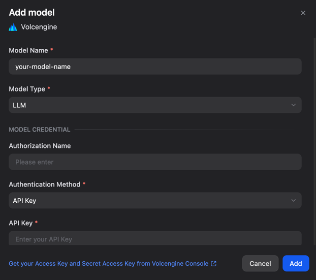

# Volcengine Ark (MaaS / Endpoint)

Use Volcengine Ark endpoints ("Endpoint ID") in Dify.

This plugin is a good fit when you:
- already created an **Ark Endpoint** (e.g., a deployed base model / fine-tuned model / embedding endpoint), and
- want to call it from Dify using **AK/SK** (IAM) or **Ark API Key** authentication.

If you want to call Ark **base models directly** without creating endpoints, use the **Volcengine Ark (Direct)** provider instead.

## Configure

1. Prepare credentials in Volcengine Console:
   - **AK/SK (Recommended)**: https://console.volcengine.com/iam/keymanage/
   - **Ark API Key**: https://console.volcengine.com/ark/region:ark+cn-beijing/apiKey
2. Create an Ark Endpoint and copy its **Endpoint ID**.
3. In Dify, go to **Settings -> Model Provider -> Volcengine Ark (Endpoint)**.
4. Click **Add Model**, fill in the fields, and save.

### Seed 2.1 and DeepSeek V4 GA

Select the base model matching your deployed endpoint:

| Base Model | Model version | Context / max output tokens |
| --- | --- | --- |
| Doubao-Seed-2.1-pro | doubao-seed-2-1-pro-260628 | 256K / 256K |
| Doubao-Seed-2.1-turbo | doubao-seed-2-1-turbo-260628 | 256K / 256K |
| DeepSeek-V4-Pro-GA | deepseek-v4-pro-ga-260813 | 1M / 384K |
| DeepSeek-V4-Flash-GA | deepseek-v4-flash-ga-260731 | 1M / 384K |

Continue to enter your `ep-...` Endpoint ID. Seed 2.1 supports image/video input,
structured output, and reasoning effort from `minimal` to `high` (default `high`).
DeepSeek V4 GA supports text input and reasoning effort up to `max`.

Specifications and standard online token prices checked on 2026-09-07:
[Seed 2.1 Pro](https://console.volcengine.com/ark/region:cn-beijing/model/detail?name=doubao-seed-2-1-pro),
[Seed 2.1 Turbo](https://console.volcengine.com/ark/region:cn-beijing/model/detail?name=doubao-seed-2-1-turbo),
[DeepSeek V4 Pro GA](https://console.volcengine.com/ark/region:cn-beijing/model/detail?name=deepseek-v4-pro-ga),
[DeepSeek V4 Flash GA](https://console.volcengine.com/ark/region:cn-beijing/model/detail?name=deepseek-v4-flash-ga).

## Troubleshooting | 常见问题

- **401/403**: invalid credentials, wrong region, or your account has no permission for the endpoint.
- **404 / model not found**: `endpoint_id` is incorrect or not available in the selected region.
- **Invalid URL**: `api_endpoint_host` must include `/api/v3`.
- **Timeout / connection error**: ensure your Dify deployment can reach Volcengine endpoints.
