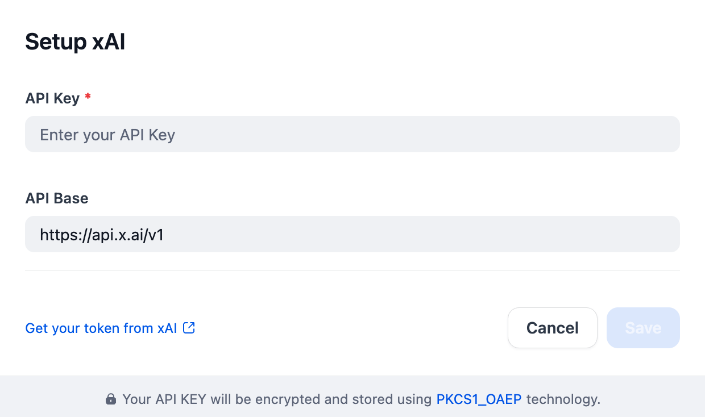

## Overview

xAI develops the **Grok** family of large language models. The current xAI lineup includes flagship and fast variants such as `grok-4`, `grok-4-fast`, `grok-4.20-beta-latest`, `grok-code-fast-1`, `grok-3`, and `grok-3-mini`. Depending on the model specifications, users can interact with Grok models for reasoning, tool use, structured outputs, live search, code generation, and image understanding.

## Configuration

After installing the plugin, configure the API key and API base within the Model Provider settings. Obtain your API key from [here](https://x.ai/api). Once saved, you can begin using xAI to build your AI agents and agentic workflows.

