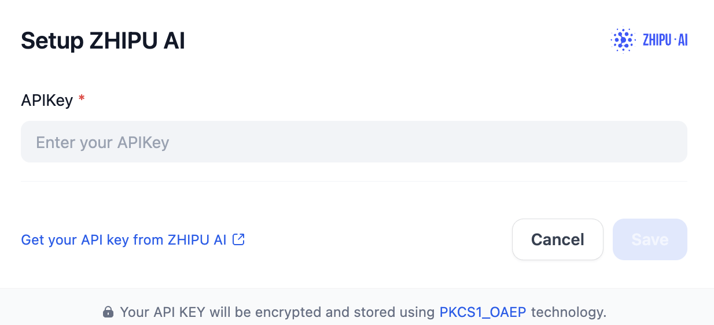

# Overview
Zhipu AI's ChatGLM is a series of advanced LLMs developed by Zhipu AI, designed to facilitate natural language understanding and generation. The ChatGLM models are particularly notable for their bilingual capabilities, excelling in both Chinese and English, and are optimized for various applications, including conversational agents, academic research, and business solutions.

# Configure
After installation, you need to get API keys from [Zhipu AI](https://open.bigmodel.cn/usercenter/apikeys) and setup in Settings -> Model Provider.

## Request metadata

`Enable request metadata` is optional and disabled by default. Turning it on attaches `dify_app_id` and `dify_source` to each ZhipuAI request as a `metadata` field in the request body, so usage can be attributed to a specific Dify app. The injection happens via the `extra_body` kwarg on `client.chat.completions.create`; the ZhipuAI API is OpenAI-compatible and silently ignores unknown body fields, so this is safe whether or not the upstream service consumes the field. The Dify session lookup is best-effort: if the session context is not initialized, no metadata is attached and the SDK receives `extra_body=None` (no body field sent).
