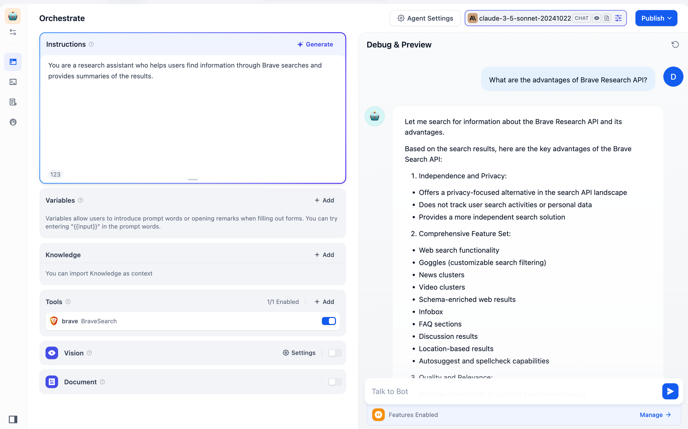
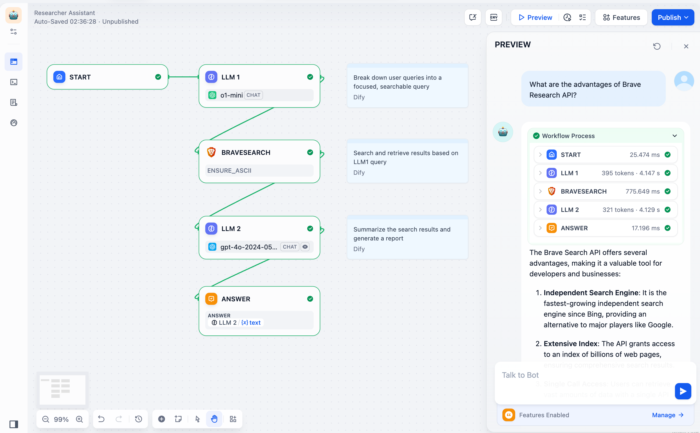
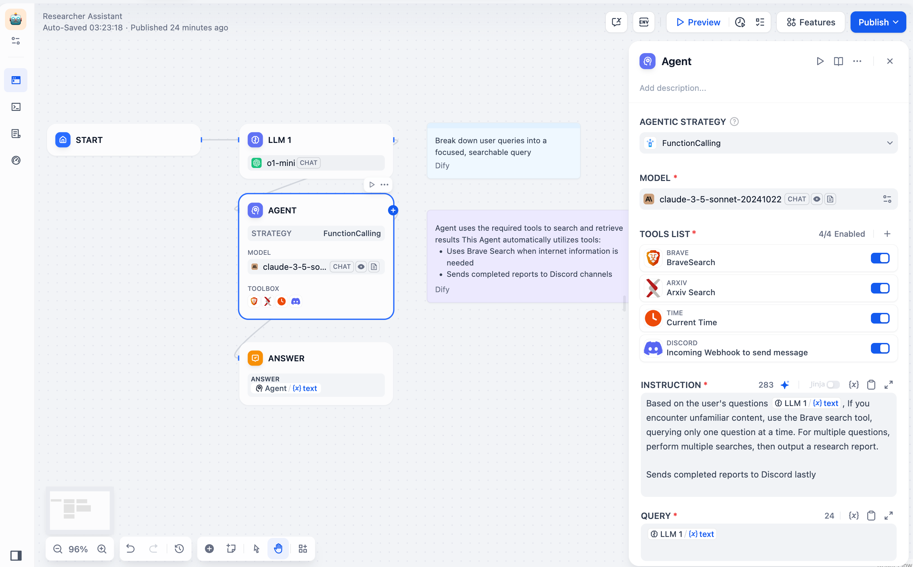

# Brave Search Plugin for Dify

[](https://github.com/langgenius/dify-plugin-brave-search)
[](https://www.python.org/downloads/)
[](LICENSE)

Brave Search offers programmatic web search capabilities, providing private, high-quality search results in various formats with comprehensive sources and an **intuitive structure**.

## 🌟 Features

- **Privacy-First**: No tracking of searches or personal information
- **Independent Results**: Leverages Brave's own search index for unbiased results
- **Fast & Reliable**: High-performance search with comprehensive coverage
- **Flexible Integration**: Multiple deployment options within Dify workflows
- **Customizable**: Configurable search parameters and result formatting

## 📋 Table of Contents

- [Quick Start](#-quick-start)
- [Installation](#-installation)
- [Usage Examples](#-usage-examples)
- [Architecture Overview](#-architecture-overview)
- [Configuration](#-configuration)
- [API Reference](#-api-reference)
- [Development](#-development)
- [Troubleshooting](#-troubleshooting)
- [Contributing](#-contributing)

## 🚀 Quick Start

### Prerequisites

- Dify platform access
- Brave Search API key ([Get yours here](https://brave.com/search/api/))
- Python 3.12+ (for development)

### 1-Minute Setup

1. **Get API Key**: Visit [Brave Search API](https://brave.com/search/api/) and create your account
2. **Install Plugin**: Navigate to Dify Tools → Install Brave Search Plugin
3. **Configure**: Enter your API key in the plugin settings
4. **Test**: Run a quick search to verify everything works

```python
# Example search query
query = "latest AI developments 2024"
results = brave_search.search(query, count=5)
```

## 📦 Installation

### Method 1: Dify Plugin Store (Recommended)

1. Open your Dify workspace
2. Navigate to **Tools** → **Plugin Store**
3. Search for "Brave Search"
4. Click **Install** and follow the setup wizard

### Method 2: Manual Installation

```bash
# Clone the repository
git clone https://github.com/langgenius/dify-plugin-brave-search
cd dify-plugin-brave-search

# Install dependencies
pip install -r requirements.txt

# Configure your API key
cp config.example.yml config.yml
# Edit config.yml with your API key
```

## 🎯 Usage Examples

The Brave Search API plugin is now integrated into Dify and accessible within the Tools category. You can use this plugin after installation in three ways:

### 1. Quick Chatbot Creation
Create basic agents quickly by combining an LLM with the Brave Search tool.

```yaml
# Example chatbot configuration
agent:
  llm: gpt-4
  tools:
    - brave_search
  prompt: "You are a helpful assistant with access to real-time web search."
```



### 2. Standalone Tool in Workflows
Enhance LLM workflows with accurate search outcomes by deploying the Brave Search tool.

```python
# Workflow integration example
def search_workflow(query):
    # Step 1: Search for information
    search_results = brave_search_tool.invoke({
        "query": query,
        "count": 5,
        "ensure_ascii": True
    })
    
    # Step 2: Process results
    processed_results = process_search_results(search_results)
    
    # Step 3: Generate response
    return generate_response(processed_results)
```



### 3. Integration into Agent Nodes (Advanced Applications)
For more complex AI applications, integrate the Brave Search tool into Agent Nodes. Agent Nodes consist of three core components: **LLM + Tools + Strategies**:



- **LLM:** The core of the Agent Node, responsible for reasoning, tool invocation, and strategy execution.  
- **Tools:** Modules that extend LLM capabilities, such as **Brave Search**, image generation, web crawling, etc. You can customize and add tools.  
- **Strategies:** Guidelines that direct how the LLM uses tools to solve problems. These include officially supported methods (Function Call and ReAct) as well as custom strategies you can create using Llamaindex, LangGraph, or other frameworks.

## 🏗️ Architecture Overview

### Project Structure

```
brave-search-plugin/
├── main.py                 # Plugin entry point
├── manifest.yml           # Plugin configuration
├── provider/
│   ├── brave.py          # Provider implementation
│   └── brave.yml         # Provider configuration
├── tools/
│   ├── brave_search.py   # Core search tool
│   └── brave_search.yaml # Tool configuration
├── requirements.txt      # Python dependencies
└── README.md            # This file
```

### Core Components

#### 1. BraveSearchWrapper
The low-level API wrapper that handles HTTP requests to Brave Search API.

```python
class BraveSearchWrapper(BaseModel):
    """Wrapper around the Brave search engine."""
    
    api_key: str                    # Your Brave API key
    search_kwargs: dict            # Additional search parameters
    base_url: str                  # API endpoint URL
    ensure_ascii: bool            # ASCII encoding for JSON output
```

#### 2. BraveSearch
The high-level search tool that provides a clean interface.

```python
class BraveSearch(BaseModel):
    """Tool that queries the BraveSearch."""
    
    name: str = "brave_search"
    description: str = "Search engine for current events"
    search_wrapper: BraveSearchWrapper
```

#### 3. BraveSearchTool
The Dify plugin integration layer.

```python
class BraveSearchTool(Tool):
    """Tool for performing a search using Brave search engine."""
    
    def _invoke(self, tool_parameters: dict[str, Any]) -> Generator[ToolInvokeMessage, None, None]:
        # Implementation handles Dify-specific messaging
```

### Data Flow

```
User Query → BraveSearchTool → BraveSearch → BraveSearchWrapper → Brave API
                ↓
User Interface ← Formatted Results ← JSON Processing ← API Response
```

## ⚙️ Configuration

### Environment Variables

```bash
# Required
BRAVE_SEARCH_API_KEY=your_api_key_here

# Optional
BRAVE_BASE_URL=https://api.search.brave.com/res/v1/web/search
MAX_REQUEST_TIMEOUT=120
```

### Plugin Configuration (manifest.yml)

```yaml
name: brave
version: 0.0.2
author: langgenius
description:
  en_US: "Brave Search offers programmatic web search capabilities..."
  
meta:
  arch: [amd64, arm64]
  runner:
    language: python
    version: "3.12"
    
resource:
  memory: 1048576
  permission:
    model:
      enabled: true
      llm: true
    tool:
      enabled: true
```

### Tool Parameters

| Parameter | Type | Default | Description |
|-----------|------|---------|-------------|
| `query` | string | - | Search query (required) |
| `count` | number | 3 | Number of results to return |
| `ensure_ascii` | boolean | true | Ensure ASCII encoding in JSON output |
| `base_url` | string | API default | Custom API endpoint |

## 📚 API Reference

### BraveSearchTool Methods

#### `_invoke(tool_parameters: dict) -> Generator[ToolInvokeMessage]`

Performs a search and returns results as a generator.

**Parameters:**
- `tool_parameters`: Dictionary containing search parameters

**Returns:**
- Generator yielding ToolInvokeMessage objects

**Example:**
```python
tool = BraveSearchTool()
for message in tool._invoke({"query": "Python tutorials", "count": 5}):
    print(message.text)
```

### Search Result Format

```json
[
  {
    "title": "Result Title",
    "link": "https://example.com",
    "snippet": "Brief description of the result content..."
  }
]
```

### Error Handling

The plugin handles various error scenarios:

- **Invalid API Key**: Returns authentication error
- **Network Issues**: Retries with exponential backoff
- **Rate Limiting**: Respects API rate limits
- **Invalid Queries**: Provides helpful error messages

## 🛠️ Development

### Setting Up Development Environment

```bash
# Clone and setup
git clonehttps://github.com/langgenius/dify-official-plugins
cd defy-official-plugins
cd tools/brave

# Create virtual environment
python -m venv venv
source venv/bin/activate  # On Windows: venv\Scripts\activate

# Install dependencies
pip install -r requirements.txt
pip install -r requirements-dev.txt  # Development dependencies

# Run tests
pytest tests/
```

### Code Style

We use the following tools for code quality:

```bash
# Format code
black .
isort .

# Lint code
flake8 .
mypy .

# Run all checks
pre-commit run --all-files
```

### Adding New Features

1. **Fork** the repository
2. **Create** a feature branch: `git checkout -b feature/amazing-feature`
3. **Implement** your changes with tests
4. **Test** thoroughly: `pytest tests/`
5. **Document** your changes
6. **Submit** a pull request


### Custom Search Parameters

You can extend the search functionality by modifying `search_kwargs`:

```python
# Example: Add language and region filters
search_kwargs = {
    "count": 10,
    "country": "US",
    "search_lang": "en",
    "ui_lang": "en-US"
}

tool = BraveSearch.from_api_key(
    api_key="your_key",
    base_url=BRAVE_BASE_URL,
    search_kwargs=search_kwargs
)
```

## 🔧 Troubleshooting

### Common Issues

#### 1. Authentication Errors
```
Error: HTTP error 401
```
**Solution**: Verify your API key is correct and active

#### 2. Rate Limiting
```
Error: HTTP error 429
```
**Solution**: Implement backoff strategy or upgrade your API plan

#### 3. No Results Found
```
No results found for 'query' in Tavily
```
**Solution**: Check query formatting and try broader search terms

#### 4. Import Errors
```
ModuleNotFoundError: No module named 'dify_plugin'
```
**Solution**: Ensure you're running within the Dify environment

### Debug Mode

Enable debug logging:

```python
import logging
logging.basicConfig(level=logging.DEBUG)

# Your search code here
```

### Performance Optimization

- **Caching**: Implement result caching for repeated queries
- **Async Requests**: Use async/await for multiple concurrent searches
- **Result Filtering**: Process only relevant results to reduce memory usage

## 🤝 Contributing

We welcome contributions! Here's how you can help:

### Ways to Contribute

- 🐛 **Bug Reports**: Open issues for bugs you find
- 💡 **Feature Requests**: Suggest new functionality
- 📝 **Documentation**: Improve docs and examples
- 🔧 **Code**: Submit pull requests for bug fixes and features
- 🧪 **Testing**: Add test cases and improve coverage

### Contribution Guidelines

1. **Check Issues**: Look for existing issues before creating new ones
2. **Follow Standards**: Use our code style and formatting
3. **Add Tests**: Include tests for new functionality
4. **Update Docs**: Document your changes
5. **Small PRs**: Keep pull requests focused and manageable

### Development Workflow

```bash
# 1. Fork and clone
git clone https://github.com/yourusername/dify-plugin-brave-search
cd dify-plugin-brave-search

# 2. Create branch
git checkout -b feature/your-feature-name

# 3. Make changes and test
# ... your changes ...
pytest tests/

# 4. Commit and push
git add .
git commit -m "feat: add your feature description"
git push origin feature/your-feature-name

# 5. Create pull request
# Open GitHub and create PR from your branch
```

## 📄 License

This project is licensed under the MIT License - see the [LICENSE](LICENSE) file for details.

## 🙏 Acknowledgments

- **Brave Software**: For providing the search API
- **Dify Team**: For the plugin framework
- **Contributors**: All developers who have contributed to this project

## 📞 Support

- **Documentation**: [Brave API Guides](https://api-dashboard.search.brave.com/app/documentation/web-search/get-started)
- **Issues**: [GitHub Issues](https://github.com/langgenius/dify-official-plugins/issues)

---

**Ready to enhance your AI applications with powerful search capabilities?** Get started with the Brave Search tool today! 🚀