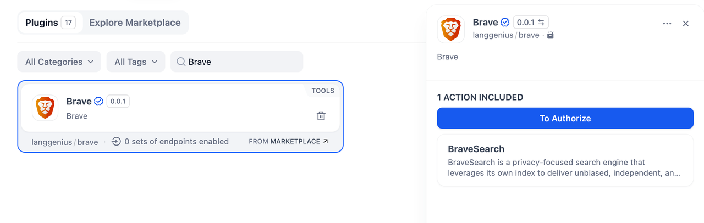
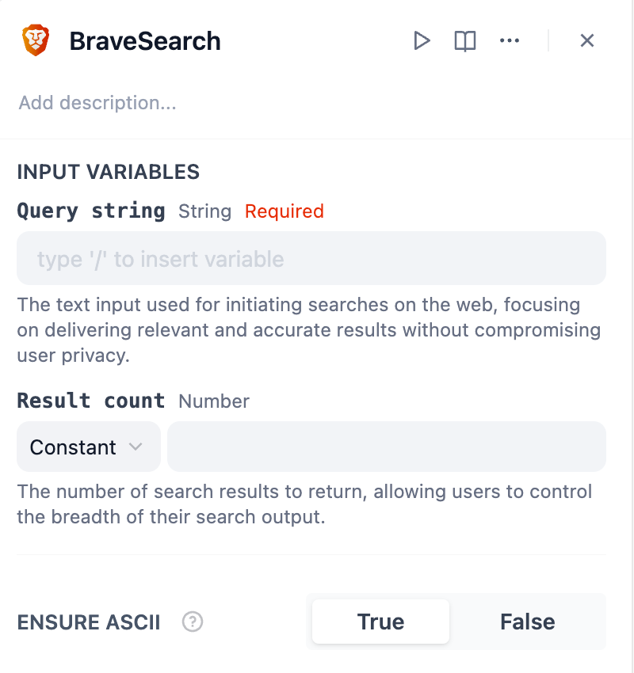
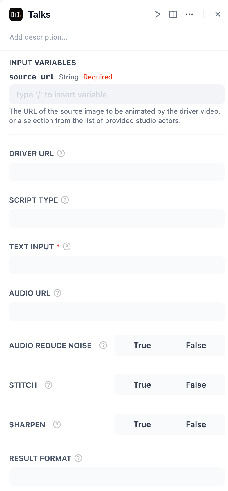
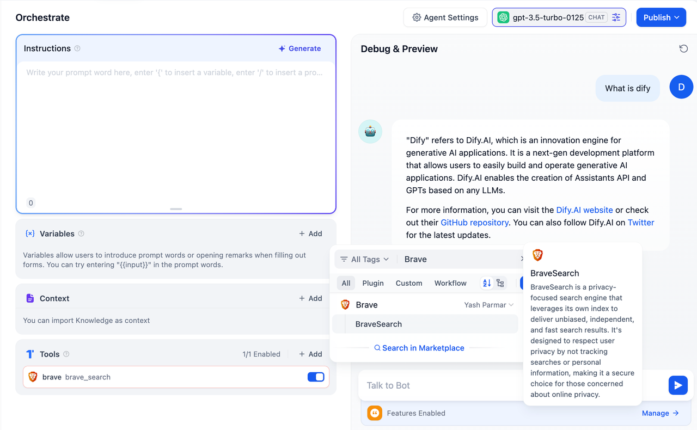

## Overview

**Brave** is a privacy-focused tool designed to leverage the **BraveSearch** engine, which uses its own index to deliver unbiased, independent, and fast search results.

In **Dify**, Brave provides secure and accurate search functionality, making it a perfect choice for those concerned about online privacy and data security.

## Configuration

To start using **Brave**, follow these steps:

1. **Install the Brave Tool** Open the Plugin Marketplace, search for the Brave tool, and install it to integrate it with your application.

2. **Get a Brave API Key** Visit the Brave platform, create a new API Key, and ensure your account has the necessary permissions to access its features.

3. **Authorize Brave** In Dify, go to **Plugins > Brave > Authorize**. Enter your API Key to activate the tool.

## Tool Features

The **Brave** plugin includes the following action:

### BraveSearch

Perform a secure and privacy-focused search using the BraveSearch engine.

**Input Variables:**

* **Query String (Required):** Provide the text input for the search query. This determines the focus of the search results.
* **Result Count:** Specify the number of search results to return. Adjust this value to control the breadth of the output.
* **Ensure ASCII:** Select whether to ensure ASCII encoding for the search query (`True` or `False`).

## Usage

Brave can seamlessly integrate Chatflow / Workflow Apps and Agent Apps.

### Chatflow / Workflow Apps

1. Add the Brave node to your Chatflow or Workflow pipeline.
2. Configure the "BraveSearch" action by specifying the query string and optional parameters (e.g., result count, ASCII encoding).
3. Run the pipeline to retrieve secure and accurate search results.

### Agent Apps

1. Add the Brave tool to your Agent application.
2. Input the search query via the chatbox.
3. The tool processes your query and returns the corresponding search results.

## Use Cases

* **Privacy-First Web Search:** Perform web searches without compromising privacy or sharing personal data.
* **Content Discovery:** Quickly retrieve unbiased and relevant information on specific topics.
* **Research Assistance:** Gather accurate and fast results for academic or professional projects.
* **Independent Results:** Access search results free from algorithmic bias or external influence.

With **Brave**, you can ensure secure, unbiased, and efficient search functionality integrated directly into your workflows and applications.
