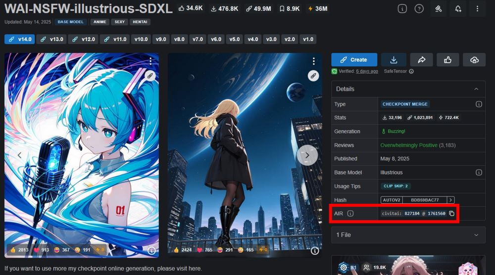

# ComfyUI

## Overview

[ComfyUI](https://www.comfy.org/) is the most powerful and modular diffusion model GUI, API and backend with a graph/nodes interface. Now you can use it in Dify, input the prompt or images, and get the generated image.

It is highly recommended to install [comfy-asset-downloader](https://github.com/ServiceStack/comfy-asset-downloader.git) on your ComfyUI server as this plugin needs it to download models automatically.

## Configuration

### 1. Ensure that the ComfyUI workflow is running normally

Please refer to its [official documentation](https://docs.comfy.org/get_started/gettingstarted) to ensure that ComfyUI can run normally and generate images.

### 2. Export the API file of the workflow


As shown in the figure, select `Save(API Format)`. If there is no such selection, you need to enable `Dev Mode` in the settings.

### 3. Get ComfyUI tools from Plugin Marketplace

The ComfyUI tools could be found at the Plugin Marketplace, please install it first.

### 4. Integrate ComfyUI in Dify

On the Dify navigation page, click `Tools > ComfyUI > To Authentication` and fill in the URL of ComfyUI Server.


### 5. Use ComfyUI in Dify

You can use the ComfyUI tool in the following application types:


#### Chatflow / Workflow applications

Both Chatflow and Workflow applications support the `ComfyUI` tool node. After adding it, you need to fill in the "Input Variables → Prompt" in the node with variables to reference the user's input prompt or the content generated by the previous node. Finally, use the variable to reference the image output by `ComfyUI` in the "End" node.

#### Agent applications

Add the `ComfyUI` tool in the Agent application, then send a picture description in the dialog box to call the tool to generate an AI image.

### Image input

Some ComfyUI workflows require multiple images inputs. In Dify, it will find every `LoadImage` node in the `WORKFLOW JSON` and fill in the image files input by the user in order. When you want to change this order, you can adjust it by filling in the `Image node ID list`. For example, if your workflow needs to input images into the 35th, 69th, and 87th nodes, then input `69,35,87` will pass the first image to the 69th node.

## Example Workflows

There are some example workflows to show what this plugin can do for you.

* [Txt2Img](_assets/Txt2Img.yml)
* [Upscale](_assets/Upscale.yml)
* [CivitAI Download](_assets/CivitAI.yml)

## Nodes


### Workflow

Workflow node is a basic node for ComfyUI.
You can set any ComfyUI node settings by inputting JSON to this node.

### Txt2Img

Txt2Img node can generate an image from texts(prompt and negative prompt).
If you want to generate large images(typically 1600x1600 or bigger), HiresFix option is for you.
It generates a small and consistent image then upscale it.
Without HiresFix, large images tend to have unnaturally duplicated objects and artifacts.

### Txt2Vid

Txt2Vid node can generate an video from texts(prompt and negative prompt).

### Img2Img

Img2Img node can edit an given image according to prompt and negative prompt.

### Img2Vid

Img2Vid node can generate an video from an given image.

### Image Edit

Image Edit node takes images and edits them in a various way.

The following features are supported.
* Depth Anything: Performs monocular depth estimation.
* Depth Pro: Performs monocular depth estimation.
* Faceswap: Extracts a face on the first image and infuse it to the second image.
* Upscale ESRGAN x4: Enlarges an given image with models by 4 (512x512 -> 2048x2048). 

Some features require addons for ComfyUI. You need to install them to ComfyUI in advance.
* Depth Anything: https://github.com/kijai/ComfyUI-DepthAnythingV2
* Depth Pro: https://github.com/spacepxl/ComfyUI-Depth-Pro
* Faceswap: https://github.com/Gourieff/ComfyUI-ReActor
* Upscale ESRGAN x4: No addons required

### List Models

List Models can fetch all the names of the models available on the connected ComfyUI.

### List Samplers

List Samplers node can fetch all samplers and schedulers available on the connected ComfyUI.

### Image Info

Image Info node can extract basic information from a given image.
These include width, height, [mode](https://pillow.readthedocs.io/en/stable/handbook/concepts.html#modes), filename and MIME type.
This node would be useful when you use [Img2Vid node](#img2vid).

### CivitAI Download

CivitAI Download node can download models from [CivitAI](https://civitai.com/home).
You need to input model ID and version ID to download a model.
These two IDs are shown as AIR(see the highlited area on the image below).



### Hugging Face Download
Hugging Face Download node can download models from [Hugging Face](https://huggingface.co/).

### Download By URL 
Download By URL node can download models from a given URL.

### Download By JSON
Download By JSON node can download models specified by ComfyUI's workflow json.
More specifically, it downloads all the models listed in "properties":{"models": [...]} in every node.
It needs a JSON file exported with "Export", not "Export (API)".

## Prebuilt Docker Image

If you don't know how to host ComfyUI, a [prebuilt docker image](https://hub.docker.com/r/l125/comfyui-for-dify) would help you.
It has [ComfyUI](https://github.com/comfyanonymous/ComfyUI) itself and all the required packages for this plugin.

All you need to start a ComfyUI server is to type the following command on a server with docker and a GPU installed.
```
docker run --gpus all -p 8188:8188 l125/comfyui-for-dify:v0.2.3-cu129
```

If you want to save large models to somewhere other than the system disk, say "/mnt/hdd/models", you can use -v option.
```
docker run -v /mnt/hdd/models:/ComfyUI/models --gpus all -p 8188:8188 l125/comfyui-for-dify:v0.2.3-cu129
```

Specifically, the docker image contains the following packages.

* https://github.com/comfyanonymous/ComfyUI: ComfyUI
* https://github.com/ltdrdata/ComfyUI-Manager: Manager for ComfyUI. helps you to install ComfyUI addons.
* https://github.com/ServiceStack/comfy-asset-downloader.git: Asset downloader for ComfyUI
* https://github.com/kijai/ComfyUI-DepthAnythingV2.git: Addon for Depth Anything
* https://github.com/spacepxl/ComfyUI-Depth-Pro.git: Addon for Depth Pro
* https://github.com/Gourieff/ComfyUI-ReActor.git: Addon for Faceswap
* https://github.com/Kosinkadink/ComfyUI-VideoHelperSuite.git: Addon for converting WEBP to MP4
