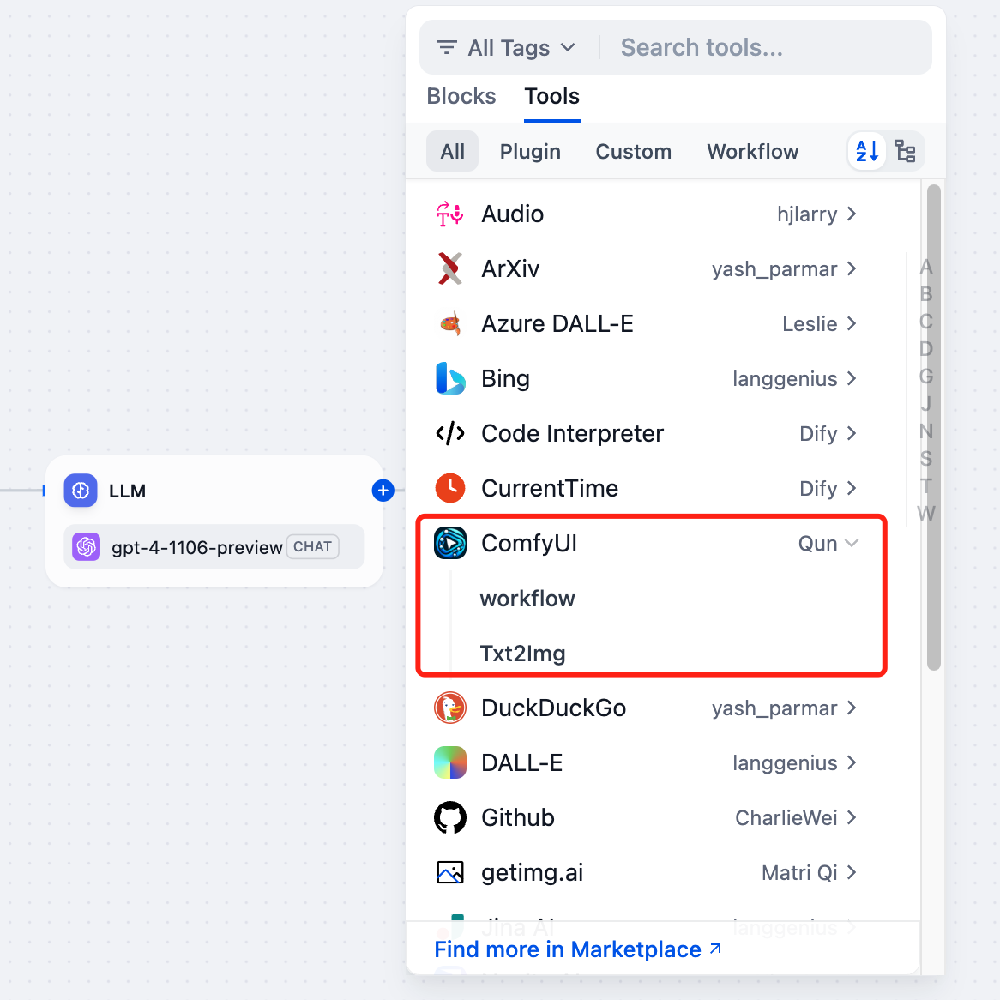
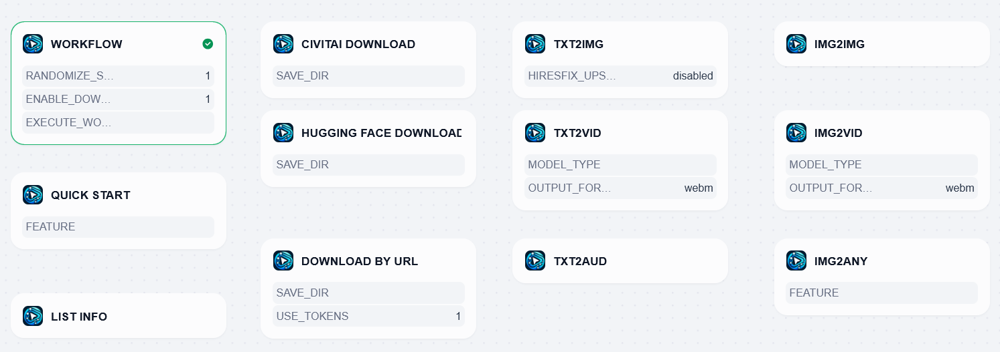

# ComfyUI

## Overview

[ComfyUI](https://www.comfy.org/) is the most powerful and modular diffusion model GUI, API and backend with a graph/nodes interface. Now you can use it in Dify, input the prompt or images, and get the generated image.

## Configuration

### 1. Ensure that the ComfyUI workflow is running normally

Please refer to its [official documentation](https://docs.comfy.org/get_started/gettingstarted) to ensure that ComfyUI can run normally and generate images.

### 2. Export the API file of the workflow

As shown in the figure, select `Save(API Format)`. If there is no such selection, you need to enable `Dev Mode` in the settings.

### 3. Get ComfyUI tools from Plugin Marketplace

The ComfyUI tools could be found at the Plugin Marketplace, please install it first.

### 4. Integrate ComfyUI in Dify

On the Dify navigation page, click `Tools > ComfyUI > To Authentication` and fill in the URL of ComfyUI Server.

### 5. Use ComfyUI in Dify

You can use the ComfyUI tool in the following application types:

#### Chatflow / Workflow applications

Both Chatflow and Workflow applications support the `ComfyUI` tool node. After adding it, you need to fill in the "Input Variables → Prompt" in the node with variables to reference the user's input prompt or the content generated by the previous node. Finally, use the variable to reference the image output by `ComfyUI` in the "End" node.

#### Agent applications

Add the `ComfyUI` tool in the Agent application, then send a picture description in the dialog box to call the tool to generate an AI image.

### Image input

Some ComfyUI workflows require multiple images inputs. In Dify, it will find every `LoadImage` node in the `WORKFLOW JSON` and fill in the image files input by the user in order. When you want to change this order, you can adjust it by filling in the `Image node ID list`. For example, if your workflow needs to input images into the 35th, 69th, and 87th nodes, then input `69,35,87` will pass the first image to the 69th node.

## Nodes

### workflow

workflow node is Basic node for ComfyUI.
You can set any ComfyUI node settings by inputting JSON to this node.

### Txt2Img

Txt2Img node can generate an image from texts(prompt and negative prompt).

### Img2Img

Img2Img node can edit an given image according to prompt and negative prompt.

### Img2Vid

Img2Vid node can generate an video from an given image.
You need to install [SVD model](https://huggingface.co/stabilityai/stable-video-diffusion-img2vid) or [SVD XT model](https://huggingface.co/stabilityai/stable-video-diffusion-img2vid-xt) to ComfyUI in advance. [Hugging Face Download node](#hugging-face-download) would be helpful to 
download them.

### Upscale

Upscale node can enlarge an given image with models. 

### Depth Anything

Depth Anything node can perform monocular depth estimation.
You need to install https://github.com/kijai/ComfyUI-DepthAnythingV2 to ComfyUI in advance.

### Depth Pro

Depth Pro node can perform monocular depth estimation.
You need to install https://github.com/spacepxl/ComfyUI-Depth-Pro to ComfyUI in advance.

### Face Swap

Face Swap node can extract a face on the first image and infuse it to the second image.
You need to install https://github.com/Gourieff/ComfyUI-ReActor to ComfyUI in advance.

### List Models

List Models can fetch all models available on the connected ComfyUI.
Those models include checkpoints, LORAs and upscale models.

### List Samplers

List Samplers node can fetch all samplers and schedulers available on the connected ComfyUI.

### Image Info

Image Info node can extract basic information from a given image.
These include width, height, [mode](https://pillow.readthedocs.io/en/stable/handbook/concepts.html#modes), filename and MIME type.
This node would be useful when you use [Img2Vid node](#img2vid).

### CivitAI Download

CivitAI Download node can download models from [CivitAI](https://civitai.com/home).
You need to input model ID and version ID to download a model.
These two IDs are shown as AIR(see the highlited area on the image below).

You need to install https://github.com/ServiceStack/comfy-asset-downloader to ComfyUI in advance.

### Hugging Face Download
Hugging Face Download can download models from [Hugging Face](https://huggingface.co/).
You need to install https://github.com/ServiceStack/comfy-asset-downloader to ComfyUI in advance.