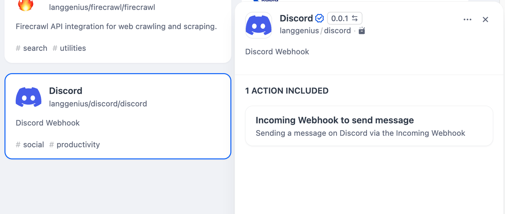
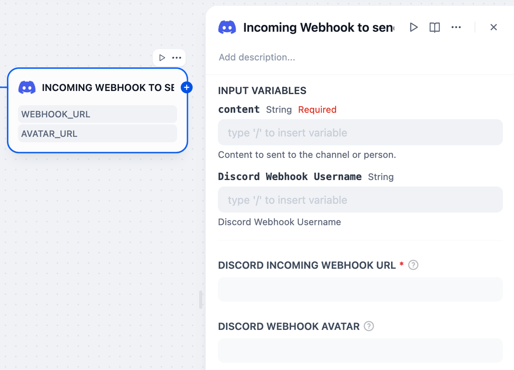

# Discord Tool

## Overview

Discord is a communication platform designed for communities. It offers features like text and voice channels, direct messaging, and server-based organization. In Dify, Discord tools allow users to create a random bot with random username and avatar to send messages.

This tool uses Discord Incoming Webhooks and supports the current Discord Execute Webhook API, including plain text messages, embeds, controlled mentions, polls, message components, and thread options.

To receive events from Discord instead of sending messages to Discord, use the Discord trigger plugin under `triggers/discord_trigger`.

## Configuration

### 1. Get Discord webhook url
Please follow [this site](https://support.discord.com/hc/en-us/articles/228383668-Intro-to-Webhooks) to create a webhook and get its url.

### 2. Get Discord tools from Plugin Marketplace
The Discord tools could be found at the Plugin Marketplace, please install it first.



### 3. Use the tool
You can use the Discord tool in the following application types.



#### Chatflow / Workflow applications

Both Chatflow and Workflow applications support adding a `Discord` tool node.

#### Agent applications
Add the Discord tool in the Agent application, then fill in the `discord incoming webhook url` to call this tool.

## Examples

### Plain text message

Set:

- `webhook_url`: your Discord webhook URL
- `content`: `Hello from Dify`

Optional fields:

- `username`: override the webhook username
- `avatar_url`: override the webhook avatar
- `tts`: send as text-to-speech

### Embed message

Set `embeds_json` to a JSON array:

```json
[
  {
    "title": "Build finished",
    "description": "The release workflow completed successfully.",
    "color": 5763719
  }
]
```

Discord allows up to 10 embeds in one webhook message.

### Controlled mentions

Use `allowed_mentions_json` to prevent accidental user, role, or everyone mentions:

```json
{
  "parse": []
}
```

To allow only user mentions:

```json
{
  "parse": ["users"]
}
```

### Poll message

Set `poll_json` to a Discord poll object:

```json
{
  "question": {
    "text": "Which launch window should we use?"
  },
  "answers": [
    {
      "poll_media": {
        "text": "Morning"
      }
    },
    {
      "poll_media": {
        "text": "Afternoon"
      }
    }
  ],
  "duration": 24,
  "allow_multiselect": false
}
```

### Send to an existing thread

Set:

- `thread_id`: the Discord thread ID
- `content`: the message text

The tool sends `thread_id` as an Execute Webhook query parameter.

### Create a forum or media thread

For webhooks in forum or media channels, set:

- `thread_name`: the new thread name
- `content`, `embeds_json`, `components_json`, or `poll_json`
- `applied_tags_json`: optional JSON array of tag IDs, for example `["123456789012345678"]`

### Return the created message

Set `wait` to `true` when you need Discord to return the created message object. The tool will return both a success text message and a JSON message with Discord's response.
