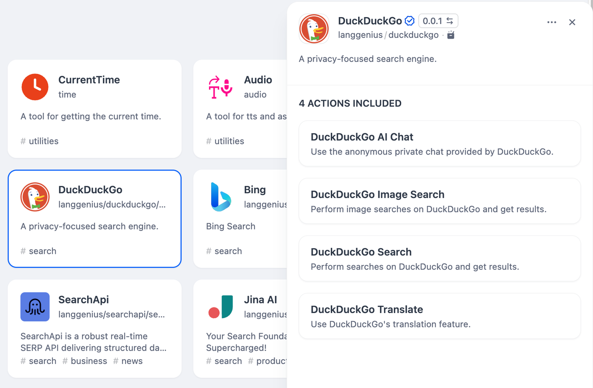
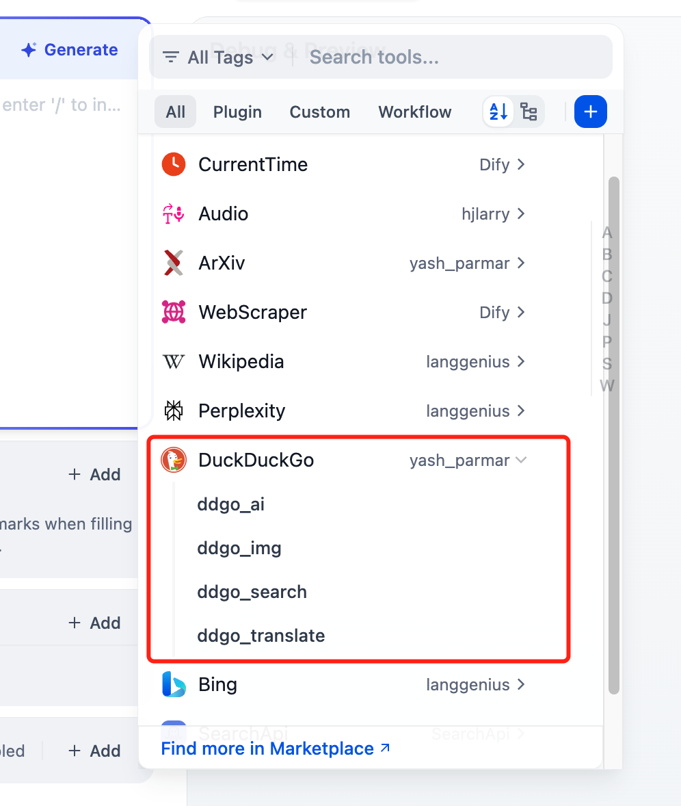

# Duckduckgo

## Overview

DuckDuckGo is a search engine focused on privacy. This plugin offers web page search and image search.

> **Note:** the AI Chat and Translate tools are deprecated and no longer functional. DuckDuckGo removed the endpoints they depended on, and the maintained search library this plugin uses (`ddgs`) provides no replacement. They remain registered so existing workflows still load, but calling them raises an explanatory error. Use an LLM node or a dedicated translation tool instead.

## Configuration

### 1. Get DuckDuckGo tools from Plugin Marketplace

The DuckDuckGo tools could be found at the Plugin Marketplace, please install it first.

### 2. Use the tool

You can use the DuckDuckGo tool in the following application types.

#### - Chatflow / Workflow applications

Both Chatflow and Workflow applications support adding DuckDuckGo tool nodes. Two tools are functional: simple search and image search. The ai chatbox and translation tools are deprecated (see the note above).

#### - Agent applications

Add the DuckDuckGo tool in the Agent application, then enter the search command to call this tool.