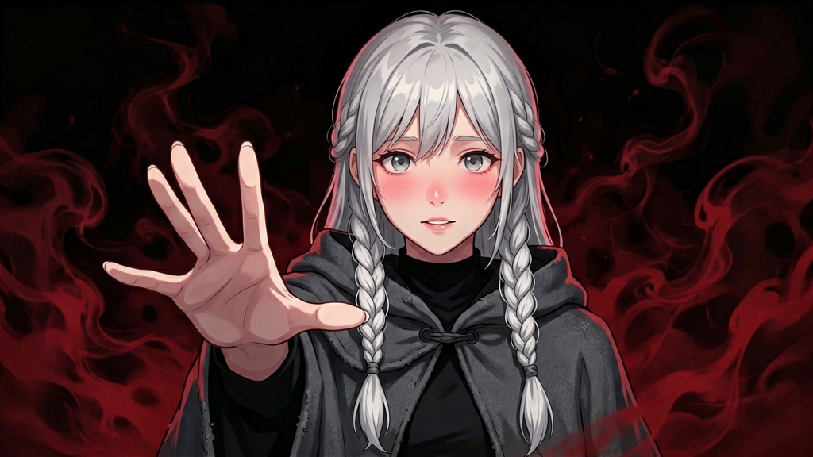

# ERNIE Image

A Dify tool that generates images with Baidu's ERNIE Image models, served by the
[AI Studio](https://aistudio.baidu.com) OpenAI-compatible endpoint.

> Localized docs: [简体中文](readme/README_zh_Hans.md) · [日本語](readme/README_ja_JP.md)

## Samples

Generated with the prompt below, `ernie-image-turbo` at 1280×720:

## Models

| Model | Notes |
|-------|-------|
| `ernie-image-turbo` | Faster, lower latency, suitable for drafts and iteration. |
| `ernie-image` | Higher quality, richer detail. |

## Setup

1. Sign in at <https://aistudio.baidu.com> and create an access token from
   *Personal Center → Access Token*.
2. In Dify, install this plugin and authorize it with that token.

## Parameters

- `prompt` *(required)* – text description of the image.
- `model` – `ernie-image-turbo` (default) or `ernie-image`.
- `size` – `WxH`, e.g. `1024x1024`, `1024x768`, `768x1024`, `1280x720`,
  `1792x1024`. Default `1024x1024`.
- `n` – number of images, 1 to 4. Default `1`.
- `seed` – optional integer for reproducibility.
- `watermark` – add a model watermark to the output. Default `false`.

The tool emits each generated image as a blob and returns the structured
response (URLs and revised prompts) as JSON.
