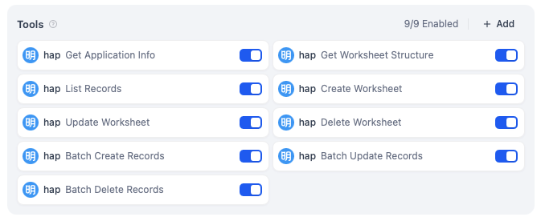
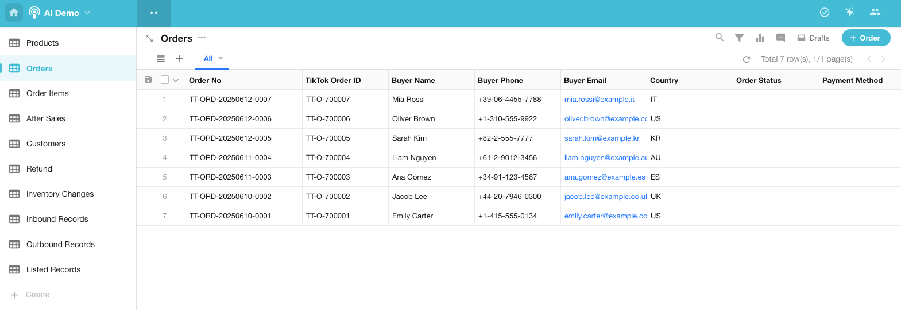
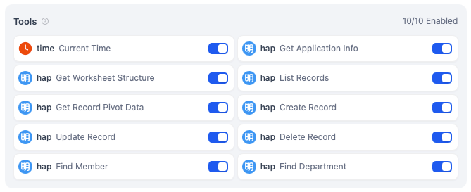
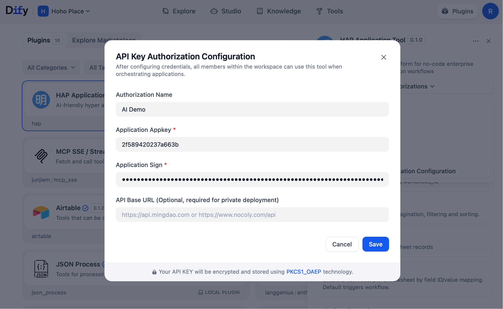
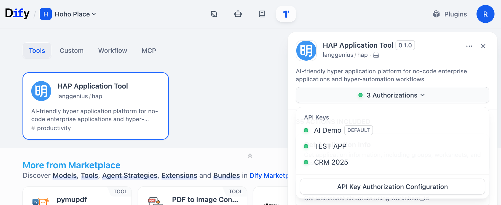
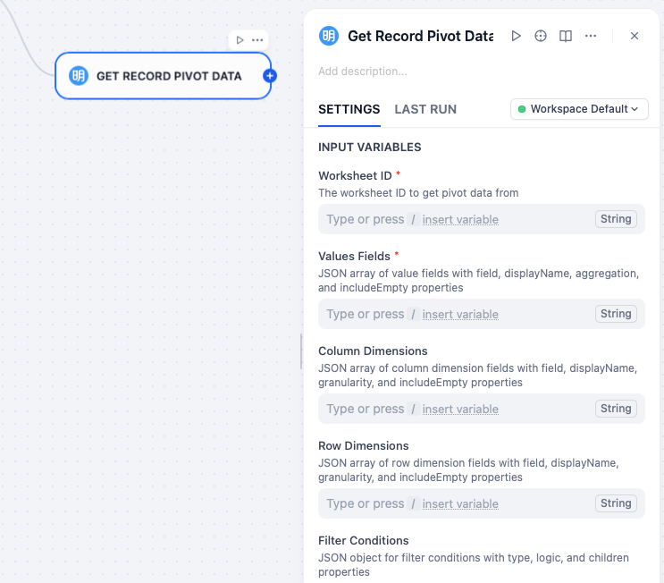

# HAP Application Tool (HAP 应用工具)

Welcome to the **HAP** (Hyper Application Platform) **Dify** Plugin, which seamlessly connects your **HAP** applications to **Dify**, enriching your applications with comprehensive AI-powered scenarios.

欢迎使用 **HAP**（Hyper Application Platform）的 **Dify** 插件，它将连接您的 **HAP** 应用至 **Dify**，为应用注入丰富的 AI 使用场景。

## Use Case Examples / 使用场景示例

### AI Application Creation: "Create a management system for TikTok orders and after-sales."

By configuring the following 9 tools, you can create a `HAP App Builder Agent` in **Dify**. Once the Agent is properly configured, you can create applications through conversational interactions and rapidly generate sample data.

### AI 创建应用：“创建一个 TikTok 订单及售后管理系统”

配置下面的 9 个工具，你可以在 Dify 快速建立一个 `HAP App Builder Agent`。配置好Agent之后，就可以通过对话创建应用并快速生成示例数据。

You can use the following prompt to have AI create a TikTok order management system for you:

> Create a product, order, and after-sales management system for a TikTok e-commerce platform, and generate a batch of sample test data.

The AI will automatically create interconnected TikTok business worksheets and generate realistic test data upon completion!

你可以用下面的对话来让 AI 帮你创建一个 TikTok 的订单管理系统：

> 为 TikTok 电商平台创建一个产品、订单和售后管理系统，并生成一批样本测试数据。

AI 会自动创建相互关联的 TikTok 业务工作表，并在创建完成后生成一批测试数据，像真实的一样！

### AI Application Data Management: "Tell me the top 3 best-selling products in Q2"

By configuring the tools below, we can create an Agent for managing application data, capable of querying, analyzing, and performing CRUD operations on data within the application.

### AI 应用数据管理：“告诉我Q2卖得最好的商品前3名是什么”

配置下面的工具，我们可以创建一个管理应用数据的Agent，可以对应用内的数据进行查询、统计以及增删改。

**Query examples:**

> 1. What are the top 3 best-selling products in Q2?
> 2. Which product category has the highest return rate in the past 30 days?
> 3. Analyze the top 5 customers with the highest repurchase rates, showing their purchase frequency and total spending.
> 4. Mark all today's after-sales orders as "Completed".

**查询示例：**

> 1. 告诉我Q2卖得最好的商品前3名是什么？
> 2. 过去30天内哪个商品类目的退货率最高？
> 3. 统计一下复购率最高的前5名客户，显示他们的购买次数和总消费金额
> 4. 帮我把今天的售后单都标记为“已完成”

## Tools / 工具列表

- **get_app_info**: Get Application Info / 获取应用信息
- **get_worksheet_structure**: Get Worksheet Structure /获取工作表结构
- **list_records**: List Records / 查询工作表行记录列表
- **get_record_pivot**: Get Record Pivot Data / 获取记录透数据
- **create_record**: Create Record / 新建记录
- **update_record**: Update Record / 更新记录
- **delete_record**: Delete Record / 删除记录
- **get_record**: Get Record Details / 获取记录详情
- **public_find_member**: Find Member / 查找成员
- **public_find_department**: Find Department / 查找部门
- **public_get_regions**: Get Regions/Citys / 获取地区/城市
- **batch_create_records**: Batch Create Records / 批量创记录
- **batch_update_records**: Batch Update Records / 批量更记录
- **batch_delete_records**: Batch Delete Records / 批量删记录
- **get_record_discussions**: Get Record Discussions / 取记录讨论
- **get_record_logs**: Get Record Logs / 获取记录日志
- **get_record_relations**: Get Record Relations / 获取记关联
- **get_record_share_link**: Get Record Share Link / 获取录分享链接
- **create_worksheet**: Create Worksheet / 新建工作表
- **update_worksheet**: Update Worksheet / 编辑工作表
- **delete_worksheet**: Delete Worksheet / 删除工作表
- **list_workflows**: List Workflows / 获取工作流列表
- **get_workflow**: Get Workflow Details / 获取工作流详情
- **trigger_workflow**: Trigger Workflow / 触发工作流
- **list_roles**: List Roles / 获取角色列表
- **get_role**: Get Role Details / 获取角色详情
- **create_role**: Create Role / 创建角色
- **delete_role**: Delete Role / 删除角色
- **add_role_members**: Add Role Members / 添加角色成员
- **remove_role_members**: Remove Role Members / 移除角色员
- **user_leave_all_roles**: User Leave All Roles / 成员退所有角色
- **list_optionsets**: List Option Sets / 获取选项集列表
- **create_optionset**: Create Option Set / 创建选项集
- **update_optionset**: Update Option Set / 更新选项集
- **delete_optionset**: Delete Option Set / 删除选项集

## Getting Started

1. Register for a free account at [https://www.mingdao.com/register](https://www.mingdao.com/register) and create a **HAP** application.
2. In the **HAP** application management, copy the application's `AppKey` and `Sign` from `API Developer Docs`.
3. Install the `HAP Application Tool` plugin from the Marketplace.
4. Configure the `AppKey` and `Sign` in the plugin's `API Key Authorization` on the Plugins page.

5. You can connect multiple **HAP** applications by creating new authorizations and switch between different authorizations when using them in **Dify**.

6. To use `HAP Application Tool` in workflows, simply add nodes directly on the canvas:

7. To use `HAP Application Tool` in an Agent, simply configure the plugin as the Agent's tool. However, given the extensive number of plugin tools available, it's important to consider the scope of tool capabilities and select the most appropriate tools based on the Agent's intended purpose.

## 快速开始

1. 从 [https://www.mingdao.com/register](https://www.mingdao.com/register) 免费注册一个用户，并创建一个 HAP 应用。
2. 在 **HAP** 应用管理菜单里，从 `API Developer Docs` 复制应用的 `Appkey` 和 `Sign`。
3. 从市场安装 `HAP 应用工具` 插件。
4. 在插件管理页面中将 `AppKey` 和 `Sign` 配置到插件的 `API Key 授权配置` 中。
5. 你可以通过创建新的授权配置来连接多个 **HAP** 应用，在 **Dify** 中使用时切换不同的凭据即可。
6. 在工作流中使用 `HAP 应用工具`，直接在画布中添加节点即可。
7. 在 Agent 中使用 `HAP 应用工具`，直接把插件配置为 Agent 的工具即可。不过由于插件工具数量比较多，要注意工具的能力范围，根据 Agent 的用途挑选最合适的工具。
