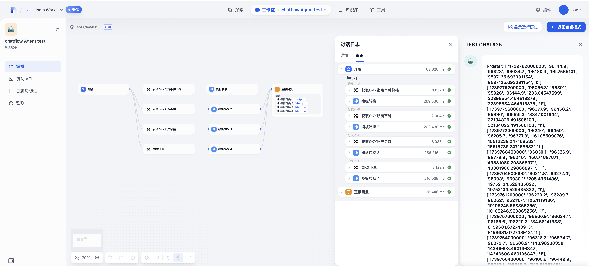

## OKX Plugin

**Author:** joe
**Version:** 0.0.1
**Type:** tool

### Description

A Dify plugin for interacting with OKX cryptocurrency exchange. This plugin provides various tools for trading and accessing market data on OKX.

### Features

- **Market Data**
  - Get real-time price data (okx_get_price)
  - List all available trading pairs (okx_get_all_symbol)
  - View account balances (okx_get_balance)
  - Place trading orders (okx_create_order)

### Tools

1. **okx_get_price**
   - Get candlestick data for a specific trading pair
   - Supports multiple time intervals (1m, 3m, 5m, 15m, 30m, 1H, 2H, 4H)
   - Customizable data limit

2. **okx_get_all_symbol**
   - List all available trading pairs
   - Filter by market type (spot/futures)
   - Returns symbol names in standard format

3. **okx_get_balance**
   - View account balances across different account types
   - Supports spot, funding, and trading accounts
   - Shows free, used, and total balances
   - Filters out zero balances automatically

4. **okx_create_order**
   - Place spot or futures orders
   - Support for market and limit orders
   - Built-in minimum amount validation
   - Comprehensive order status response

### Setup

1. Get your API credentials from OKX:
   - API Key
   - Secret Key
   - Passphrase

2. Configure the plugin with your credentials in Dify
### Security

- API credentials are securely handled through Dify's credential management
- All requests are made via CCXT's secure API implementation
- No credentials are stored in plaintext

### Note

Please ensure you understand the risks involved in cryptocurrency trading. This plugin is provided as-is, and users are responsible for their own trading decisions.

