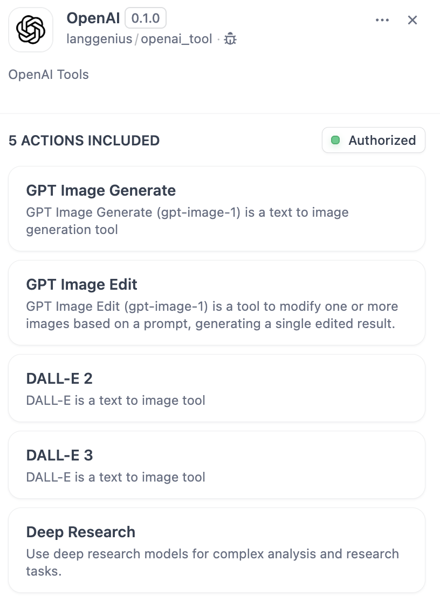
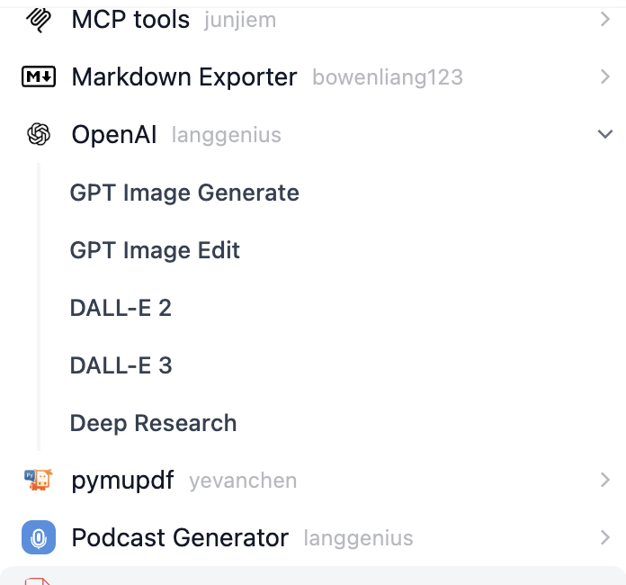

# OpenAI Tools for Dify

## Overview

OpenAI offers powerful AI models for various tasks including image generation, editing, and deep research analysis. Dify has integrated tools leveraging these capabilities, including DALL-E 2, DALL-E 3, GPT-IMAGE-1, and the Deep Research tool. This document outlines the steps to configure and use these OpenAI tools in Dify.

### Available Tools

#### Image Generation and Editing Tools
- **DALL-E 2**: Generate images from text descriptions
- **DALL-E 3**: Advanced image generation with improved quality and prompt adherence
- **GPT Image Generate**: General-purpose image generation
- **GPT Image Edit**: Edit existing images based on text instructions

#### Deep Research Tool
- **Deep Research**: Perform comprehensive research and analysis using OpenAI's specialized research models (o3-deep-research, o4-mini-deep-research). This tool can find, analyze, and synthesize information from hundreds of sources to create detailed reports with proper citations.

## Configure

### 1. Apply for an OpenAI API Key

Please apply for an API Key on the [OpenAI Platform](https://platform.openai.com/). This key will be used for all OpenAI image tools.

**Important Note for GPT Image-1 Model:** If you plan to use the GPT-Image-1 model, your organization must complete verification first. Without organization verification, you'll receive a 403 error. To complete verification, please visit the [API Organization Verification guide](https://help.openai.com/en/articles/10910291-api-organization-verification).

**Important Note for Deep Research Tool:** The Deep Research tool requires access to OpenAI's specialized research models. Ensure your API key has access to these models and be aware that deep research tasks may consume significant tokens and time.

### 2. Get OpenAI tools from Plugin Marketplace

The OpenAI tools (including DALL-E, GPT IMAGE, and Deep Research) can be found in the Plugin Marketplace. Please install the ones you need.

### 3. Fill in the configuration in Dify

On the Dify navigation page, click `Plugins > [Installed OpenAI Tool] > Authorize` and fill in the API Key. Repeat this for each OpenAI tool you install.

**Note:** Base URL and Organization ID are optional. The Organization IDs can be found on your [Organization settings](https://platform.openai.com/settings/organization/general) page.

 
*(Note: Image may show DALL-E specifically, but the process is similar for other OpenAI tools)*

### 4. Use the tools

You can use the OpenAI tools in the following application types:

#### Chatflow / Workflow / Agent applications

Both Chatflow and Workflow applications support nodes for the installed OpenAI tools (e.g., `DALL-E 3`, `GPT Image Generate`, `Deep Research`). After adding a node, you need to fill in the necessary inputs with variables referencing user input or previous node outputs. 

For image tools, use variables to reference the image output in the "End" node or subsequent nodes.

For the Deep Research tool, you can:
- **Start a research task**: Provide a detailed research prompt and configure options
- **Check task status**: Use the retrieve action with a response ID
- **Cancel a task**: Use the cancel action with a response ID

## Deep Research Tool Usage

The Deep Research tool supports three main actions:

### Starting a Research Task

- **Action**: `start`
- **Model**: Choose between `o3-deep-research` or `o4-mini-deep-research`
- **Prompt**: Provide a detailed research question or analysis request
- **Data Sources**: Enable web search and/or code interpreter as needed
- **Max Tool Calls**: Optional limit on the number of searches/analyses

### Checking Task Status
- **Action**: `retrieve`
- **Response ID**: The ID returned when starting the task

#### Task Status: Queued

When a research task is started, it will initially show as "queued" status while waiting to be processed.

#### Task Status: Completed

When a research task is completed, it will return comprehensive reports with numbered citations and reference lists for completed research tasks.

### Canceling a Task
- **Action**: `cancel`
- **Response ID**: The ID of the task to cancel

