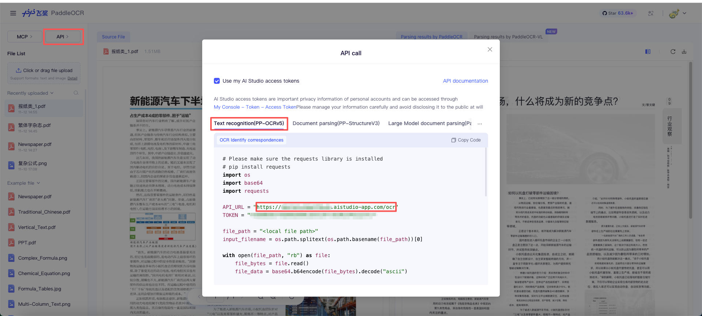

# PaddleOCR Text Recognition

## Overview

**[PaddleOCR](https://github.com/PaddlePaddle/PaddleOCR) is an industry-leading, production-ready OCR and document AI engine, offering end-to-end solutions from text extraction to intelligent document understanding.** This plugin provides text recognition capabilities for multiple scenarios and various text types.

## Configuration

### 1. Get the PaddleOCR text recognition plugin from Plugin Marketplace

Open the Plugin Marketplace, search for the PaddleOCR text recognition plugin, and install it to integrate it with your application.

### 2. Fill in the configuration in Dify

1. Go to the [PaddleOCR official website](https://aistudio.baidu.com/paddleocr/task), click the **API** button in the upper-left corner, select **Text Recognition (PP-OCRv5)**, and copy the `API_URL`.

    

2. Get your AI Studio access token from [this page](https://aistudio.baidu.com/index/accessToken).

### 3. Use the plugin

You can use the PaddleOCR text recognition plugin in the following application types.

#### Chatflow / Workflow applications

Both Chatflow and Workflow applications support adding a PaddleOCR text recognition tool node.

#### Agent applications

Add the PaddleOCR text recognition tool in the Agent application, and then enter commands to call this tool.

## Credits

This plugin is powered by [PaddleOCR](https://github.com/PaddlePaddle/PaddleOCR).
