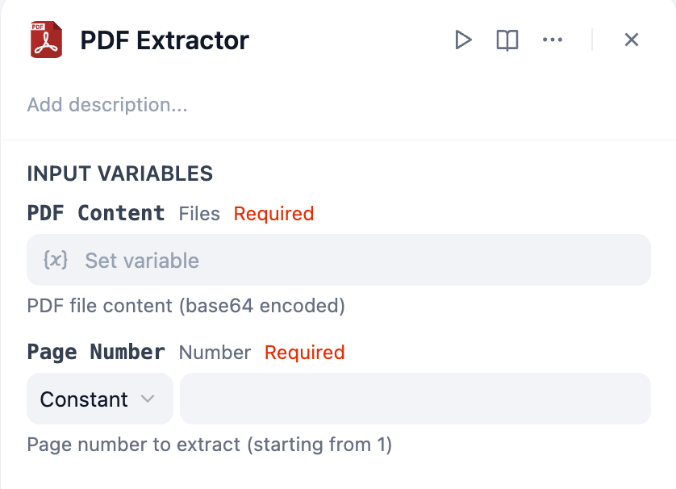
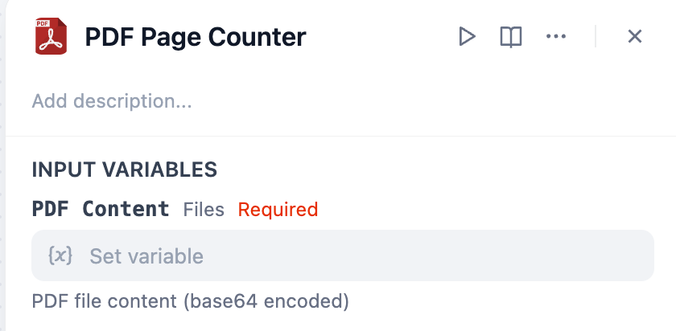

# Overview
PDF Process is a group of tools for working with PDF files, allowing you to perform PDF operations.

# Configure
## PDF Extractor
PDF Extractor tool extracts a specific page from a PDF file and saves it as a new PDF.

The tool requires two parameters:
- **PDF Content**: The input PDF file to be extracted
- **Page Number**: The page number to extract (1-indexed)

## PDF Page Counter
PDF Page Counter tool counts the total number of pages in a PDF file and returns the count as a number.

The tool requires one parameter:
- **PDF Content**: The input PDF file to be analyzed
