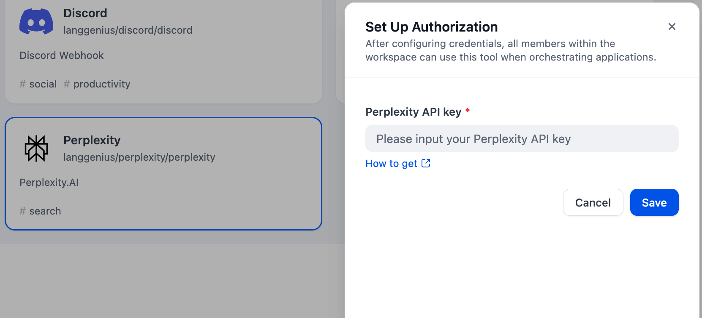
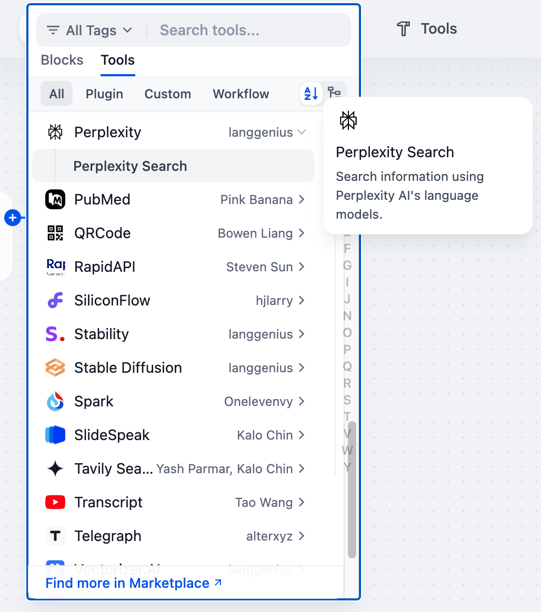

# Perplexity

## Overview

Perplexity is an AI-based search engine that can understand complex queries and provide accurate, relevant real-time answers. Here are the steps to configure and use the Perplexity Search tool in Dify.

## Configuration

### 1. Apply for Perplexity API Key

Please apply for an API Key at [Perplexity](https://www.perplexity.ai/settings/api), and ensure that your account has sufficient Credits.

### 2. Fill in the configuration in Dify

In the Dify navigation page, click on Tools > Perplexity > Go to authorize to fill in the API Key.

### 3. Using the tool

You can use the Perplexity Search tool in the following application types:

#### Chatflow / Workflow applications

Both Chatflow and Workflow applications support adding `Perplexity Search` tool nodes. Pass the user's input content through variables to the "Query" box in the Perplexity tool node, adjust the built-in parameters of the Perplexity tool as needed, and finally select the output content of the Perplexity tool node in the response box of the "End" node.

#### Agent applications

Add the `Perplexity Search` tool in the Agent application, then enter relevant commands to invoke this tool.
## Migration Notice

As of version 1.1.0, this plugin has been migrated from Perplexity's Sonar Chat Completions API to the new [Agent API](https://docs.perplexity.ai/docs/agent-api/quickstart), ahead of the Sonar API's retirement on September 27, 2026.

The "Model Name" parameter has been replaced by "Preset", which roughly maps to the previous Sonar models:

| Previous Sonar model | New Agent API preset |
| --- | --- |
| Sonar | fast |
| Sonar Pro | low |
| Sonar Reasoning / Reasoning Pro | medium |
| Sonar Deep Research | high |
| N/A | xhigh |

"Return Images" and "Return Related Questions" are no longer available, as the Agent API does not expose equivalent options.
