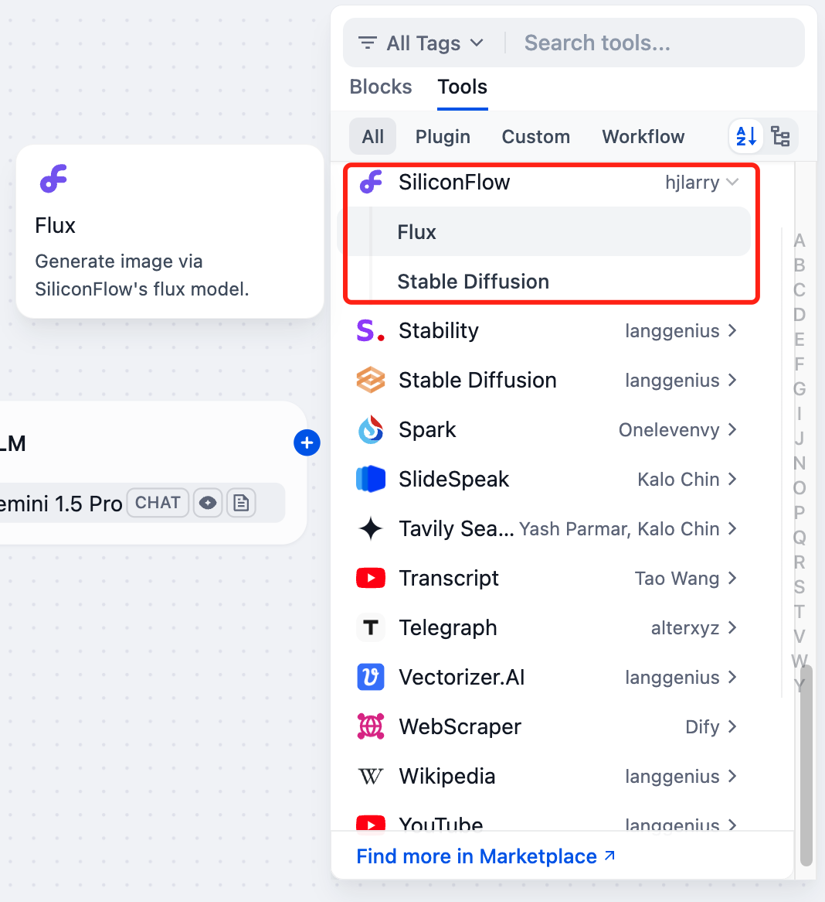
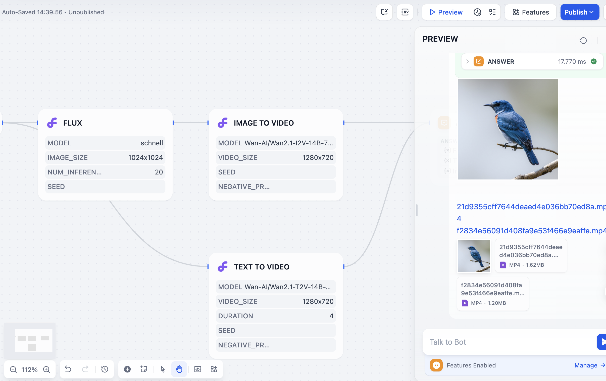

# SiliconFlow

## Overview

SiliconFlow provides high-quality GenAI services based on excellent open-source foundation models. You can use SiliconFlow in Dify through consolidated image generation, image editing, and video generation tools backed by current SiliconFlow models.

## Configuration

### 1. Apply for SiliconCloud API Key

Create a new API Key on the [SiliconCloud API management](https://cloud.siliconflow.cn/account/ak) page and ensure that you have sufficient balance.

### 2. Get SiliconFlow tools from Plugin Marketplace

The SiliconFlow tools could be found at the Plugin Marketplace, please install it first.

### 3. Fill in the configuration in Dify

On the Dify navigation page, click `Tools > SiliconFlow > To Authorize` and fill in the API Key.

### 4. Using the tools

You can use the SiliconFlow tool in the following application types:

#### Chatflow / Workflow applications

Both Chatflow and Workflow applications support the SiliconFlow tool node. After adding it, fill in "Input Variables → Prompt" with variables that reference the user's prompt or the content generated by the previous node. Then reference the structured output from the SiliconFlow tool in the "End" node.

#### Agent applications

Add the SiliconFlow tool in the Agent application, then send an image-generation, image-editing, or video-generation prompt in the dialog box to call the corresponding unified tool.

### 5. Features

#### Image Generation

**Image Generate**

The `Image Generate` tool uses the current `/v1/images/generations` API and supports both text-to-image and image-to-image generation.

- **Parameters**:
  - `model`: Choose between `Kwai-Kolors/Kolors` and `Qwen/Qwen-Image`; this choice determines which model-specific parameters are effective
  - `prompt` (required): Text prompt used to generate the image
  - `image`: Optional input image URL or base64 data for image-to-image generation; leave empty for text-to-image
  - `negative_prompt`: Optional content to avoid in the image, supported by both models
  - `image_size`: Model-dependent recommended sizes; pick a size that matches the selected model
  - `batch_size`: 1-4 images per generation, only effective for Kolors
  - `guidance_scale`: 0-20 (default: 7.5), only effective for Kolors
  - `cfg`: 0.1-20 (default: 4), only effective for Qwen Image
  - `num_inference_steps`: 1-100 (default: 20), supported by both models
  - `seed`: Optional parameter for reproducible results, supported by both models

- **Available Models**:
  - `Kwai-Kolors/Kolors`
  - `Qwen/Qwen-Image`

**Image Edit**

The `Image Edit` tool uses the current `/v1/images/generations` API for image editing.

- **Parameters**:
  - `model`: Choose between `Qwen/Qwen-Image-Edit-2509` and `Qwen/Qwen-Image-Edit`
  - `prompt` (required): Text prompt describing the target edit result
  - `num_inference_steps`: 1-100 (default: 20)
  - `cfg`: 0.1-20 (default: 4)
  - `seed`: Optional parameter for reproducible results
  - `image`: Required first input image URL or base64 data
  - `image2` / `image3`: Optional additional input images for `Qwen/Qwen-Image-Edit-2509`

- **Available Models**:
  - `Qwen/Qwen-Image-Edit-2509`
  - `Qwen/Qwen-Image-Edit`

#### Video Generation

**Video Generate**

The `Video Generate` tool uses SiliconFlow's current `/v1/video/submit` and `/v1/video/status` workflow, supporting both text-to-video and image-to-video depending on the selected model.

- **Parameters**:
  - `prompt` (required): Detailed text description for video generation
  - `model`: Choose between `Wan-AI/Wan2.2-T2V-A14B` and `Wan-AI/Wan2.2-I2V-A14B`
  - `image`: Required when model is `Wan-AI/Wan2.2-I2V-A14B`, ignored for text-to-video
  - `video_size`: Supported sizes `1280x720`, `720x1280`, and `960x960`
  - `seed`: Optional parameter for reproducible results
  - `negative_prompt`: Control what you don't want in the video

- **Available Models**:
  - `Wan-AI/Wan2.2-T2V-A14B`
  - `Wan-AI/Wan2.2-I2V-A14B`

(May take 4 minutes to generate 1 video)

#### About SiliconFlow

SiliconFlow is committed to building a scalable, standardized, and high-performance AI Infra platform. It offers SiliconCloud (the model cloud service platform), SiliconLLM (the LLM inference engine), and OneDiff (the high-performance text-to-image/video acceleration library). These solutions help enterprises and individual users deploy AI models efficiently and cost-effectively.

[Website](https://siliconflow.cn/) | [SiliconCloud](https://cloud.siliconflow.cn/playground/chat) | [Discord](https://discord.gg/3nAMSVJekY) | [X](https://twitter.com/SiliconFlowAI) 
