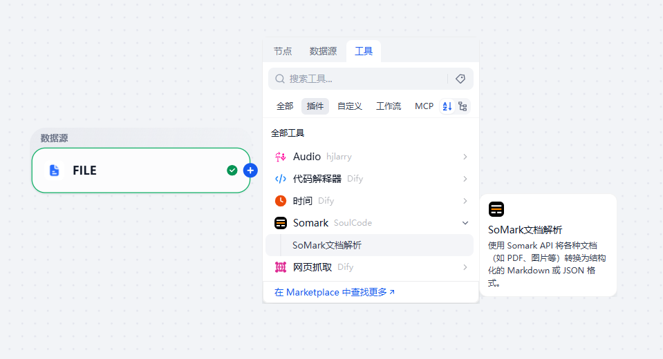
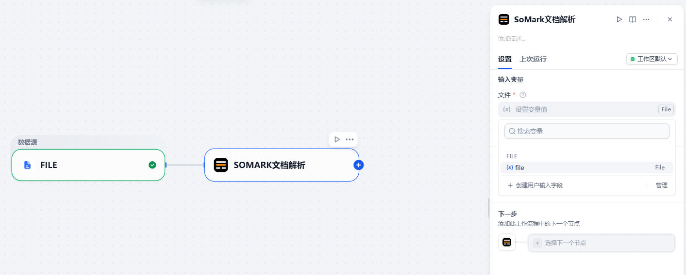

# Somark Dify Plugin

## Overview / 简介

SoMark is a DocAI that can convert diverse documents—such as PDFs, images, and more—into structured Markdown or JSON. It is designed to work seamlessly across all scenarios.

SoMark 是一款 DocAI 产品，能够将各种文档（如 PDF、图片等）转换为结构化的 Markdown 或 JSON 格式。它旨在无缝适用于所有场景。

It breaks the traditional trade-off between accuracy, speed, and cost, delivering precise document parsing in milliseconds with minimal hardware resources.

它打破了传统 OCR 在准确性、速度和成本之间的权衡，以极少的硬件资源在毫秒级内提供精确的文档解析。

The resulting structured data is AI-native, ready to power LLM training, enhance RAG systems, and enable intelligent agents.

生成的结构化数据是 AI 原生的，可直接用于 LLM 训练、增强 RAG 系统和赋能智能体 (Agent)。

## Key Advantages / 核心优势

SoMark pioneers the proprietary 「OXR」algorithm, extending traditional OCR (Optical Character Recognition) into Optical Everything Recognition.

SoMark 首创了专有的「OXR」算法，将传统的 OCR（光学字符识别）扩展为 OXR（光学万物识别）。

From basic layout segmentation and reading-order recovery to complex elements such as tables, formulas, images, and even chemical notations, every component can be accurately extracted and reconstructed. The output is a complete, highly structured representation of the document.

从基础的版面分割和阅读顺序还原，到复杂的元素（如表格、公式、图片，甚至化学符号），所有组件都能被准确提取和重构。输出的是文档的完整、高度结构化的表示。

Built on this powerful OXR algorithm, SoMark achieves the perfect balance of accuracy, speed, and cost:

基于强大的 OXR 算法，SoMark 实现了准确性、速度和成本的完美平衡：

- **Accurate / 精准**: Ultra-fine granularity— coordinate-traceable parsing for 21 document element types

  超细粒度——对 21 种文档元素类型进行坐标可追溯的解析
- **Fast / 快速**: Exceptional performance—parsing 100 pages in as little as 5 seconds

  卓越性能——解析 100 页仅需 5 秒
- **Economical / 经济**: Robust efficiency—private deployment can start with just a single RTX 3090

  高效能——私有化部署仅需单张 RTX 3090 即可启动

SoMark delivers strong general-purpose recognition capability. A single API call handles document parsing across all formats and scenarios.

SoMark 提供强大的通用识别能力。只需一个 API 调用即可处理所有格式和场景的文档解析。

### Supported Industries & Use Cases / 支持的行业与用例:

- **Finance / 金融**: research reports, financial statements, prospectuses

  研报、财报、招股书
- **Research / 科研**: academic papers, programming books, patent documents

  学术论文、编程书籍、专利文档
- **Education / 教育**: exam papers, workbooks, textbooks, scanned books

  试卷、教辅、教材、扫描书籍
- **Manufacturing / 制造**: forms, industrial manuals, engineering drawings

  表单、工业手册、工程图纸
- **Legal / 法律**: regulations, contracts, industry standards

  法规、合同、行业标准
- **Others / 其他**: white papers, PPTs, handwritten notes, vertical text, magazines, newspapers

  白皮书、PPT、手写笔记、竖排文本、杂志、报纸

### Supported File Formats / 支持的文件格式:

- **PDF & Images / PDF 与图片**: PDF, PNG, JPG/JPEG, BMP, TIFF, JP2, DIB, PPM, PGM, PBM, GIF, HEIC/HEIF, WEBP, XPM, TGA, DDS, XBM

## Unique Features / 独家功能

- **Image Understanding / 图像理解**: Comprehensively understands image content and generates accurate descriptions for pictures within documents.

  全面理解图像内容，并为文档中的图片生成准确描述。
- **Embedded Image Restoration / 嵌入式图像还原**: Recovers images embedded within text paragraphs and table cells, precisely presenting the original, complex information.

  还原嵌入在文本段落和表格单元格中的图片，精确呈现原始的复杂信息。
- **Watermark Resistance with Seal Recognition / 抗水印与印章识别**: Removes watermark interference, identifies seals/stamps, and extracts clean, pure content.

  去除水印干扰，识别印章/图章，提取干净纯粹的内容。

## Next Steps and To-Do List / 后续计划与待办事项

### Expanded File Format Support / 扩展文件格式支持
- Spreadsheets / 电子表格: CSV, XLSX, XLSM, XLS, XLTX, XLTM, QPW
- Text Documents / 文档: DOC, DOCX, WPD, TXT
- Presentations / 演示文稿: PPTX, PPT, HTML

### New Advanced Features / 新增高级功能
- Heading Hierarchy Recognition / 标题层级识别
- Cross-Page Table Patching / 跨页表格合并
- Auto Table Rotation / 自动表格旋转
- Statistical Charts to Tables / 统计图表转表格
- Multilingual Recognition & Parsing / 多语言识别与解析

## Getting Started / 快速开始

### Configuration Steps / 配置步骤

1.  Log into your Dify platform.

    登录您的 Dify 平台。
2.  Go to **"Tools" -> "Plugin Market"**, search for **"Somark"** plugin and add it.

    前往 **"工具" -> "插件市场"**，搜索 **"Somark"** 插件并添加。
3.  Configure the Somark plugin parameters:

    配置 Somark 插件参数：
    *   **Base URL**: Default is `https://somark.tech/api/v1/extract`. You usually don't need to change this.

        默认为 `https://somark.tech/api/v1/extract`。通常无需修改。
    *   **API Key**: Enter your Somark API Key.

        输入您的 Somark API Key。
        *   *No API Key?* [Get 1000 free pages here / 在此免费领取 1000 页额度](https://somark.tech/workbench/purchase)
4.  Save your configuration.

    保存配置。

### Usage in Workflow / 在工作流中使用

#### Step 1: Configure the Start Node / 第一步：配置开始节点

In your workflow's **Start** node, add an input variable of type **File** to receive the document uploaded by the user. This variable will be passed downstream to the Somark tool node.

在工作流的 **开始** 节点中，添加一个类型为 **文件** 的输入变量，用于接收用户上传的文档。该变量将被传递给下游的 Somark 工具节点。

#### Step 2: Add the Somark Tool Node / 第二步：添加 Somark 工具节点

In your Dify workflow, click **"+"** to add a new node, select **"Tools"**, then find and add the **Somark > Extract Document** node.

在 Dify 工作流中，点击 **"+"** 添加新节点，选择 **"工具"**，找到并添加 **Somark > Somark文档解析** 节点。

#### Step 3: Configure Input Variables / 第三步：配置输入变量

In the **Extract Document** node panel, configure the **File** input:

在 **文档解析** 节点面板中，配置 **文件** 输入：

- Click the variable icon **`{x}`** in the **File** input field.
  点击 **文件** 输入框中的变量图标 **`{x}`**。
- Select the file variable you defined in the Start node.
  选择您在开始节点中定义的文件变量。

**Note / 注意**: The API Key is automatically injected from the plugin configuration — you do **not** need to enter it manually in the node.

API Key 由插件配置自动注入，**无需**在节点中手动输入。

#### Step 4: Reference the Output in Downstream Nodes / 第四步：在下游节点中引用输出

After the node executes, its output variables become available for all downstream nodes (e.g., LLM, Text Splitter, Code node). Click **`{x}`** in any downstream node's input field and select from the Somark node's output variables.

节点执行完成后，其输出变量可在所有下游节点（如 LLM、文本分割、代码节点）中使用。在任意下游节点的输入框中点击 **`{x}`**，即可选择 Somark 节点的输出变量。

#### Input Parameters / 输入参数

| Parameter / 参数 | Type / 类型 | Required / 必填 | Description / 描述 |
| :--- | :--- | :--- | :--- |
| file | file | Yes / 是 | Supported files: PDF, PNG, JPG, JPEG, BMP, TIFF, JP2, DIB, PPM, PGM, PBM, GIF, HEIC, HEIF, WEBP, XPM, TGA, DDS, XBM. Max 50MB/50 pages.   支持的文件：PDF, PNG, JPG, JPEG, BMP, TIFF, JP2, DIB, PPM, PGM, PBM, GIF, HEIC, HEIF, WEBP, XPM, TGA, DDS, XBM。最大 50MB/50 页。 |

#### Output Variables / 输出变量

The node exposes the following output variables:

节点暴露以下输出变量：

**`markdown`** `string` — The parsed document content in Markdown format, preserving the original layout structure including headings, tables, lists, formulas, and images. 

解析后的文档内容（Markdown 格式），保留原始版面结构，包括标题、表格、列表、公式和图片。

**`json`** `array[object]` — The full raw JSON response from the Somark API, containing detailed structured data for every document element (element type, content, bounding box coordinates, page number, etc.). Useful for advanced processing in a Code node.

Somark API 返回的完整原始 JSON 响应，包含每个文档元素的详细结构化数据（元素类型、内容、坐标框、页码等）。适合在代码节点中进行高级处理。

**`text`** / **`files`** — Dify built-in variables, not populated by this plugin.

Dify 内置变量，本插件不填充这两个变量。

## Credits / 致谢

This plugin interacts with the [Somark API](https://somark.ai).

本插件基于 [Somark API](https://somark.ai) 构建。
