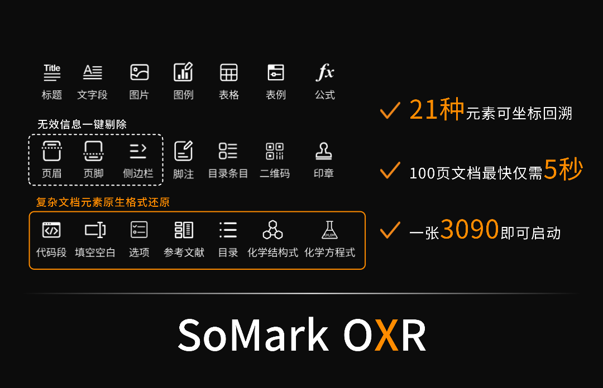
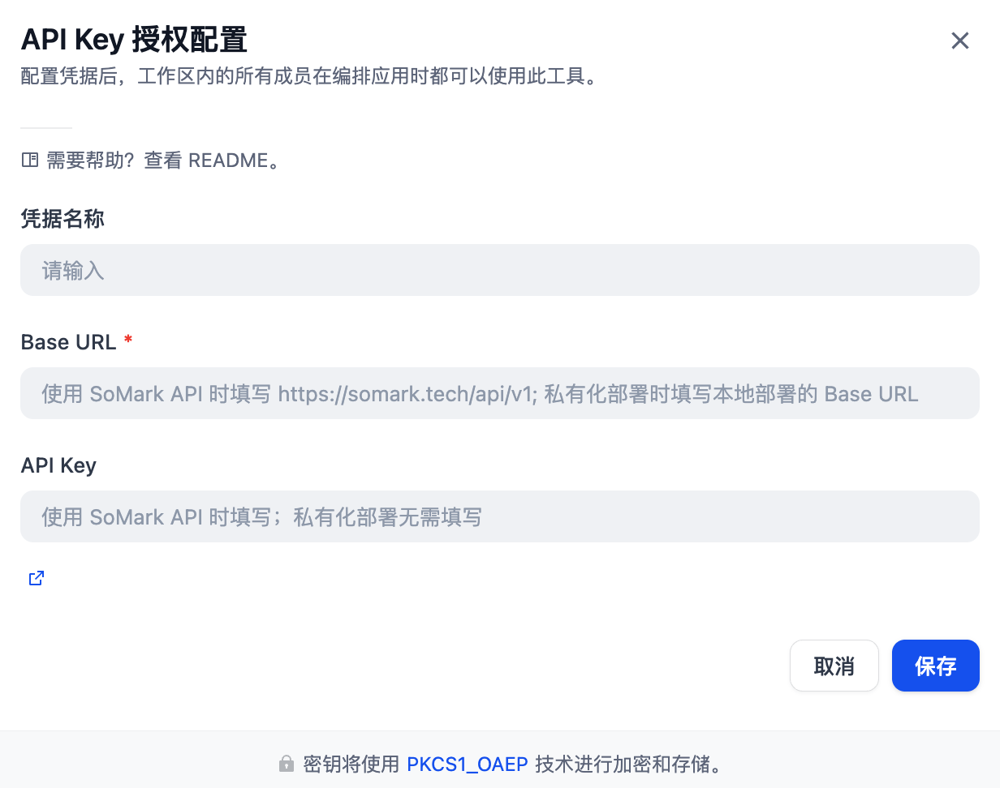
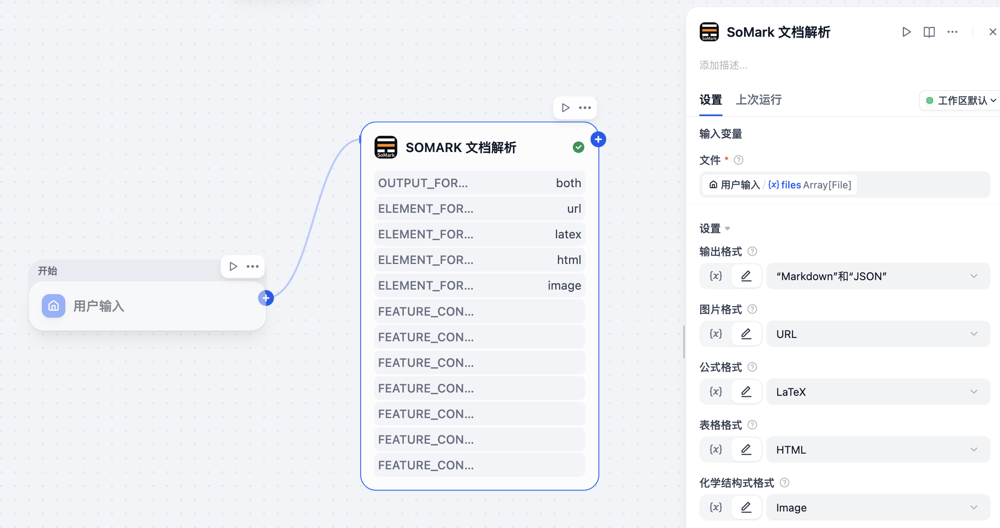

# SoMark

SoMark is a DocAI that can convert diverse documents—such as PDFs, images, and more—into structured Markdown or JSON. It is designed to work seamlessly across all scenarios.

It breaks the traditional trade-off between accuracy, speed, and cost, delivering precise document parsing in milliseconds with minimal hardware resources.

The resulting structured data is AI-native, ready to power LLM training, enhance RAG systems, and enable intelligent agents.

## Key Advantages

SoMark pioneers the proprietary "OXR" algorithm, extending traditional OCR (Optical Character Recognition) into Optical Everything Recognition.

From basic layout segmentation and reading-order recovery to complex elements such as tables, formulas, images, and even chemical notations, every component can be accurately extracted and reconstructed. The output is a complete, highly structured representation of the document.

Built on this powerful OXR algorithm, SoMark achieves the perfect balance of accuracy, speed, and cost:

- **Accurate**: Ultra-fine granularity—coordinate-traceable parsing for 21 document element types
- **Fast**: Exceptional performance—parsing 100 pages in as little as 5 seconds
- **Economical**: Robust efficiency—private deployment can start with just a single RTX 3090

SoMark delivers strong general-purpose recognition capability. A single API call handles document parsing across all formats and scenarios.

### Supported Industries & Use Cases

- **Finance**: research reports, financial statements, prospectuses
- **Research**: academic papers, programming books, patent documents
- **Education**: exam papers, workbooks, textbooks, scanned books
- **Manufacturing**: forms, industrial manuals, engineering drawings
- **Legal**: regulations, contracts, industry standards
- **Others**: white papers, PPTs, handwritten notes, vertical text, magazines, newspapers

### Supported File Formats

- **PDF & Images**: PDF, PNG, JPG/JPEG, BMP, TIFF, JP2, DIB, PPM, PGM, PBM, GIF, HEIC/HEIF, WEBP, XPM, TGA, DDS, XBM
- **Office Documents**: DOC, DOCX, PPT, PPTX, XLS, XLSX

## Unique Features

- **Image Understanding**: Comprehensively understands image content and generates accurate descriptions for pictures within documents.
- **Embedded Image Restoration**: Recovers images embedded within text paragraphs and table cells, precisely presenting the original, complex information.
- **Watermark Resistance with Seal Recognition**: Removes watermark interference, identifies seals/stamps, and extracts clean, pure content.
- **Heading Hierarchy Recognition**: Recognizes and extracts the hierarchy of headings in a document.
- **Cross-Page Table Patching**: Merges tables that span multiple pages, preserving the structure of the original document.
- **Cross-Page Text Patching**: Merges text that spans multiple pages, preserving the original document structure.

## Next Steps and To-Do List

### Expanded File Format Support
- Spreadsheets: CSV, XLSM, XLTX, XLTM, QPW
- Text Documents: WPD, TXT
- Presentations: HTML

### New Advanced Features
- Auto Table Rotation
- Statistical Charts to Tables
- Multilingual Recognition & Parsing

## Getting Started

### Configuration Steps

1.  Log into your Dify platform.
2.  Go to **"Tools" -> "Plugin Market"**, search for the **"SoMark"** plugin and add it.
3.  Configure the SoMark plugin parameters:

    *   **Base URL** (required): The address of the SoMark service.

        - For SoMark API, fill in `https://somark.tech/api/v1`.
        - For self-hosted deployment, fill in your SoMark service Base URL (e.g. `https://somark.your-domain.com/api/v1`). The URL must start with `http://` or `https://`.

    *   **API Key**:

        - **Required** when using **SoMark API**. The plugin will validate your key against the SoMark service when you save.
        - **Not required** for self-hosted deployment (leave it blank if your self-hosted instance does not require authentication).
        - *No API Key?* [Get 1000 free pages here](https://somark.tech/workbench/purchase)

4.  Save your configuration.

### Usage in Workflow

#### Step 1: Add the SoMark Document Parser Tool Node

In your Dify workflow, click **"+"** to add a new node, select **"Tools"**, then find and add the **SoMark > SoMark Document Parser** node.

#### Step 2: Configure Input Variables

In the **SoMark Document Parser** node panel, configure the **File** input:

- Click the variable icon **`{x}`** in the **File** input field.
- Select the file variable you defined in the upstream node.

For more parameters (such as output format and feature toggles), see **Input Parameters** below.

**Note**:

- The API Key and Base URL are automatically injected from the plugin configuration — you do **not** need to enter them manually in the node.
- In self-hosted deployments, tool nodes run inside the plugin runtime (plugin-daemon). Ensure it can reach the configured Base URL (network egress / proxy / DNS).

#### Step 3: Reference the Output in Downstream Nodes

After the node executes, its output variables become available for all downstream nodes (e.g., LLM, Text Splitter, Code node). Click **`{x}`** in any downstream node's input field and select from the SoMark node's output variables.

#### Input Parameters

| Parameter | Type | Required | Description |
| :--- | :--- | :--- | :--- |
| `File` | File | Yes | Supported files: PDF, PNG, JPG, JPEG, BMP, TIFF, JP2, DIB, PPM, PGM, PBM, GIF, HEIC, HEIF, WEBP, XPM, TGA, DDS, XBM, DOC, DOCX, PPT, PPTX, XLS, XLSX. Max 200 MB / 300 pages. |
| `Output Formats` | Single-select | No | Select the output format. Supported options: `Markdown`, `JSON`, `Both "Markdown" and "JSON"`. Default: `Both "Markdown" and "JSON"`. |
| `Image Format` | Single-select | No | Image output format. Supported options: `URL`, `Base64`, `None`. Default: `URL`. |
| `Formula Format` | Single-select | No | Formula output format. Supported options: `LaTeX`, `MathML`, `ASCII`. Default: `LaTeX`. |
| `Table Format` | Single-select | No | Table output format. Supported options: `HTML`, `Markdown`, `Image`. Default: `HTML`. In Markdown mode, merged cells are expanded into individual cells with duplicated content. |
| `Chemical Structure Formula Format` | Single-select | No | Chemical structure output format. Supported options: `Image`. Default: `Image`. |
| `Enable Text Cross Page` | True / False | No | Merge text that spans across pages into a continuous paragraph. Default: `False`. |
| `Enable Table Cross Page` | True / False | No | Merge tables that span across pages into a continuous table. Default: `False`. |
| `Enable Title Level Recognition` | True / False | No | Recognize heading hierarchy such as H1/H2/H3. Default: `False`. |
| `Enable Inline Image` | True / False | No | Return images embedded in text paragraphs. Default: `False`. |
| `Enable Table Image` | True / False | No | Return images embedded in table cells. Default: `True`. |
| `Enable Image Understanding` | True / False | No | Perform semantic understanding and structured description for images in the document. Default: `True`. |
| `Keep Header Footer` | True / False | No | Keep page headers and footers instead of filtering them out. Default: `False`. |

#### Output Variables

The node exposes the following output variables:

**`markdown`** `string` — The parsed document content in Markdown format, preserving the original layout structure including headings, tables, lists, formulas, and images.

**`json_str`** `string` — The parsed document content in JSON string format, containing structured data for document elements such as text blocks, tables, formulas, images, coordinates, and page information. Suitable for advanced downstream processing in a Code node after JSON parsing.

**`text`** / **`files`** — Dify built-in variables, not populated by this plugin.

## Setup
1. Install this plugin from the Dify Marketplace.
2. Prepare the required credentials: Base URL, API Key.
3. Add the credentials in the plugin settings.
4. Save the configuration.

## Usage
Add the SoMark tools to an agent or workflow, fill in the required inputs, and run the node to call the upstream service.

## Privacy
This plugin sends the inputs required by the selected operation to the upstream service. Review the upstream service's privacy policy before use.
