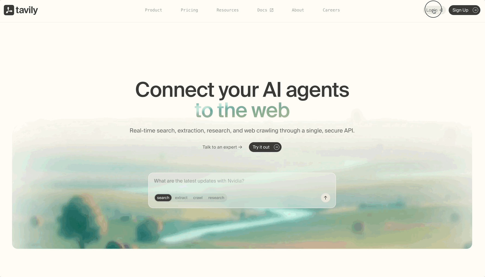
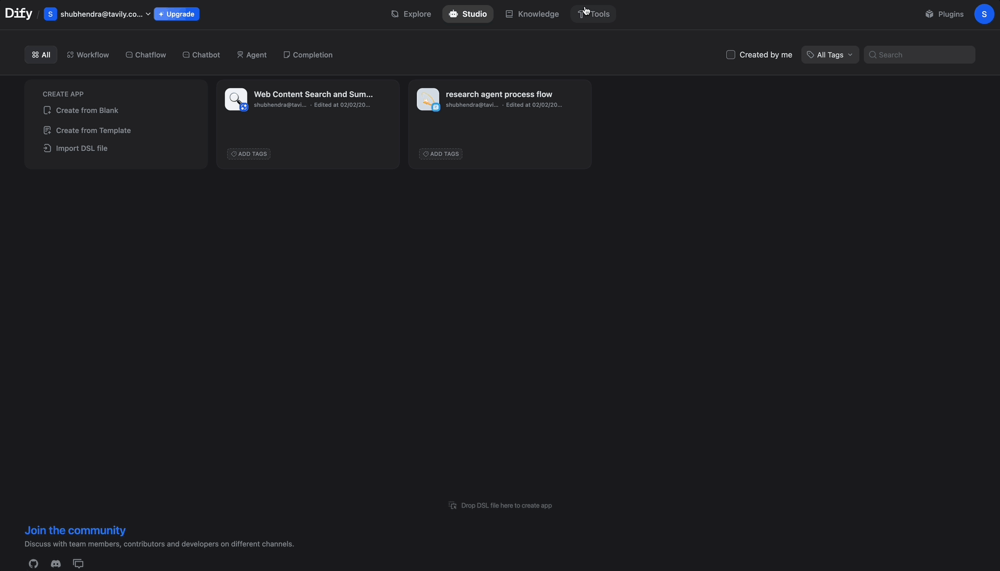
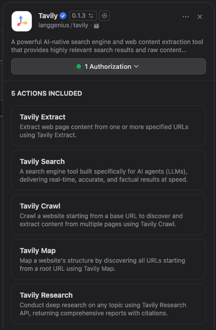

# Tavily

The Tavily tool connects your Dify agents to an AI-native search engine built specifically for LLMs. Unlike traditional search APIs that return raw links, Tavily delivers clean, structured, and contextually relevant results ready for AI consumption.

## Available Actions

| Action       | Description                                      | Best For                                                 |
| ------------ | ------------------------------------------------ | -------------------------------------------------------- |
| **Search**   | AI-optimized web search with relevance scoring   | General queries, real-time information, fact-checking    |
| **Extract**  | Pull structured content from specific URLs       | Reading articles, parsing documentation, data extraction |
| **Crawl**    | Deep crawl websites following internal links     | Site audits, comprehensive data collection               |
| **Map**      | Discover and map all URLs within a domain        | Site structure analysis, content discovery               |
| **Research** | Multi-step autonomous research on complex topics | In-depth reports, market research, due diligence         |

## Configuration

### 1. Get Your API Key

Sign up and get your API key at [app.tavily.com](https://app.tavily.com).

Free tier includes **1,000 API credits/month**.

### 2. Install from Plugin Marketplace

Navigate to **Plugin Marketplace** in Dify and search for "Tavily". Click **Install**.

### 3. Add Your API Key

Go to **Tools → Tavily → Authentication** and paste your API key.

### 4. Add a Tool node to your flow

Add a Node → Tool → Tavily. All five actions are available:

  

## Common Patterns

**Fact-checking workflow:**  
User question → Search (include_answer: true) → LLM validates and responds

**Content aggregation:**  
Topic → Search → Extract (top URLs) → LLM summarizes

**Competitive analysis:**  
Competitor URL → Map → Crawl key pages → LLM analyzes

## Resources

- [Tavily Docs](https://docs.tavily.com/documentation/api-reference/introduction)
- [Tavily Dashboard](https://app.tavily.com)
- [Tavily Discord](https://discord.gg/TPu2gkaWp2)
