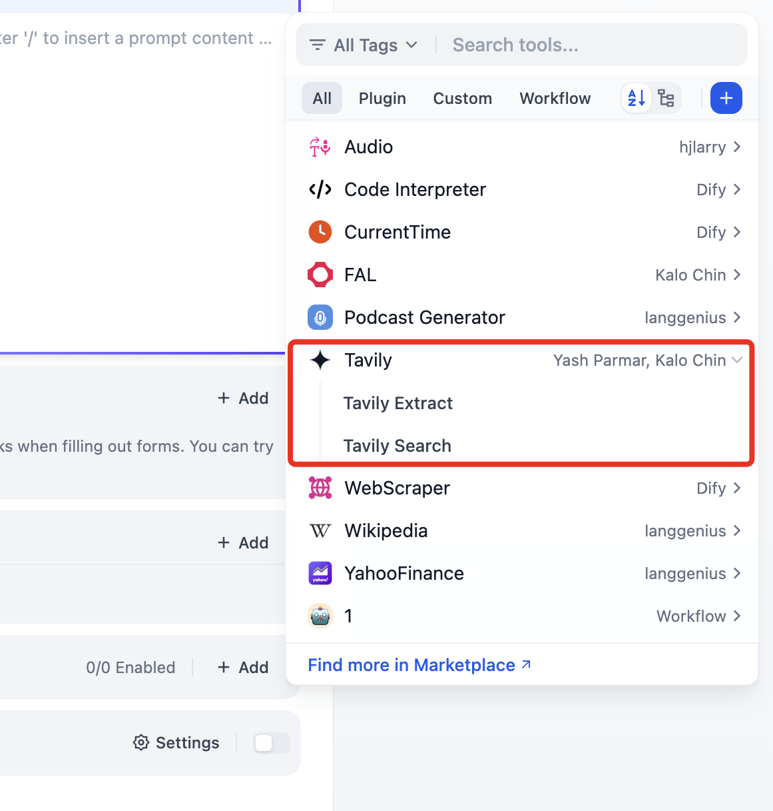

# Tavily

The Tavily tool connects your Dify agents to an AI-native search engine built specifically for LLMs. Unlike traditional search APIs that return raw links, Tavily delivers clean, structured, and contextually relevant results ready for AI consumption.

## Available Actions

| Action       | Description                                      | Best For                                                 |
| ------------ | ------------------------------------------------ | -------------------------------------------------------- |
| **Search**   | AI-optimized web search with relevance scoring   | General queries, real-time information, fact-checking    |
| **Extract**  | Pull structured content from specific URLs       | Reading articles, parsing documentation, data extraction |
| **Crawl**    | Deep crawl websites following internal links     | Site audits, comprehensive data collection               |
| **Map**      | Discover and map all URLs within a domain        | Site structure analysis, content discovery               |
| **Research** | Multi-step autonomous research on complex topics | In-depth reports, market research, due diligence         |

## Configuration

### 1. Get Your API Key

Sign up and get your API key at [app.tavily.com](https://app.tavily.com).

Free tier includes **1,000 API credits/month**.


### 2. Install from Plugin Marketplace

Navigate to **Plugin Marketplace** in Dify and search for "Tavily". Click **Install**.

### 3. Add Your API Key

Go to **Tools → Tavily → Authentication** and paste your API key.


## Usage

### In Chatflow / Workflow

Add a Tavily node to your flow. All five tools are available:


**Example: Search node configuration**

```
Query: {{user_input}}
Search Depth: advanced
Max Results: 5
Include Answer: true
```

### In Agent Applications

Add Tavily tools to your agent's toolkit. The agent will autonomously decide when to use each action.



## Action Details

### Search

Returns AI-optimized search results with optional direct answers.

| Parameter         | Type   | Description                                    |
| ----------------- | ------ | ---------------------------------------------- |
| `query`           | string | Search query                                   |
| `search_depth`    | string | `basic` (faster) or `advanced` (more thorough) |
| `max_results`     | int    | Number of results (1-10)                       |
| `include_answer`  | bool   | Include AI-generated answer summary            |
| `include_domains` | array  | Limit search to specific domains               |
| `exclude_domains` | array  | Exclude specific domains                       |

### Extract

Extracts clean, structured content from one or more URLs.

| Parameter | Type  | Description                          |
| --------- | ----- | ------------------------------------ |
| `urls`    | array | List of URLs to extract content from |

### Crawl

Recursively crawls a website starting from a given URL.

| Parameter   | Type   | Description                      |
| ----------- | ------ | -------------------------------- |
| `url`       | string | Starting URL for the crawl       |
| `max_depth` | int    | How many levels deep to crawl    |
| `limit`     | int    | Maximum number of pages to crawl |

### Map

Returns a complete list of URLs found on a website.

| Parameter | Type   | Description                 |
| --------- | ------ | --------------------------- |
| `url`     | string | Root URL of the site to map |

### Research

Conducts autonomous multi-step research and returns a comprehensive report.

| Parameter     | Type   | Description                |
| ------------- | ------ | -------------------------- |
| `query`       | string | Research topic or question |
| `max_results` | int    | Depth of research          |

## Common Patterns

**Fact-checking workflow:**  
User question → Search (include_answer: true) → LLM validates and responds

**Content aggregation:**  
Topic → Search → Extract (top URLs) → LLM summarizes

**Competitive analysis:**  
Competitor URL → Map → Crawl key pages → LLM analyzes

## Resources

- [Tavily API Docs](https://docs.tavily.com)
- [Tavily Dashboard](https://app.tavily.com)
