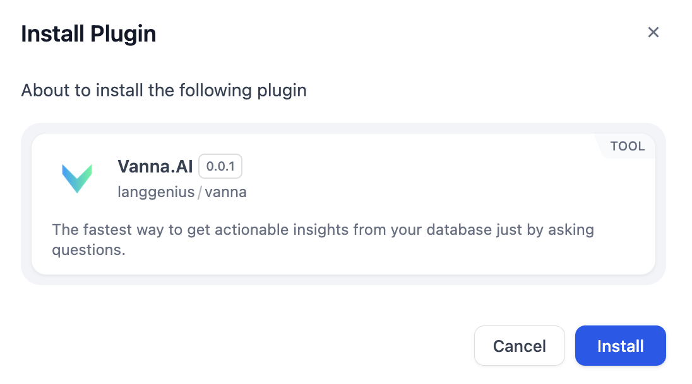

# 概要
Vanna.aiは、ユーザーと複雑なSQLデータベース間のやり取りを簡素化するために設計された、革新的なAI駆動プラットフォームです。

# 設定
## APIキーの取得
1. Vanna.aiでアカウントを作成してログインします。
2. API KeysからAPIキーをコピーします。

## Vanna.AIツールの設定
1. MarketplaceからVanna.AIをインストールします。

2. ワークフローにVanna.AIノードを追加します。
3. Vanna.AI APIキーを入力します。
4. データベース設定を入力します。

