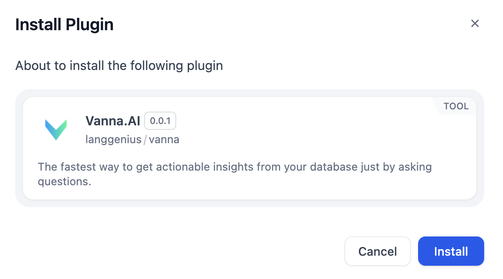
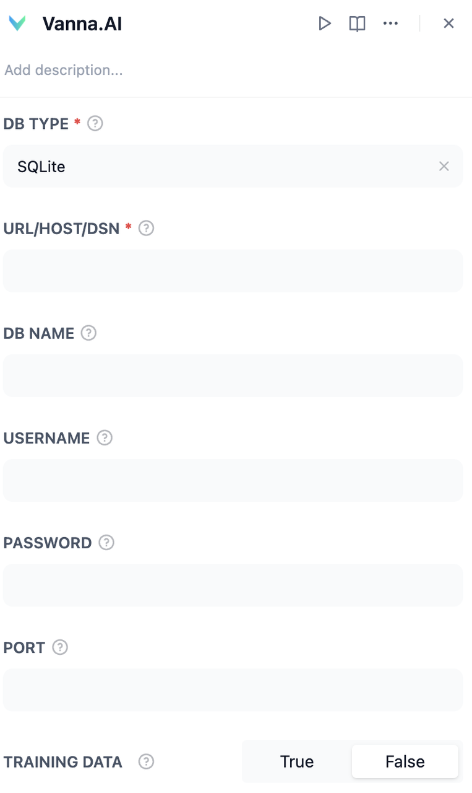

# 概述
Vanna.ai 是一个创新的 AI 驱动平台,旨在简化用户与复杂 SQL 数据库之间的交互。

# 配置
## 获取 API 密钥
1. 创建账户并登录到 Vanna.ai。
2. 从 API Keys 复制 API 密钥。

## 配置 Vanna.AI 工具
1. 从 Marketplace 安装 Vanna.AI。

2. 将 Vanna.AI 节点添加到您的工作流中。
3. 填入 Vanna.AI API 密钥。
4. 填入数据库配置。

## 数据库连接

SQLite 和 DuckDB 支持已有本地数据库文件或 HTTP(S) 下载地址。
DuckDB 也支持 `:memory:`、`md:` 和 `motherduck:` 连接。
使用 Microsoft SQL Server 时，在 URL/Host/DSN 中填写 ODBC 连接字符串。
插件运行环境需要安装 unixODBC 及对应的 SQL Server ODBC 驱动。
