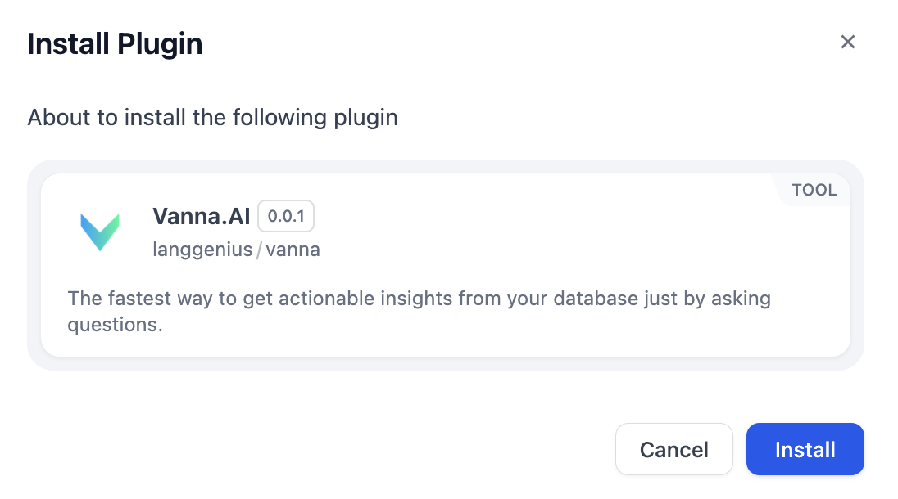

# 概述
Vanna.ai 是一个创新的 AI 驱动平台,旨在简化用户与复杂 SQL 数据库之间的交互。

# 配置
## 获取 API 密钥
1. 创建账户并登录到 Vanna.ai。
2. 从 API Keys 复制 API 密钥。

## 配置 Vanna.AI 工具
1. 从 Marketplace 安装 Vanna.AI。

2. 将 Vanna.AI 节点添加到您的工作流中。
3. 填入 Vanna.AI API 密钥。
4. 填入数据库配置。

