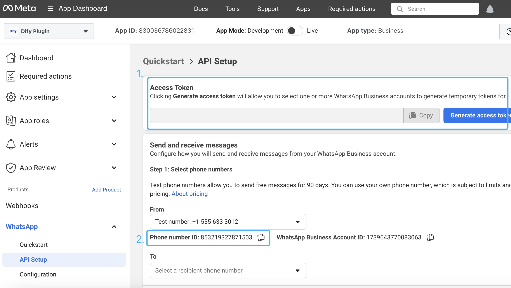
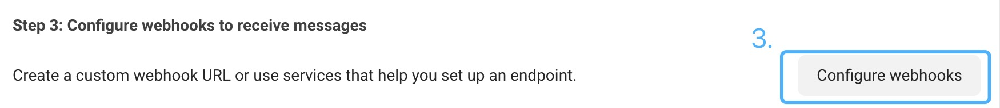
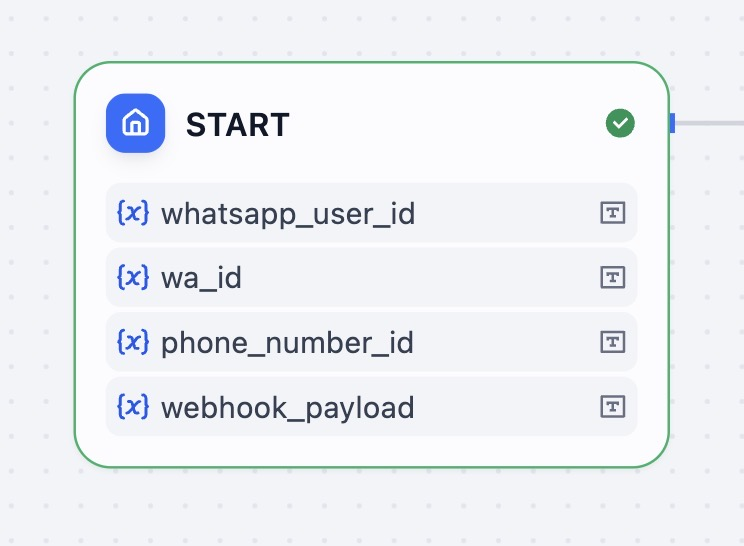
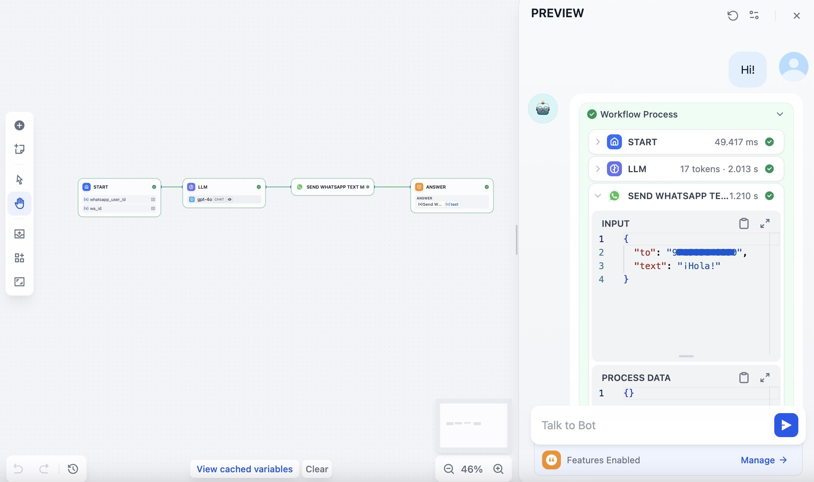
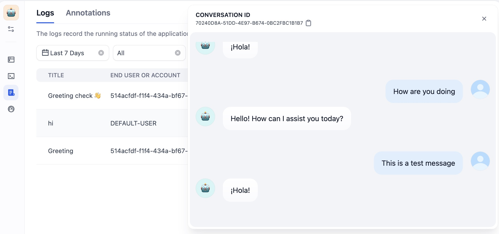
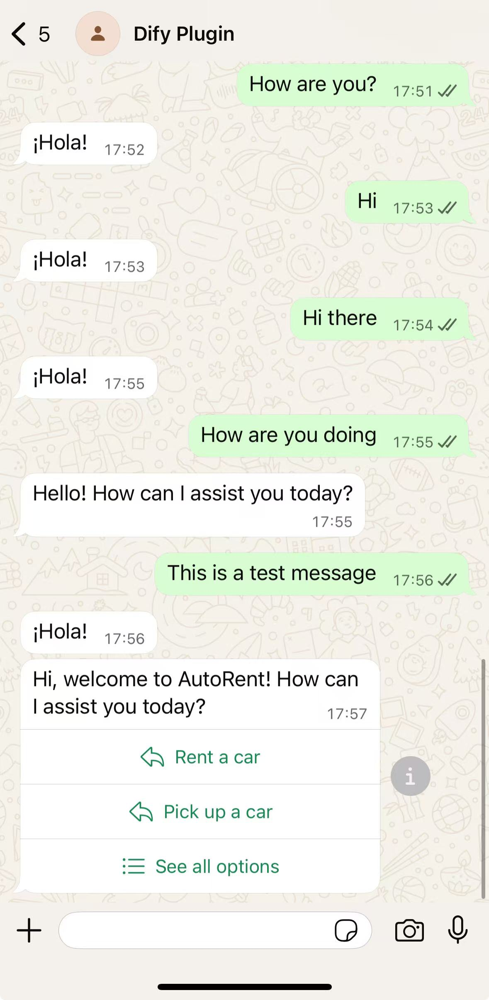
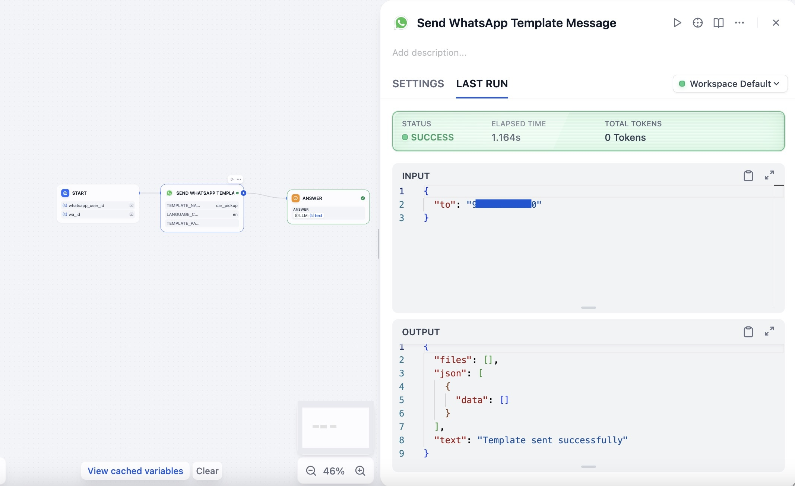

## whatsapp-bot

**Author:** langgenius
**Version:** 0.0.1
**Type:** extension

### Description
WhatsApp Cloud API extension that receives messages via webhook and optionally forwards them to a selected Dify App to generate replies, then sends responses back to WhatsApp users.

### Setup

1. Install dependencies:
   ```bash
   pip install -r requirements.txt
   ```
2. Run locally for remote debug in Dify:
   ```bash
   python -m main
   ```

### Configure in Dify

Open plugin settings and fill:
- `WhatsApp Access Token` (`access_token`): from Meta for Developers.
- `Webhook Verify Token` (`verify_token`): choose a secret and reuse in Meta webhook setup.
- `Phone Number ID` (`phone_number_id`): WhatsApp Business phone number ID.
- `WhatsApp Business Account ID` (`waba_id`): WABA ID, required for fetching approved templates.
- `Dify App` (`app`): optional. If set, incoming user text can be forwarded to the app; otherwise the plugin echoes the text.

### Available Tools

This plugin provides the following WhatsApp tools:

#### 1. Send Message (`send_message`)
Send a plain text message to a WhatsApp user.

**Parameters:**
- `to`: WhatsApp user ID or phone number (international format without +)
- `text`: Message content to send

#### 2. Send Template (`send_template`)
Send an approved WhatsApp template message to a user. This tool dynamically fetches your approved templates from WhatsApp Business.

**Parameters:**
- `to`: WhatsApp user ID or phone number (international format without +)
- `template_name`: Enter the template you would like to send as a string. The template has to be approved by Meta.
- `language_code`: Template language code (e.g., en_US, zh_CN, pt_BR). Default: en_US
- `template_parameters`: Optional parameters for template variables (comma-separated or JSON array)

**Example template parameters:**
- Simple: `"John,123"` (for templates with {{1}}, {{2}})
- JSON: `[{"type":"text","text":"John"},{"type":"text","text":"123"}]`

### Webhook Endpoints

- `GET /webhooks/whatsapp` for webhook verification: responds with `hub.challenge` when `hub.verify_token` matches settings.
- `POST /webhooks/whatsapp` to receive events. Currently extracts text messages and replies with text.

### Configure WhatsApp Business (Cloud API)

1. Apply for a Meta Developer account
   - Visit `https://developers.facebook.com/` and create/upgrade to a Developer account.

2. Create a WhatsApp app in Meta for Developers
   - In your Meta Developer dashboard, create an App, then add the WhatsApp product to the app.
   - Follow the quickstart to get a test phone number and set the product up. See Meta guide: `https://developers.facebook.com/docs/whatsapp/cloud-api/guides/set-up-whatsapp-echo-bot`.

3. Generate API token and copy Phone Number ID
   - In WhatsApp > API Setup, generate an access token (temporary test token or system user token) and copy your Phone Number ID.
   - You will need these values in Dify plugin settings: `WhatsApp Access Token` and `Phone Number ID`.
   - Reference:
     
     

3.5. Find your WhatsApp Business Account ID (WABA ID)
   - In Meta Business Suite, navigate to WhatsApp Accounts or check the URL when viewing your WhatsApp Business settings.
   - The WABA ID is a numeric ID (e.g., `123456789012345`) that identifies your WhatsApp Business Account.
   - You can also find it in the API Setup page or by calling: `https://graph.facebook.com/v24.0/me/businesses?access_token=YOUR_TOKEN`
   - For developers with a testing account, the WABA ID is next to Phone number ID under WhatsApp -> API Setup -> Send and receive message.
   - This ID is required for the `send_template` tool to fetch your approved message templates.

4. Configure the webhook in Meta to point to this plugin
   - In WhatsApp > Configuration, set:
     - Callback URL: your public Dify endpoint for this plugin, for example: `https://<your-dify-host>/webhooks/whatsapp`
     - Verify token: the exact `Webhook Verify Token` you set in the plugin settings.
   - Subscribe to the `messages` field for the Webhook.
   - References:
     
     
     
     

5. Token hygiene for testing accounts
   - If you are using a test account, Meta’s temporary access tokens expire frequently. Regenerate tokens as needed and update the plugin settings accordingly.
   - Keep your access token secret; do not commit it to source control.

Helpful docs:
- Webhook payload examples (to understand inbound sender fields like `messages[].from`): `https://developers.facebook.com/docs/whatsapp/cloud-api/webhooks/payload-examples`
- Echo bot setup (quick setup flow): `https://developers.facebook.com/docs/whatsapp/cloud-api/guides/set-up-whatsapp-echo-bot`

### Chatflow Start Node 

To have the Chatflow identify user from webhook, you will need to set up a few optional fields in your Chatflow's Start node.

After setting up API keys, add the following inputs in your Chatflow App's start node:

- **whatsapp_user_id** (not required)
- **wa_id** (not required)

You may use either for the To field in send_message tool. Include both to act as fallback for payload inconsistency. 



### Tests

#### Test 1: send a text message to a specified user


#### Test 2: reply to a user with a text message


#### Test 3: send a template to a specific user
Note: since all templates need to be approved by Meta, the `send_template` tool acts as a functional node most suitable for Workflow, rather than Chatflow.



