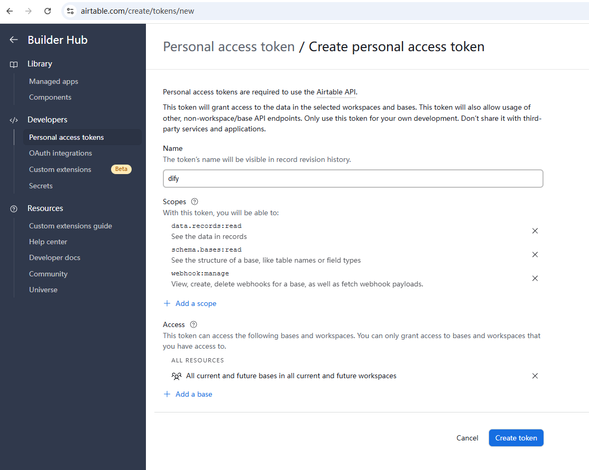

# Airtable Trigger Plugin for Dify

## Overview

This plugin enables Dify to receive real-time webhook notifications from Airtable when records in your bases are created, updated, or deleted. It provides a seamless integration between Airtable and your Dify workflows.


## Getting Your Airtable Personal Access Token


1. Go to [Airtable Account Settings](https://airtable.com/create/tokens)
2. Click "Create new token"
3. Give your token a name (e.g., "Dify Integration")
4. Add the following scopes:
   - `webhook:manage`
   - `data.records:read`
   - `schema.bases:read`
5. Add access to the specific bases you want to monitor
6. Click "Create token" and copy the token value

## Configuration

### Settings

- **Personal Access Token**: Your Airtable Personal Access Token
- **Base ID**: The ID of the Airtable base to monitor (found in the base URL: `https://airtable.com/{baseId}/...`)
- **Events**: Select which event types to monitor (created, updated, deleted)
- **Table IDs**: Comma-separated list of specific table IDs to monitor (leave empty to monitor all tables)


## Usage Example

1. Install the Airtable Trigger plugin in your Dify workspace
2. Create a new workflow and add an Airtable Trigger
3. Configure the trigger with your Personal Access Token and Base ID
4. Select the events you want to monitor
5. Add any optional filters to narrow down notifications
6. Save and activate your workflow


## Output Variables

The trigger provides the following variables to your workflow:

```json
{
  "base_id": "appXXXXXXXXXXXXXX",
  "webhook_id": "achXXXXXXXXXXXXXX",
  "timestamp": "2023-01-01T00:00:00.000Z",
  "cursor": 9,
  "payloads": { /* full webhook notification payload */ }
}
```

## References

- [Airtable Webhooks API Documentation](https://airtable.com/developers/web/api/webhooks-overview)
- [Airtable Authentication](https://airtable.com/developers/web/api/authentication)
- [Airtable Scopes](https://airtable.com/developers/web/api/scopes)

