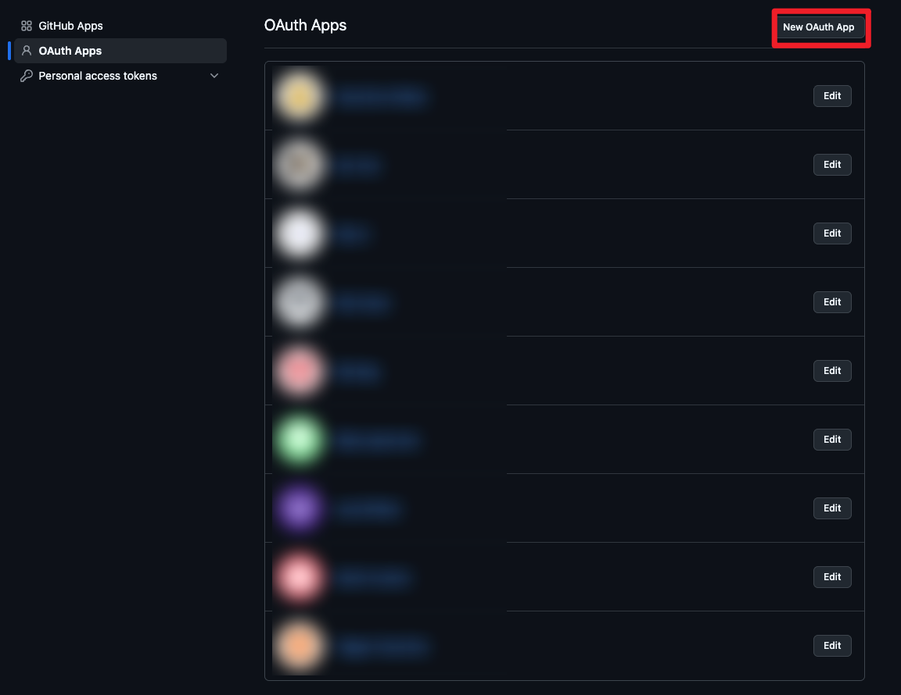

GitHub Trigger (Webhooks)

Overview

- GitHub Trigger connects repository webhooks to Dify and fans out concrete events for issues, pull requests, CI/CD jobs, security alerts, and more.
- Subscriptions can be provisioned automatically: the plugin creates a webhook on the selected repository, generates a secret, and stores it for signature verification.
- Both OAuth (recommended) and personal access tokens are supported, so administrators can choose between per-user authorization flows and shared GitHub credentials.
- Incoming payloads are validated (`X-Hub-Signature-256`, `X-GitHub-Event`) before Dify receives the resulting trigger events.

Prerequisites

- GitHub user with administrative permission on each repository that should emit events.
- Dify instance reachable by GitHub over HTTPS (publicly accessible endpoint for webhook deliveries).
- One of the following credential options:
  - GitHub OAuth App (client ID/secret, scopes `read:user admin:repo_hook`).
  - GitHub fine-grained personal access token with repository administration → **Repository hooks: Read & Write**.

Step-by-step Setup

1. Install the plugin in Dify

- Options:
  - Import the `.difypkg` in Plugin Center (Plugins → Import).
  - During development, make sure your runtime installs the dependencies from `requirements.txt`.

2. Choose an authentication strategy (Administrator)

- **OAuth (recommended)**: Users authorize with their own GitHub identities, and Dify stores only refreshable access tokens.
- **Personal Access Token**: Administrators paste a PAT that grants webhook administration rights; all subscriptions share the same token.

3. (OAuth only) Create a GitHub OAuth App

- GitHub Settings → Developer settings → OAuth Apps → **New OAuth App**  
  URL: https://github.com/settings/applications/new
  

- Configuration:
  - Application name: anything descriptive (e.g., “Dify GitHub Trigger”)
  - Homepage URL: your Dify console URL
  - Authorization callback URL: `https://<your-dify-host>/console/api/plugin/oauth/callback`
- Capture the generated **Client ID** and **Client Secret**.
- Adjust scopes if needed; the plugin defaults to `read:user admin:repo_hook`, which allows webhook management without full repo access.

4. Enter credentials in Dify (Administrator)

- For OAuth:
  - `client_id`: from the OAuth App.
  - `client_secret`: from the OAuth App.
  - `scope` (optional): keep the default unless additional GitHub APIs are required.
- For Personal Access Token:
  - `access_tokens`: paste the PAT; ensure it has the repository hook permissions mentioned above.

5. User: Create a subscription

- Click **Authorize** (OAuth) or ensure a PAT is configured; the plugin will retrieve repositories the authenticated account can administer.
- Select the target `repository` from the dropdown (format `owner/repo`).
- Choose one or more webhook `events`. Defaults cover most repository-level activities; you can narrow the list to reduce noise.
- (Optional) Provide `webhook_secret` if you maintain the webhook manually. If Dify provisions the webhook, a secret is generated automatically and stored with the subscription.
- Manual webhook setup: under GitHub → Repository Settings → Webhooks, set **Content type** to `application/json`. The trigger only accepts raw JSON payloads (`Content-Type: application/json`) and will reject `application/x-www-form-urlencoded`.
- Save the subscription. Dify shows the webhook endpoint URL (`https://<dify-host>/triggers/plugin/<subscription-id>`) for manual setups or diagnostics.
    

What happens automatically

- The plugin calls GitHub’s `repos/{owner}/{repo}/hooks` API to create (or later delete) the webhook, using JSON payloads with `content_type=json` and the shared secret.
- Webhook secrets are generated with UUID4 hex strings when not supplied, enabling HMAC SHA-256 signature verification (`X-Hub-Signature-256`) on every delivery.
- Subscription refresh extends the webhook TTL (~30 days) so GitHub keeps it active without reauthorization.
- On unsubscribe, the webhook is removed via `DELETE repos/{owner}/{repo}/hooks/{hook_id}`.

Supported Events (high-level)

- `issues`, `issue_comment`, `pull_request`, and related review/comment events.
- CI/CD and automation: `check_run`, `check_suite`, `workflow_run`, `workflow_job`, `deployment`, `deployment_status`.
- Repository activity: `push`, `ref_change` (create/delete), `commit_comment`, `star`, `watch`, `fork`, `public`, `repository`.
- Project and collaboration: `project`, `project_card`, `project_column`, `discussion`, `discussion_comment`, `label`, `milestone`, `member`.
- Security and quality: `code_scanning_alert`, `dependabot_alert`, `repository_vulnerability_alert`, `secret_scanning`.
- Configuration and governance: `branch_protection_configuration`, `branch_protection_rule`, `repository_ruleset`, `custom_property_values`.

How It Works

- Dispatch
  - Validates the webhook signature if a secret is present.
  - Parses JSON (or `payload` in form-encoded requests) and captures `X-GitHub-Event`.
  - Maps GitHub events to concrete Dify event names (e.g., `deployment_status` → `deployment_status_created`, `create/delete` → `ref_change`).
  - Returns a JSON `{"status": "ok"}` response so GitHub considers the delivery successful.
- Events
  - Each event YAML loads the stored payload, highlights the most relevant fields, and exposes them as structured outputs for downstream workflows.
  - Action-based events (e.g., release published) are split to keep automation clear and deterministic.

Troubleshooting

- Webhook creation fails: confirm the OAuth token or PAT has `admin:repo_hook` scope and that the actor is an admin on the repository.
- “Missing webhook signature”: either supply the secret in the subscription form (for manual webhooks) or let Dify recreate the webhook.
- No events arriving: check that your Dify endpoint is publicly reachable (status 200) and that selected events match the GitHub activity you expect.
- 401/403 responses: re-authorize the plugin; revoked tokens or expired PATs must be replaced.

References

- GitHub Webhooks: https://docs.github.com/webhooks
- OAuth Apps: https://docs.github.com/apps/oauth-apps
- Event payloads: https://docs.github.com/webhooks-and-events/webhooks/webhook-events-and-payloads
