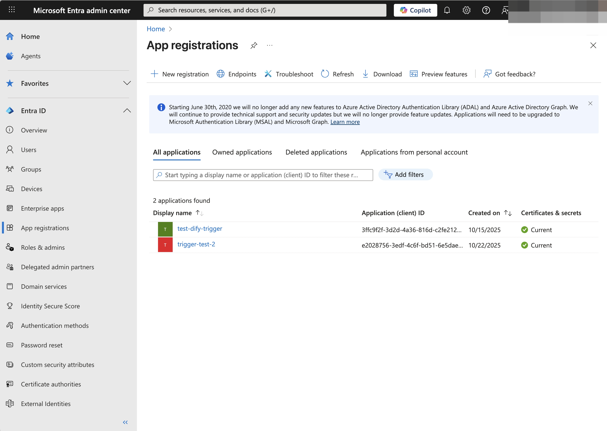
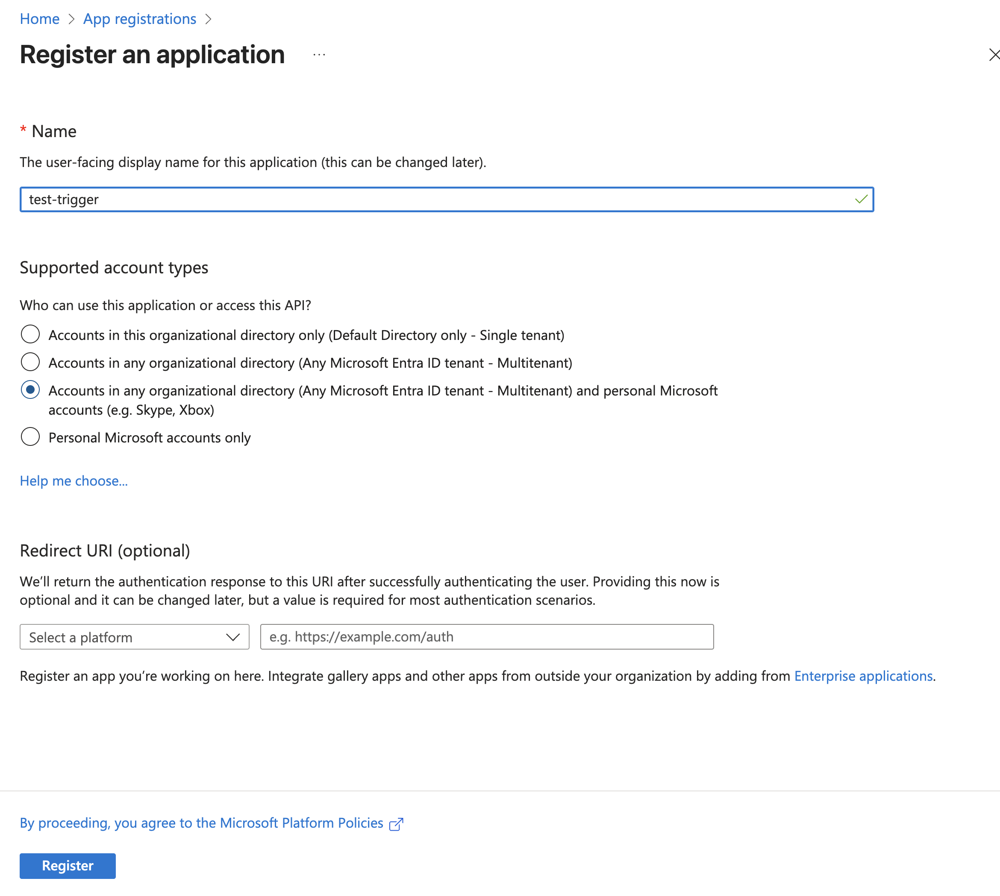
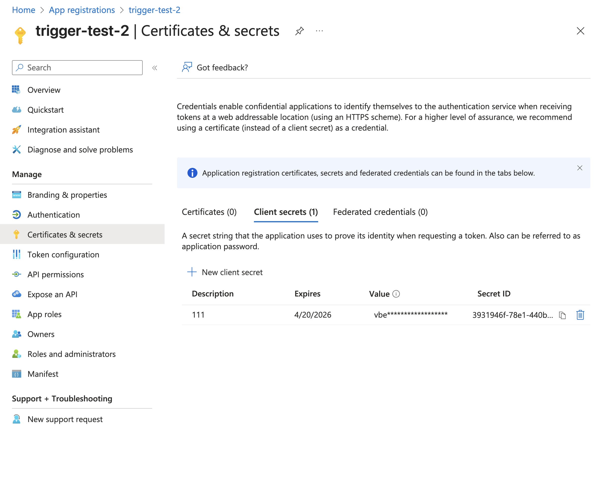
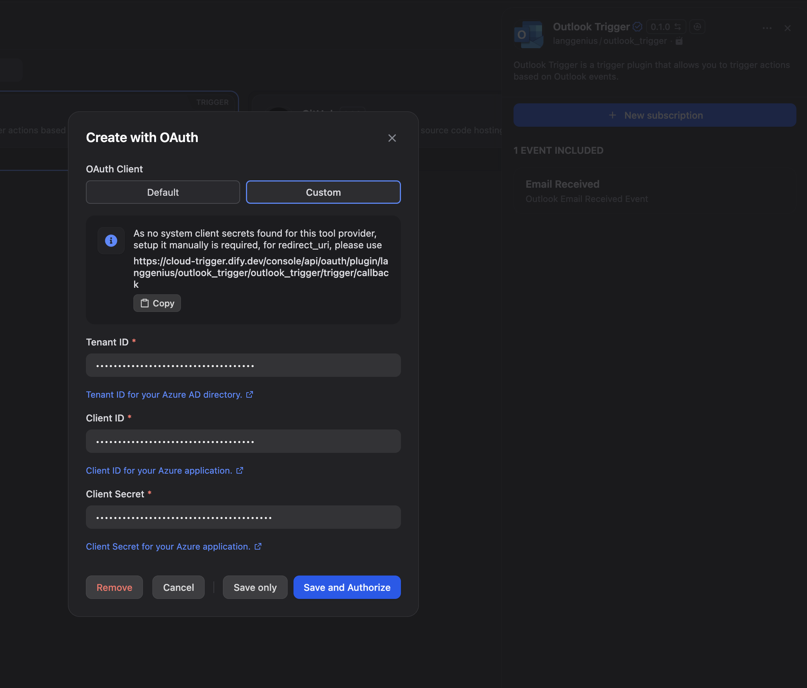
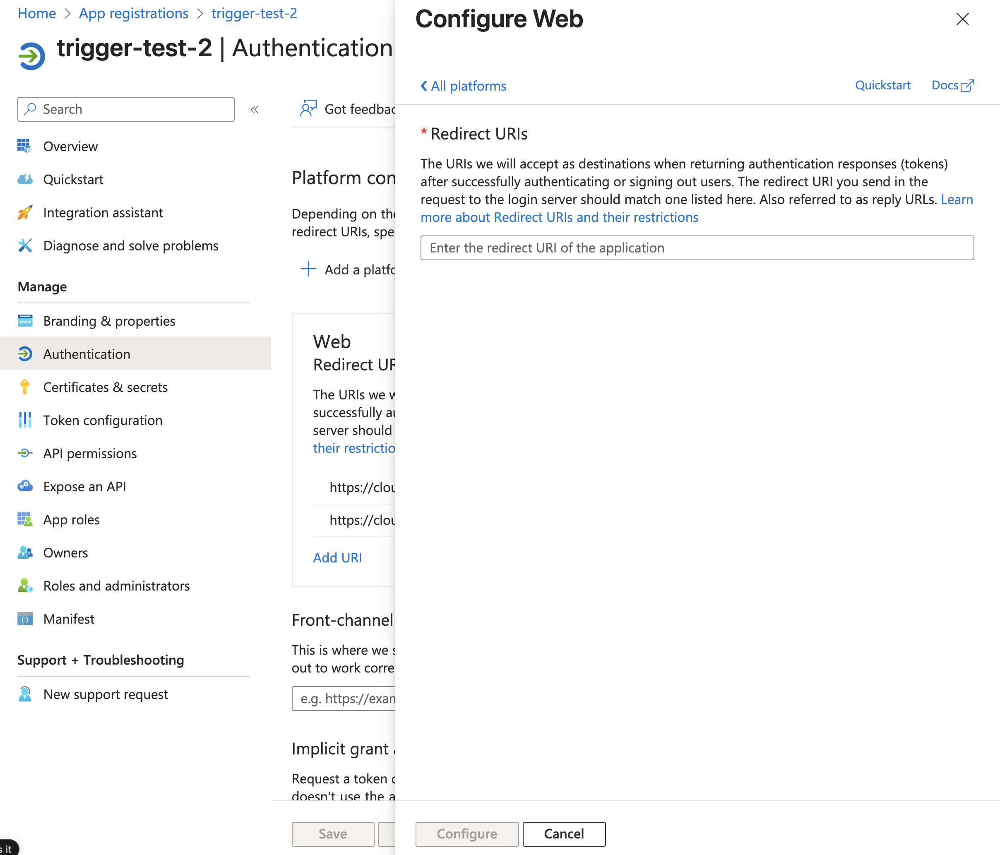

# Outlook Trigger

This trigger receives email received events from Microsoft Outlook and triggers a workflow.

## Set up

1. Enter [Azure Portal](https://portal.azure.com/#home), head to `App Registrations` and create a new application.

Fill with a name and select `Accounts in any organizational directory (Any Microsoft Entra ID tenant - Multitenant) and personal Microsoft accounts (e.g. Skype, Xbox)` as the supported account types. Click `Register`.

2. Copy the `Application (client) ID` and `Directory (tenant) ID` from `Overview` page. Generate a new client secret in `Certificates & secrets` page and copy the value.

3. Install this plugin in Dify and open configuration page.

Fill in the `Client ID` `Client Secret` and `Tenant ID` fields with the values you copied from the Azure Portal.

You'll get a `redirect_url` in this dialog, copy it and go back to the Azure Entra ID page, head to `Authentication` page, select `Web` as the platform type, add paste the `redirect_url` in the `Redirect URIs` field. Click `Save`.

Now you can go back to the Dify plugin configuration page and click `Save and authorize` to initiate the OAuth flow.

This plugin will redirect you to the Microsoft login page, login with your Microsoft account and grant the permissions to the application.

Then you can use this plugin in a workflow to trigger it when you receive an email.